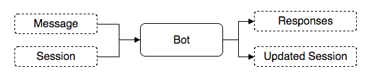

## Overview

To deploy a bot to a channel you need to create:

- Create a Project, with `bot: true`. It would create one bot under one project.
- Create a Deployment of the selected Project, with the selected botRevision
- Info: deploymentId equals projectId
- Create an Environment of the selected Deployment
- Add a Channel of the selected Environment

## Data Structure

### Project

```ts
interface Project {
  id?: string;

  name: string;
  label?: string;
  description?: string;

  botLatestRevision: string;
  nluLatestRevision?: string;
  cmsLatestRevision?: string;

  options: {
    bot: boolean;
    cms: boolean;
    nlu: boolean;
    timezone: number;
    nluVisibility: 'private' | 'public';
    nluLang: string;
    nluId: string;
  };
}
```

### Deployment

```ts
interface Deployment {
  id?: string;
  name?: string;
  version: string;

  botRevision: string;
  nluRevision?: string;
  cmsRevision?: string;

  modules: null;
}
```

### Environment

```ts
interface Environment {
  id?: string;
  name: string;
  slug?: string;
  deploymentId: string;
  deploymentVersion: string;
}
```

### Channel

```ts
interface Channel {
  id?: string;
  name: string;
  type: 'generic' | 'line' | 'fbmessenger' | 'telegram' | 'twitter' | 'slack' | 'spark' | 'bbm' | 'qiscus' | 'whatsapp';
  url: string;
  rpmLimit?: number;
  agentId?: string;
  options: JsonObject;
}
```

### Bot Types

**Bot**

```ts
interface Bot {
  id: string;
  name: string;
  version: string;
  desc: string;
  lang: string;
  timezone: number;
  flows: { [name: string]: Flow };
  nlus?: { [name: string]: Nlu };
  methods?: { [name: string]: string | Method };
  config?: JsonObject;
}
```

**Flow**

```ts
interface Flow {
  fallback?: boolean;
  priority?: number;
  expire?: number;
  volatile?: boolean;
  intents: { [i: string]: Intent };
  states?: { [i: string]: State };
  stateMapper?: string;
  stateActions?: { [i: string]: StateAction | StateAction[] };
  actions?: { [i: string]: Action };
  methods?: { [name: string]: string | Method };
  nlus?: { [name: string]: Nlu };
}
```

**Intent**

```ts
interface Intent {
  condition?: string | string[];
  type?: 'data' | 'text' | 'command';
  classifier?: (IntentClassifier | string) | (IntentClassifier | string)[];
  initial?: boolean;
  priority?: number;
  fallback?: boolean;
  attributes?: {
    [i: string]: IntentAttribute | string;
  };
}
```

**Intent Classifier**

```ts
interface IntentClassifier {
  nlu: string;
  hint?: string;
  match?: string | string[];
  process?: string | string[];
  options?: JsonObject;
}
```

**Intent Attribute**

```ts
interface IntentAttribute {
  nlu: string;
  hint?: string;
  options?: JsonObject;
  path?: string;
  process?: string | string[];
}
```

**State**

```ts
interface State {
  initial?: boolean;
  float?: StateTransition;
  action?: (StateAction | string) | (StateAction | string)[];
  enter?: { [name: string]: string } | string;
  transit?: { [name: string]: string } | string;
  exit?: { [name: string]: string } | string;
  end?: boolean;
  transitions?: { [name: string]: StateTransition };
}
```

**State Transition**

```ts
interface StateTransition {
  condition?: string | string[];
  fallback?: boolean;
  priority?: number;
  mapping?: string | { [name: string]: string };
}
```

**State Action**

```ts
interface StateAction {
  name: string;
  method?: string;
  condition?: string | string[];
  options?: JsonObject;
}
```

**Action**

```ts
interface Action {
  type: string;
  method?: string;
  condition?: string | string[];
  options?: JsonObject;
}
```

**Nlu**

```ts
interface Nlu {
  type: string;
  process?: string | string[];
  method?: string;
  options?: JsonObject;
}
```

**Method**

```ts
interface Method {
  code: string;
  entry?: string;
}
```

### Message Types

**Nlu**

```ts
interface NLU {
  name: string;
  lang: 'id' | 'en';
  visibility: 'public' | 'private';
  entities: {
    entity_name: {
      root?: string; //username:nlu/entity_name
      type: 'dict' | 'trait' | 'phrase';
      profile: string;
      relProfile?: string;
      labels?: string[];
      belongsTo?: string;
      dictionary?: { [key: string]: string[] };
      resolver?: string;
    };
  };
}
```

**Training Data**

```ts
interface TrainingData {
  input: string;
  entities: ITrainingEntity[];
}
```

**Training Entity**

```ts
interface TrainingEntity {
  id: string;
  entity: string;
  label?: string;
  start: number;
  end: number;
  value: string;
  belongsTo?: { entity: string; id: string };
}
```

​

### Token

```ts
interface Token {
  id: string; // Bearer token
  type: string;
  label: string;
  userId: string;
  teamId: string;
  botId: string;
  roleId: string;
  expire: number;
}
```

## Public Endpoint

### Authentication

Authentication can be provided using bearer token in header:

```
Authorization: Bearer <token>
```

Other possibility is to include it in the _query string_:

```
?token={token}
```

### Format

Only supported format is `json`. Use following header:

```
Content-Type: application/json
Accept: application/json
```

### Error Codes

This API implements following HTTP codes:

- `200` **OK** - returns the data
- `403` **Forbidden** - returns `"You're not authorized to view this page."`
- `400` **Bad Request** - returns `"Wrong API usage. Please refer to the documentation!"`
- `429` **Too Many Requests** - returns `"Ratelimit exceeded! 100 per minute"`
- `500` **Internal Server Error** - returns `"Server is not available at the moment. We are working on it."`

## Auth API

### Login

```
POST /login
```

**Body**

```
{
  username: string,
  password: string,
}
```

**Response:**

```js
{
  ...Token
}
```

## Project API

To create Bot, Cms, and/or Nlu, you need to create a project. **One** project consists of **one** Bot, Cms, and/or Nlu.

### Create Project

```
POST /projects/
```

**Access Control**

- `create_own_projects`
- if project belongs to user or team
- `create_any_projects`

**Body**

```ts
interface RequestPayload {
  name: string;

  options: {
    bot: boolean;
    cms: boolean;
    nlu: boolean;
    timezone: number;
    nluVisibility: 'private' | 'public';
    nluLang: 'en' | 'id' | string;
  };
}
```

**Example**

```json
{
  "name": "My New Project",

  "options": {
    "bot": true,
    "cms": true,
    "nlu": true,
    "timezone": 7,
    "nluVisibility": "private",
    "nluLang": "id"
  }
}
```

**Response**

```js
{
    ...Project
}
```

### List Projects

```
GET /projects/
```

**Access Control**

- `list_own_projects`
- if project belongs to user or team
- `list_any_projects`

**Response**

```
{
  page: number,
  limit: number,
  total: number,
  data: Project[]
}
```

### Get Project

```
GET /projects/:projectId
```

**Access Control**

- `read_own_projects`
- if project belongs to user or team
- `read_any_projects`

**Response**

```js
{
  ...Project
}
```

### Update Project

```
PUT /projects/:projectId:
```

**Body**

```js
{
  ...Project
}
```

**Response**

```js
{
  ...Project
}
```

## Bot API

### List Bots

_Removed, see [List Projects](#list-projects)_

### Create Bot

_Removed, see [Create Project](#create-project)_

### Get Bot

```
GET /projects/:projectId/bot/
```

**Response**

```js
{
  ...Bot
}
```

### Update Bot (create new bot revision)

To update bot, it is done by creating a new bot revision.

```
POST /projects/:projectId/bot/revisions/
```

**Body**

```js
{
...Bot
}
```

**Response**

```js
{
  ...Bot,
  revision: "newRevisionHash"
}
```

**Notes**

- If version already exist, it will be rejected

## Bot Converse API

**Overview**

To converse, begin by sending initial session and then use the returned/updated session on new request

```js
let session = initial_session;

while (conversing) {
  let { responses, session } = converse(messageFromUser, session);
  // the retuned session will be used for the next conversation
}
```



### Converse

```
POST /projects/{projectId}/bot/converse
```

**Body**

```ts
interface RequestPayload {
  session: Session;
  message: {
    type: 'text';
    content: string;
  };
  revision?: string;
  tag?: string;
  variables?: object;
}
```

Initial session:

```ts
const initialSession: Session = {
  channel_id: 'console-channel',
  environment_id: 'console-environment',
  states: {},
  contexes: {},
  history: [],
  current: null,
  meta: null,
  timestamp: Date.now(),
  data: {},
  created_at: Date.now(),
  updated_at: Date.now(),
  session_start: Date.now(),
  session_id: 'test~from~console',
  id: 'test~from~console'
};
```

Example:

```json
{
  "session": {
    "channel_id": "console-channel",
    "environment_id": "console-environment",
    "states": {},
    "contexes": {},
    "history": [],
    "current": null,
    "meta": null,
    "timestamp": 1547107552237,
    "data": {},
    "created_at": 1547107552237,
    "updated_at": 1547107552237,
    "session_start": 1547107552237,
    "session_id": "test~from~console",
    "id": "test~from~console"
  },
  "message": {
    "type": "text",
    "content": "your-text-here"
  }
}
```

**Response**

```ts
interface ResponseObject {
  messages: Message[];
  responses: Response[];
  session: Session;
}
```

Example:

```json
{
  "messages": [
    {
      "type": "text",
      "content": "a",
      "id": "34cc49f5-9634-452d-a5ec-5995be9b05b3",
      "intent": "fallback",
      "attributes": {}
    }
  ],
  "responses": [
    {
      "type": "text",
      "content": "sorry!",
      "action": "text",
      "id": "a268afd9-2621-465b-8d8c-c682ae4a22cb",
      "refId": "34cc49f5-9634-452d-a5ec-5995be9b05b3",
      "flow": "hello",
      "intent": "fallback"
    }
  ],
  "session": {
    "id": "test~from~console",
    "states": {},
    "contexes": {},
    "history": [],
    "current": null,
    "meta": {
      "lastFlow": "hello",
      "lastState": "other",
      "end": true
    },
    "timestamp": 0,
    "data": {}
  },
  "duration": 161
}
```

## Draft API

### Get Draft

```
GET /projects/:projectId/bot/draft
```

**Response**

```js
{
  ...BotDescriptor
}
```

### Create or Update Bot Draft

```
PUT /projects/:projectId/bot/draft
```

**Body**

```js
{
  ...BotDescriptor
}
```

**Response**

```ts
interface ResponseObject {
  draftId: string;
}
```

### Delete bot draft

```
DELETE /projects/:projectId/bot/draft
```

**Response**

```ts
interface ResponseObject {
  draftId: string;
}
```

## Deployment API

### Create New Deployment Version

```
POST /projects/:projectId/deployment/versions
```

**Access Control:**

- `create_own_deployments`
- if deployment belongs to user or team
- `create_any_deployments`

**Body**

```js
{
  ...Deployment
}
```

Example:

```json
{
  "version": "0.0.1",
  "botRevision": "myBotRevisionHash",
  "modules": null
}
```

**Response**

```js
{
  ...Deployment
}
```

Example:

```json
{
  "id": "myProjectId",
  "name": "myProjectId~0.0.1",
  "version": "0.0.1",
  "botId": "myProjectId",
  "botRevision": "myBotRevisionHash",
  "modules": null
}
```

### Get Latest Deployment Version

```
GET /projects/:projectId/deployment/
```

**Access Control**

- `read_own_deployments`
- if deployment belongs to user or team
- `read_any_deployments`

**Response:**

```js
{
  ...Deployment
}
```

### Get Deployment Version

```
GET /projects/:projectId/deployment/versions/:version
```

**Access Control**

- `read_own_deployments`
- if deployment belongs to user or team
- `read_any_deployments`

**Response:**

```js
{
  ...Deployment
}
```

### List Deployment Versions

```
GET /projects/:projectId/deployment/versions/
```

**Access Control**

- `read_own_deployments`
- if deployment belongs to user or team
- `read_any_deployments`

**Response**

```js
{
  ...Deployment
}
```

### Update Deployment Version

```
PUT /projects/:projectId/deployment/versions/:version
```

**Access Control**

- `update_own_deployments`
- if deployment belongs to user or team
- `update_any_deployments`

**Body**

```js
{
  ...Deployment
}
```

**Response**

```js
{
  ...Deployment
}
```

### Delete Deployment version

```
DELETE /projects/:projectId/deployment/versions/:version
```

**Access Control**

- `delete_own_deployments`
- if deployment belongs to user or team
- `delete_any_deployments`

**Response:**

```js
{
  ...Deployment
}
```

## Environment API

### List All Environments

```
GET /projects/:projectId/environments
```

**Access Control**

- `list_own_environments`
- if environments belongs to user or team
- `list_any_environments`

**Query Params**

- `limit: number`
- `page: number`

**Response**

```ts
interface ResponseObject {
  page: number;
  limit: number;
  total: number;
  data: Deployment[];
}
```

### Get Environment

```
GET /projects/:projectId/environments/:environmentId:
```

**Access Control**

- `list_own_environments`
- if environments belongs to user or team
- `list_any_environments`

**Response**

```js
{
  ...Environment
}
```

### Create Environment

```
POST /projects/:projectId/environments
```

**Access Control:**

- `create_own_environments`
- if environments belongs to user or team
- `create_any_environments`

**Body**

```ts
interface RequestPayload {
  depId: projectId;
  depVersion: deployment.version;
  name;
  slug;
}
```

depVersion: the selected deployment version

Example

```json
{
  "depId": "projectId",
  "depVersion": "0.0.1",
  "name": "Development",
  "slug": "katatelco-dev"
}
```

**Response**

```js
{
  ...Environment
}
```

Example:

```json
{
  "id": "unique-id",
  "depId": "projectId",
  "depVersion": "0.0.1",
  "name": "Development",
  "slug": "katatelco-dev",
  "channels": []
}
```

### Update Environment

Update Environment can be used to change the Deployment version

```
PUT /projects/:projectId/environments/:environmentId
```

**Access Control**

- `update_own_environments`
- if environments deployment belongs to user or team
- `update_any_environments`

**Body:**

```ts
interface RequestPayload {
  depVersion: deployment.version;
}
```

Example

```json
{
  "depVersion": "0.0.2"
}
```

**Response**

```js
{
  ...Environment
}
```

### Delete Environments

```
DELETE /projects/:projectId/environments/:environmentId
```

**Access Control**

- `delete_own_environments`
- if environments belongs to user or team
- `delete_any_environments`

**Response:**

```js
{
  ...Environment
}
```

## Channel API

### List Channels

```
GET /projects/:projectId/environments/:environmentId/channels
```

**Access Control**

- `list_own_channels`
- if session belongs to user or team
- `list_any_channels`

**Query Params**

- `limit: number`
- `page: number`

**Response**

```ts
interface ResponseObject {
  page: number;
  limit: number;
  total: number;
  data: Channel[];
}
```

### Create Channel

```
POST /projects/:projectId/environments/:environmentId/channels
```

**Access Control**

- `create_own_channels`
- if session belongs to user or team
- `create_any_channels`

**Body**

```js
{
  ...Channel
}
```

Example:

```json
{
  "name": "mychannelname",
  "type": "line",
  "options": { "token": "mytoken", "refreshToken": "myrefreshtoken", "secret": "mysecret" },
  "url": "https://api.line.me"
}
```

**Response:**

```js
{
  ...Channel
}
```

Example:

```json
{
  "name": "my-channel-name",
  "type": "line",
  "url": "https://api.line.me",
  "options": { "token": "mytoken", "refreshToken": "myrefreshtoken", "secret": "mysecret" },
  "rpmLimit": 1000,
  "id": "my-webhook",
  "webhook": "https://kanal.kata.ai/receive_message/my-webhook"
}
```

### Update Channel

```
PUT /projects/:projectId/environments/:environmentId/channels/:channelId
```

**Access Control**

- `update_own_channels`
- if session belongs to user or team
- `update_any_channels`

**Body**

```js
{
  ...Channel
}
```

Example:

```json
{
  "name": "mychannelname",
  "type": "line",
  "options": "{\"token\":\"mytoken\",\"refreshToken\":\"myrefreshtoken\",\"secret\":\"mysecret\"}",
  "url": "https://api.line.me"
}
```

**Response**

```js
{
  ...Channel
}
```

Example:

```json
{
  "name": "my-channel-name",
  "type": "line",
  "url": "https://api.line.me",
  "options": "{\"token\":\"mytoken\",\"refreshToken\":\"myrefreshtoken\",\"secret\":\"mysecret\"}",
  "rpmLimit": 1000,
  "id": "my-webhook",
  "webhook": "https://kanal.kata.ai/receive_message/my-webhook"
}
```

### Get Channel

```
GET /projects/:projectId/environments/:environmentId/channels/:channelId
```

**Access Control**

- `read_own_channels`
- if session belongs to user or team
- `read_any_channels`

**Response**

```js
{
  ...Channel
}
```

### Delete Channel

```
DELETE /projects/:projectId/environments/:environmentId/channels/:channelId
```

**Access Control:**

- `delete_own_channels`
- if session belongs to user or team
- `delete_any_channels`

**Response:**

```js
{
  ...Channel
}
```

## Team API

### Get Teams

```
GET /users/:userId/teams
```

**Response**

```
Team[]
```

### Create Team

POST /teams

**Body**

```js
{
  ...Team
}
```

**Response**

```ts
interface ResponseObject extends Team {
  members: {
    userId: string;
    username: string;
    roleId: string;
    role: string;
  }[];
}
```

### Get Team

```
GET /teams/:teamId
```

**Response**

```ts
interface ResponseObject extends Team {
  members: {
    userId: string;
    username: string;
    roleId: string;
    role: string;
  }[];
}
```

### Delete Team

```
DELETE /teams/{teamname}
```

**Response**

```js
{
  ...Team
}
```

### Add Member to a Team

POST /teams/:teamId/users/:userId

**Body**

```ts
interface RequestPayload {
  role: string;
}
```

**Response**

```ts
interface ResponseObject {
  role: string;
}
```

### Remove Member from a Team

DELETE /teams/{teamname}/users/{username}

**Response:**

```ts
interface ResponseObject {
  username: string;
  role: string;
}
```
