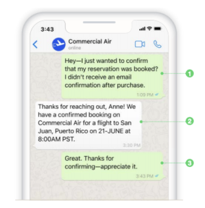
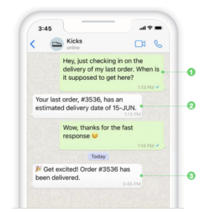
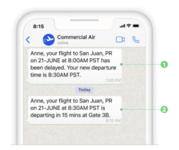
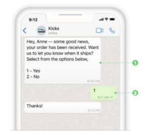

Starting February 1, 2022, WhatsApp will switch from a notification-based pricing model to a conversation-based pricing
model. Businesses will no longer be charged for sent notifications, instead, they will be charged per conversation. See
how it works below for more information.

## Terms & Definitions
<table className='bordered'>
  <tr>
    <td>Conversation</td>
    <td>A session that occurs between businesses and users within 1x24 hours. Conversation via WhatsApp can be initiated by both businesses and users.</td>
  </tr>
  <tr>
    <td>User-Initiated Conversation</td>
    <td>A conversation initiated by a user to a business. This session starts when the business responds to the first message from a customer within 1x24 hours, either using an automated chatbot or an agent manually via the omnichannel dashboard. If the business replies to messages more than 1x24 hours from the user's first message, then the session will be considered a Business Initiated Conversation.</td>
  </tr>
  <tr>
    <td>Business-Initiated Conversation</td>
    <td>A conversation initiated by a business to a user, usually in the form of a notification template message (formerly known as a Template Message) or a message used to follow up on a User-Initiated Conversation that has lasted more than 1x24 hours. This session will be open for 1x24 hours starting from the first message sent by the business, and in that session, the business is only charged for one session even if it sends more than one message template.</td>
  </tr>
  <tr>
    <td>Kata Business Dashboard</td>
    <td>Product of Kata.ai for WhatsApp Business Platform management (formerly called WhatsApp Business API/WABA). Businesses can register, purchase credit independently, as well as perform uses such as number verification, submission and sending of template messages, and monitoring usage of purchased credits.</td>
  </tr>
  <tr>
    <td>Credit</td>
    <td>Represents the right to a number of conversations that are paid in advance, in the form of pulses in the amount of Rupiah currency, which can be reduced by the unit price of User-Initiated Conversations and/or Business-Initiated Conversations.</td>
  </tr>
  <tr>
    <td>Top-Up Credit</td>
    <td>a system of adding credit in bulk or wholesale paid in advance.</td>
  </tr>
  <tr>
    <td>Top-Up Pricing Tier</td>
    <td>Fee structuring system for top-up credit, where purchases with a larger value will get a bigger discount.</td>
  </tr>
</table>

## How It Works

WhatsApp Business API conversations fall into two different priced categories:

1. **User-initiated**, such as customer service and general inquiries (Inbound).
2. **Business-initiated**, such as notifications and notifications (Outbound).

All conversations or “Conversations” are measured in 24-hour increments, also known as “Sessions”, which start each time
the first message is delivered by the business. The first message can be a response to a user question or a
business-initiated message template that is being delivered.

Charges for conversations are based on the end user's phone number. Rates for business-initiated and user-initiated
conversations vary by market (country or region). See Rates for specific pricing information.

The first 1,000 conversations each month will be free, so your business can start building experiences your customers
will love before they have to pay. In addition, conversations will not be charged when a user sends a message to a
business using the call-to-action button on an Ad that clicks into WhatsApp or a Facebook Page CTA.

## Scenarios
*Disclaimer: This scenario is based on The Official Facebook documentation. The complete scenario can be found [here](https://developers.facebook.com/docs/whatsapp/pricing/conversationpricing).*

For the following scenarios, we will use a user named Anne Budianto, a Commercial Air (airline) customer, and Kicks (an
online shoe retailer).

Anne prefers to use WhatsApp to message businesses as it is the fastest way to get the support and information she
needs. Commercial Air and Kicks know that many of their customers prefer to connect via WhatsApp, so they are ready to
answer questions or send important updates via message.

#### 1. User-Initiated Conversation (UIC)

1.a. Illustrated Scenario 1

**Scenario 1: User/customer service or general support questions in one 24-hour conversation session.**
1. Our user, Anne Budianto, messaged Commercial Air with a question about an upcoming reservation. When a Commercial Air
   reply message is sent, a 24-hour conversation session will start.
2. In this scenario, all additional messages are free within a 24-hour session. This encourages Commercial Air to follow
   up with support questions in a timely manner while giving users the ability to exchange as many messages as needed to
   resolve issues in a 24-hour session.
3. If Commercial Air continues to exchange messages with Anne after the initial 24-hour conversation session has ended,
   they will be charged for the new conversation. They will also be asked to send a message template to start a new
   conversation if it has been more than 24 hours since Anne's last message, which will be charged as a
   business-initiated conversation.
In this scenario, Anne gets the info she needs about her reservation and Commercial Air pays for a single user-initiated
conversation.

Cost: **IDR 320**, for 1 UIC

1.b. Illustrated Scenario 2

**Scenario 2: A user/customer-initiated conversation that leads to two conversations with a Message Template.**
1. Anne wanted to check on an order she had made with Kicks, an online shoe retailer. He did it at 13:13.
2. Kicks have a bot set up to reply to basic order inquiries and respond to Anne with delivery details at 13:13.
3. As a follow-up the next day, the Kicks bot notified Anne that her order had shipped at 3:45 p.m.
In this scenario, Kicks pays for one user-initiated conversation and one business-initiated conversation.
Cost: **IDR 820**, for 1 UIC & 1 BIC

#### 2. Business-Initiated Conversation (UIC)

2.a. Illustrated Scenario 3

**Scenario 3: Business initiates sending notification messages using Message Templates.**
1. When a flight is delayed or its status changes, Commercial Air notifies customers who have chosen to receive notifications using message templates.
2. Two message templates sent in one 24-hour conversation session result in one business-initiated conversation fee.
In this scenario, Commercial Air wants to inform Anne that her flight is delayed by 30 minutes.
Commercial Air will charge for one business-initiated conversation for sending these two message templates to Anne in a 24-hour conversation session.
Cost: **IDR 500**, for 1 BIC

2.b. Illustrated Scenario 4

**Scenario 4: The business initiates a conversation that leads to a two-way conversation with the user/customer.**
1. When a customer places a new order from Kicks, the online retailer sends a text message to confirm the order has been received and asks the customer if they would like to receive a notification when the order is shipped.
2. The customer selects Yes and chooses to receive additional order notifications.
In this scenario, Kicks pays for one conversation initiated by the business.

If the user replies more than 24 hours after sending the initial business message and is followed by a business reply, it will result in a new conversation initiated by the user.

Cost: 
a. **IDR 500**, for 1 BIC, if the user does not reply to the message. 
b. **IDR 500**, for 1 BIC, if the user replies within 1x24 hours. 
c. **IDR 820**, for 1 BIC & 1 UIC, if the user replies after 1x24 hours. 

These are four common conversation scenarios between businesses and users. If you still have questions regarding the
comparison of the scenarios above, not limited to other possibilities that can occur between business and user
conversations, please contact the Kata.ai team to discuss it further.

## Pricing
The pricing scheme continues to use the credit system with a top-up in bulk. Imagine buying a prepaid cell phone number that will be reduced by Business-Initiated Conversation and/or User-Initiated Conversation according to the number of conversations initiated by businesses and users.

Don't worry because no major changes have occurred. We only convert credit purchases that previously used the number of messages to be sent, into Rupiah currency values ​​that can be used for the existing types of conversations. The tiering system still applies, the more credits you buy, the bigger the discount you get.

To accommodate changes in pricing schemes that occur, said the Business Dashboard to be updated to make it easier to use and monitor credit and the amount of usage. The latest update will be released on February 1, 2022, along with the price changes of the WhatsApp Business API.

#### 1. IDR, for Indonesian Numbers Only
<table className='pricing-table'>
    <thead>
        <tr>
            <th>Conversation Type</th>
            <th>Price, IDR (per Conversation)</th>
        </tr>
    </thead>
    <tbody>
        <tr>
            <td>Business-Initiated Conversation</td>
            <td>IDR 500</td>
        </tr>
        <tr>
            <td>User-Initiated Conversation</td>
            <td>IDR 320</td>
        </tr>
    </tbody>
</table>

<table className='pricing-table'>
    <thead>
        <tr>
            <th>Top-Up Credit (IDR)</th>
            <th>Discount (%)</th>
            <th>Discount (IDR)</th>
            <th>Final Price (IDR)</th>
        </tr>
    </thead>
    <tbody>
        <tr>
            <td>IDR 5,000,000</td>
            <td>2.00%</td>
            <td>IDR 100,000</td>
            <td>IDR 4,900,000</td>
        </tr>
        <tr>
            <td>IDR 20,000,000</td>
            <td>3.00%</td>
            <td>IDR 600,000</td>
            <td>IDR 19,400,000</td>
        </tr>
        <tr>
            <td>IDR 50,000,000</td>
            <td>4.00%</td>
            <td>IDR 2,000,000</td>
            <td>IDR 48,000,000</td>
        </tr>
        <tr>
            <td>IDR 100,000,000</td>
            <td>5.00%</td>
            <td>IDR 5,000,000</td>
            <td>IDR 95,000,000</td>
        </tr>
    </tbody>
</table>

#### 2. IDR, for Non-Indonesian Numbers
Prices for credit deductions from and for non-Indonesian numbers can be seen on: https://developers.facebook.com/docs/whatsapp/pricing/conversationpricing#cost-per-conversation-in-idr with a small round-up to the next dollar, plus an additional BSP Fee of **+IDR 50** for both types of messages on WhatsApp, namely User-Initiated Conversation and Business-Initiated Conversation.

Example:

a. User-Initiated Conversation from Germany number 
Cost: IDR 1,169.20 
Round-up: IDR 1,170 
BSP Fee of IDR 50 = **IDR 1,220**

b. Business-Initiated Conversation sent to a German number 
Cost: IDR 1,948.66 
Round-up: IDR 1,949 
BSP Fee of IDR 50 = **IDR 1,999**

**<u>Final Price for Non-Indonesian Countries:</u>**
<table className='pricing-table'>
    <thead>
        <tr>
            <th>Country</th>
            <th>User-Initiated Conversation (IDR)</th>
            <th>Business-Initiated Conversation (IDR)</th>
        </tr>
    </thead>
    <tbody>
      <tr>
        <td>Argentina</td>
        <td>IDR 501</td>
        <td>IDR 801</td>
      </tr>
      <tr>
        <td>Brazil</td>
        <td>IDR 479</td>
        <td>IDR 764</td>
      </tr>
      <tr>
        <td>Chile</td>
        <td>IDR 699</td>
        <td>IDR 1,131</td>
      </tr>
      <tr>
        <td>Colombia</td>
        <td>IDR 136</td>
        <td>IDR 193</td>
      </tr>
      <tr>
        <td>Egypt</td>
        <td>IDR 969</td>
        <td>IDR 1,582</td>
      </tr>
      <tr>
        <td>France</td>
        <td>IDR 1,277</td>
        <td>IDR 2,095</td>
      </tr>
      <tr>
        <td>Germany</td>
        <td>IDR 1,220</td>
        <td>IDR 1,999</td>
      </tr>
      <tr>
        <td>India</td>
        <td>IDR 107</td>
        <td>IDR 145</td>
      </tr>
      <tr>
        <td>Israel</td>
        <td>IDR 307</td>
        <td>IDR 479</td>
      </tr>
      <tr>
        <td>Italy</td>
        <td>IDR 601</td>
        <td>IDR 968</td>
      </tr>
      <tr>
        <td>Malaysia</td>
        <td>IDR 364</td>
        <td>IDR 1,095</td>
      </tr>
      <tr>
        <td>Mexico</td>
        <td>IDR 200</td>
        <td>IDR 548</td>
      </tr>
      <tr>
        <td>Netherlands</td>
        <td>IDR 1,322</td>
        <td>IDR 2,170</td>
      </tr>
      <tr>
        <td>Nigeria</td>
        <td>IDR 493</td>
        <td>IDR 788</td>
      </tr>
      <tr>
        <td>Pakistan</td>
        <td>IDR 253</td>
        <td>IDR 726</td>
      </tr>
      <tr>
        <td>Peru</td>
        <td>IDR 307</td>
        <td>IDR 904</td>
      </tr>
      <tr>
        <td>Russia</td>
        <td>IDR 618</td>
        <td>IDR 997</td>
      </tr>
      <tr>
        <td>Saudi Arabia</td>
        <td>IDR 329</td>
        <td>IDR 514</td>
      </tr>
      <tr>
        <td>South Africa</td>
        <td>IDR 291</td>
        <td>IDR 451</td>
      </tr>
      <tr>
        <td>Spain</td>
        <td>IDR 577</td>
        <td>IDR 928</td>
      </tr>
      <tr>
        <td>Turkey</td>
        <td>IDR 93</td>
        <td>IDR 193</td>
      </tr>
      <tr>
        <td>United Arab Emirates</td>
        <td>IDR 321</td>
        <td>IDR 502</td>
      </tr>
      <tr>
        <td>United Kingdom</td>
        <td>IDR 604</td>
        <td>IDR 974</td>
      </tr>
      <tr>
        <td>North America*</td>
        <td>IDR 176</td>
        <td>IDR 260</td>
      </tr>
      <tr>
        <td>Rest of Africa*</td>
        <td>IDR 568</td>
        <td>IDR 1,775</td>
      </tr>
      <tr>
        <td>Rest of Asia Pacific*</td>
        <td>IDR 370</td>
        <td>IDR 1,114</td>
      </tr>
      <tr>
        <td>Rest of Central &amp; Eastern Europe*</td>
        <td>IDR 408</td>
        <td>IDR 1,242</td>
      </tr>
      <tr>
        <td>Rest of Latin America*</td>
        <td>IDR 655</td>
        <td>IDR 1,058</td>
      </tr>
      <tr>
        <td>Rest of Middle East*</td>
        <td>IDR 362</td>
        <td>IDR 1,088</td>
      </tr>
      <tr>
        <td>Rest of Western Europe*</td>
        <td>IDR 617</td>
        <td>IDR 1,940</td>
      </tr>
      <tr>
        <td>Other*</td>
        <td>IDR 257</td>
        <td>IDR 740</td>
      </tr>
    </tbody>
</table>

**<u> * Rest of Non-Indonesian Country Groups:</u>**
<table className='bordered'>
    <tbody>
        <tr>
            <td>
                <b>North America:</b> 
                Canada 
                United States  
                <b>Rest of Africa:</b> 
                Algeria 
                Angola 
                Benin 
                Botswana 
                Burkina Faso 
                Burundi 
                Cameroon 
                Chad 
                Congo 
                Eritrea 
                Ethiopia 
                Gabon 
                Gambia 
                Ghana 
                Guinea-Bissau 
                Ivory Coast 
                Kenya 
                Lesotho 
                Liberia 
                Libya 
                Madagascar 
                Malawi 
                Mali 
                Mauritania 
                Morocco 
                Mozambique 
                Namibia 
                Niger 
                Rwanda 
                Senegal 
                Sierra Leone 
                Somalia 
                South Sudan 
                Sudan 
                Swaziland 
                Tanzania 
                Togo 
                Tunisia 
                Uganda 
                Zambia 
            </td>
            <td>
                <b>Rest of Asia Pacific:</b> 
                Afghanistan 
                Australia 
                Bangladesh 
                Cambodia 
                China 
                Hong Kong 
                Japan 
                Laos 
                Mongolia 
                Nepal 
                New Zealand 
                Papua New Guinea 
                Philippines 
                Singapore 
                Sri Lanka 
                Taiwan 
                Tajikistan 
                Thailand 
                Turkmenistan 
                Uzbekistan 
                Vietnam  
                <b>Rest of Central & Eastern Europe:</b> 
                Albania 
                Armenia 
                Azerbaijan 
                Belarus 
                Bulgaria 
                Croatia 
                Czech Republic 
                Georgia 
                Greece 
                Hungary 
                Latvia 
                Lithuania 
                Macedonia 
                Moldova 
                Poland 
                Romania 
                Serbia 
                Slovakia 
                Slovenia 
                Ukraine 
            </td>
            <td>
                <b>Rest of Latin America:</b> 
                Bolivia 
                Costa Rica 
                Dominican Republic 
                Ecuador 
                El Salvador 
                Guatemala 
                Haiti 
                Honduras 
                Jamaica 
                Nicaragua 
                Panama 
                Paraguay 
                Puerto Rico 
                Uruguay 
                Venezuela  
                <b>Rest of Middle East:</b> 
                Bahrain 
                Iraq 
                Jordan 
                Kuwait 
                Lebanon 
                Oman 
                Qatar 
                Yemen  
                <b>Rest of Western Europe:</b> 
                Austria 
                Belgium 
                Denmark 
                Finland 
                Ireland 
                Norway 
                Portugal 
                Sweden 
                Switzerland  
                <b>Other:</b> 
                All other countries not listed 
                in the above regions or 
                specifically listed in the above tables 
            </td>
        </tr>
        <tr></tr>
    </tbody>
</table>

## Credit Carry Over Policy
For loyal Kata.ai customers and our partners who still have a credit balance from purchases before replacement and price negotiations. Credit from your business can be converted and can still be valid until the expiration limit of the top-up purchase in the previous period.

Example:
Remaining credit 100,000 Template Message * IDR 400 (old price) = **IDR 40,000,000** remaining credit that can be converted into conversations.
Remaining credit IDR 40,000,000 / IDR 500 (new price) = **80,000** Total Business-Initiated Conversation
Remaining credit IDR 40,000,000 / IDR 320 (new price) = **125,000** Total User-Initiated Conversation

The deduction for Business-Initiated Conversation and User-Initiated Conversation will use the new prices listed in point 1 above.

For other topics that have not been discussed in this notification letter or for further questions regarding this price plan change, please contact your consultant for further clarification or contact sales@kata.ai
