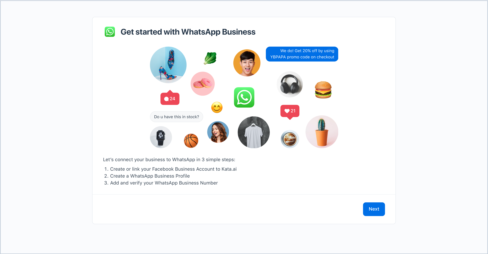
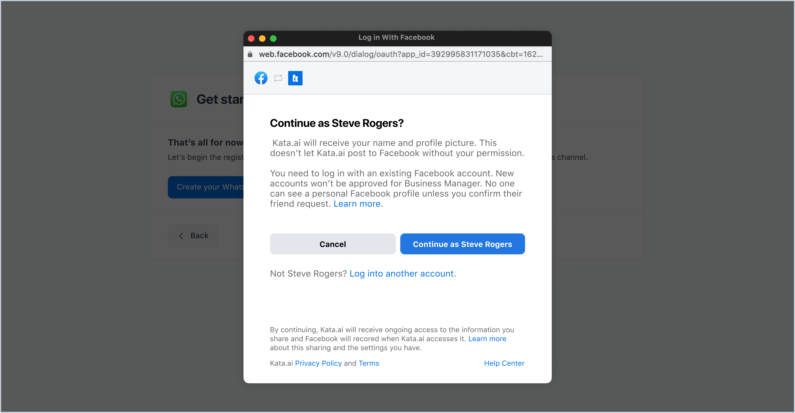
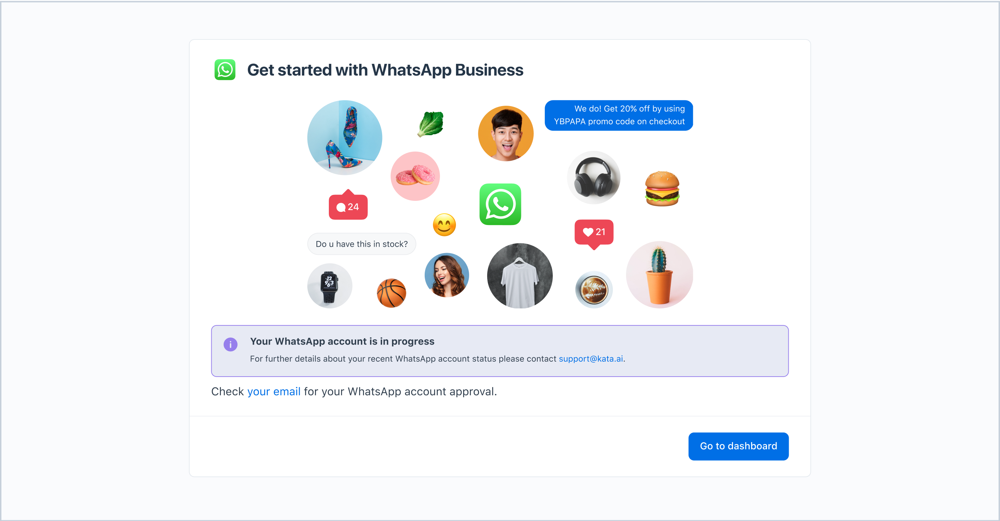

Watch the video tutorial below on how to sign up and log in to your Business Dashboard, as well as on how to register your WhatsApp Business Account.

<iframe width="560" height="315" src="https://www.youtube.com/embed/jNTAPD5cou0" title="YouTube video player" frameborder="0" allow="accelerometer; autoplay; clipboard-write; encrypted-media; gyroscope; picture-in-picture" allowfullscreen></iframe>

### Sign Up for WhatsApp Business Dashboard

Create your account to start using WhatsApp Business Dashboard

1. Go to Kata.ai business dashboard site at  [https://business.kata.ai/](https://business.kata.ai/)

2. Click the **Sign Up** link at the bottom page to create an account.

3. Fill in your details and create a password. Once you have filled in all your details, click the **Sign Up** button. A verification email will be sent to your registered email address.  

4. Complete your registration by clicking the verification button on the email sent to your inbox.

### Log in to WhatsApp Business Dashboard

1. Open [https://business.kata.ai/](https://business.kata.ai/) on your browser. Fill in your **Email** and **Password**. Click the checkbox to verify the captcha, and click on the **Login** button.

2. When the login is successful, you will be directed to the **Get Started** page to register your WhatsApp business account.

### Register Your WhatsApp Business Account

1. After your first **Login**, you will see the **Get Started** page, which points out the steps to register for a WhatsApp business account. Click **Next**.

2. On step 1 of 3, we make sure you have a Facebook account as it is required by WhatsApp. If you don’t have a Facebook account, click the **create one** link and follow the steps. If you already have one, tick the checkbox and click **Next**.
  
To register your WhatsApp Business Account, you also have to have access to your company's Facebook Business Manager. If your company does not have a Facebook Business Manager account yet, the next steps will direct you to create one. 

3. On step 2 of 3, you will find information on the type of phone number eligible for a WhatsApp business account. Once you have read and understood the information, tick the checkbox and click **Next**.

4. On the next page (step 3 of 3), click the **Create your WhatsApp channel** button and follow the registration steps from Facebook.

5. Once you have completed the registration process, your request will be reviewed by Facebook for approval. Once your account is approved, you will be notified through your email and all of the WhatsApp Dashboard features will be unlocked. You can also start using the registered number to send messages after it is approved.
 
While waiting for your account’s approval, you can send a trial message using our trial experience feature without requiring approval or payment. 

