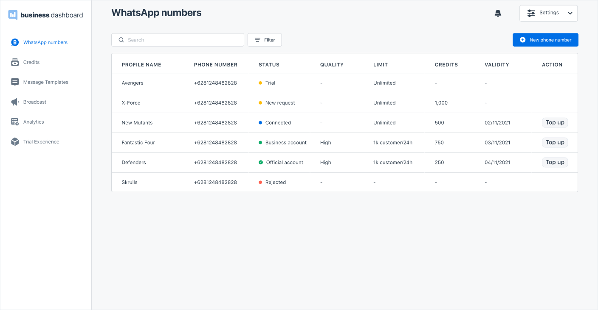

In WhatsApp Business Dashboard, you can connect multiple WhatsApp accounts to the dashboard.

1. To connect a new phone number, Go to the **WhatsApp Numbers** page by clicking from the left side navigation.

2. Click the **+ New Phone Number** button and follow the registration steps from Facebook.

3. Once you have completed the registration process, your request will be reviewed by Facebook for approval. You can only use the registered number to send messages after it is approved. You will be notified through your email once your account is approved. Alternatively, see the WhatsApp number status on the data table on the **WhatsApp Numbers** page.

> WhatsApp Numbers page. You can add a new phone number and see the list of WhatsApp numbers that are registered to your Business Dashboard acount with the details.

#### WhatsApp Number Status

For every registered WhatsApp number, you will see a status on the WhatsApp Numbers page. Here’s what the status means:

<table className='bordered'>
  <tr>
    <td>Trial</td>
    <td>You have successfully registered a new WhatsApp number to your WhatsApp Business Account (WABA) for the first time and waiting for verification from Facebook. You can send a sample message with the trial experience feature.</td>
  </tr>
  <tr>
    <td>New Request</td>
    <td>You have successfully registered another new WhatsApp number and waiting for verification from Facebook.</td>
  </tr>
  <tr>
    <td>Connected</td>
    <td>Your WhatsApp number is verified by Facebook and waiting for two-factor verification from Kata.ai. </td>
  </tr>
  <tr>
    <td>Business Account</td>
    <td>Your WhatsApp number is verified by Facebook and Kata.ai and can be used to create and broadcast messages.</td>
  </tr>
  <tr>
    <td>Official Account</td>
    <td>Your WhatsApp number is upgraded from a business account to an official account.</td>
  </tr>
  <tr>
    <td>Rejected</td>
    <td>Your request for connecting a new phone number has been rejected by WhatsApp. In this case, the following may be the case:
    <ul>
      <li>Your number has been registered to WhatsApp</li>
      <li>Your number has expired</li>
      <li>Your display name does not comply with <a href="https://developers.facebook.com/docs/whatsapp/guides/display-name">guidelines</a> from Facebook</li>
    </ul>
    </td>
  </tr>
</table>
