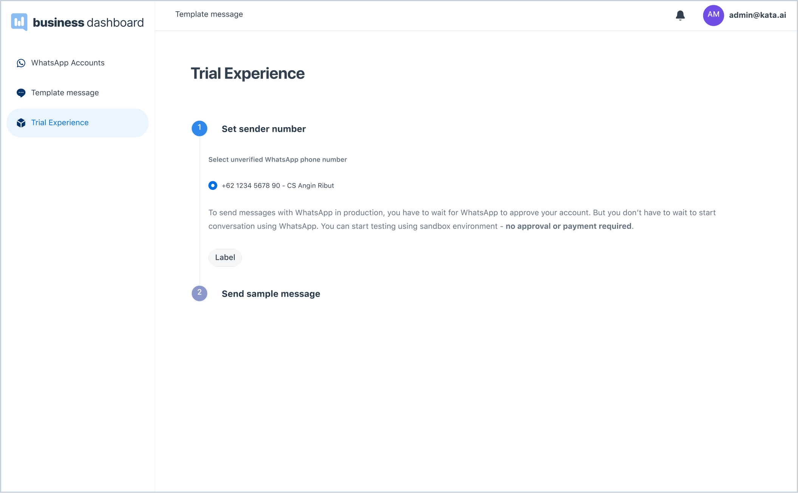

Before sending real messages to your audiences, you can send a trial message with the **Trial Experience** feature for free and without requiring approval. This trial is available only for first-time registration with a WhatsApp Business account. Any additional phone number needs to wait until the business is verified.

1. Go to the **Trial Experience** page by clicking from the left-side navigation.

2. Select the WhatsApp phone number you wish to send the message from and hit the **Next** button.

3. Input the recipient WhatsApp number you wish to send the message to and click **Send Sample Message**. Shortly, the recipient(s) will receive the sample message. You can send to maximum two recipients with a total up to ten messages per day.

> Trial Experience page
