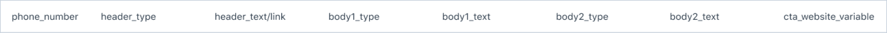
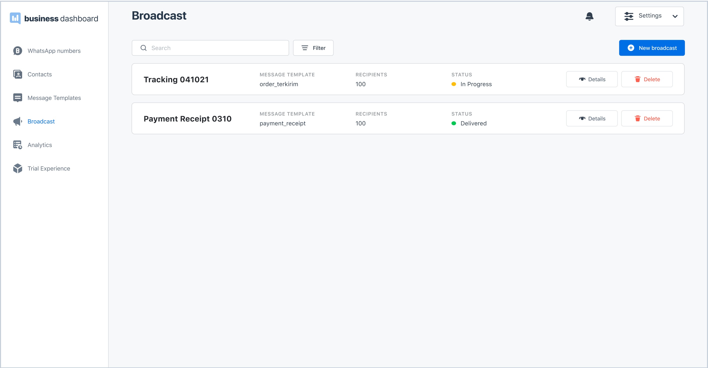

Once you have an approved message template, you can use it to send messages to your audience using the broadcast feature in our dashboard.

You can watch our video tutorial below to learn how to broadcast a template message.

<iframe width="560" height="315" src="https://www.youtube.com/embed/smbHZW5qsIk" title="YouTube video player" frameborder="0" allow="accelerometer; autoplay; clipboard-write; encrypted-media; gyroscope; picture-in-picture" allowfullscreen></iframe>

### How to Broadcast a Template Message

1. Go to the **Broadcast** page by clicking from the left side navigation, and click **+New Broadcast** on the top right of the page.

2. Type in the broadcast name and select the WhatsApp number that you want to send the messages from. Make sure you have enough broadcast credit to broadcast to all of your audience.

3. Choose a message template. The field Type and Language will change according to the content of the selected message template. If a message template has more than one language content, you will be able to select the language in the language field.

4. Upload a CSV file that contains the content of the template message you have chosen. Make sure you create the CSV file in the correct format. To learn more about how to create the CSV file, read the section Example Case for Creating a CSV File below.

5. Once all the details are filled in and the uploaded CSV file passes the checking (See section Error on CSV Upload), the send broadcast button will be enabled by changing the color from grey to blue. Click Send Broadcast.

#### Example Case for Creating a CSV File

Let’s take a look at how to make a CSV file for an example content below:

Assume this message template has a "visit a website" CTA button with a dynamic URL. In the CSV file, you have to make a column for the variable URL.

To create the CSV from example above, make columns with the following names in excel:

The example content above has two variables in the body content. In the excel, make columns body1_type and body1_text to input the content for variable {{1}} and columns body2_type and body3_text to input the content for variable {{2}}. There will be more body#_type and body#_text columns following the number of variables in the body section.

After making the column names, fill in the contents for each column like the example below:

Make sure you fill all the contents correctly to ensure the message is sent successfully. Once you are done filling the contents, **save** your excel document as a CSV and your CSV is ready for upload.

To see the full format guideline on creating a CSV file, please refer to the document [here](https://see-spaces.sgp1.digitaloceanspaces.com/business-dashboard/How%20to%20upload%20broadcast%20template%20message.pdf). You can also download the CSV template example [here](https://docs.google.com/spreadsheets/u/0/d/19MhdnZLytmh4iB5J-EVWYLhRrq6WcAYqkoe0jcOW3IU/edit). Note that if you would like to use the template example for broadcast, you still need to revise the template according to the format of the message template you are about to send.

#### Error on CSV Upload

If your CSV upload returns a warning, you can’t proceed to send a broadcast. Let’s take a look at the warnings and what you can do to solve the problem.

<table className='bordered'>
<thead>
<tr>
    <th>Warning Message</th>
    <th>Solution</th>
</tr>
</thead>
<tbody>
  <tr>
    <td>Your CSV file size must not exceed 10 MB</td>
    <td>Compress your CSV file size and reupload </td>
  </tr>
  <tr>
    <td>Your CSV file is incompatible with the chosen template message, please check your parameters. </td>
    <td>Make sure the column fields and their names are correct and match with the variables in the selected message template</td>
  </tr>
</tbody>
</table>

### View Your Broadcast

After you send a broadcast, your broadcast is listed on the **Broadcast** page. Here are the things you can see or do on the **Broadcast** page:

> Broadcast page

#### Broadcast Status

After a broadcast message has been submitted, the status will show **In progress**. Once the broadcast has been sent to all audiences, the status will be changed to **Sent**.

#### Broadcast Details

Broadcast details allow you to see the contents of the messages you have broadcasted and the analytics of the number of messages sent, read, and failed to send.

To view a broadcast detail, choose the broadcast that you want to see the details, and click the **Details** button on the right column.

You can find the information on a broadcast message under the **"Broadcast details"** title. On the right column, you’ll see a broadcast report that shows the status of the broadcasted messages. Here’s what the status means:

<table className='bordered'>
  <tr>
    <td>Delivered</td>
    <td>The message is sent but has not been opened by the recipient yet or the recipient might have read the message, but has the read receipt turned off.   </td>
  </tr>
  <tr>
    <td>Read</td>
    <td>The recipient has read the message.</td>
  </tr>
  <tr>
    <td>Failed</td>
    <td>The message was not sent to a recipient. In this case, the following may be the case:
      <li>Recipients do not activate WhatsApp on their device.</li>
      <li>Recipients have expired/invalid numbers.</li>
      <li>Error in CSV due to too much recipients (we recommend capping recipients at 10,000 per broadcast)</li>
      <li>Your phone number has reached its daily sending limit.</li>
      <li>Your phone number got restricted by Facebook.</li>
    </td>
  </tr>
</table>

#### Delete Broadcast

If you want to delete a submitted broadcast, select the broadcast you want to delete and click the **"Delete"** button on the right column.

## Helpful Tips on Broadcast

1. Ensure opt-in is obtained to avoid surprising your customers when these messages are sent. If opt-in was previously obtained for just transactional notifications, consider sending an update that notifications may now include additional types of notifications, like promotions, and provide clarity on how to opt-out.

2. Leverage data to segment and target specific audiences with various marketing messages.

3. If running a campaign, kick off with a small volume, gather learnings, and make adjustments as needed before ramping up volumes.

4. Monitor quality metrics, like phone-level quality scores (green, yellow, red) available in the Business Manager UI and via API.
