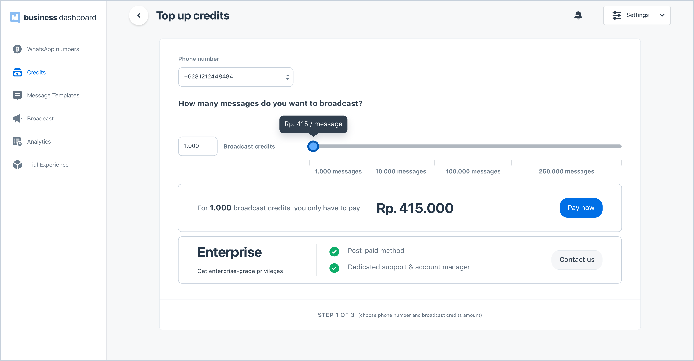
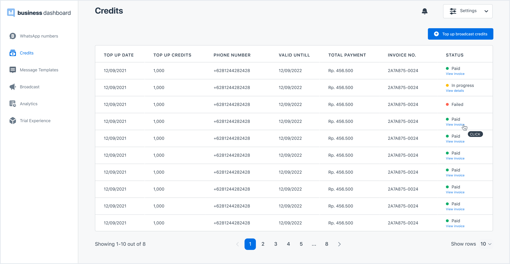

To send messages to your audiences, you have to use Broadcast credit. In your dashboard you will see a credit template message balance, one (1) credit represents one (1) template message sent to your client. Cost per template message credit is determined by the different volume of credits you purchased (self-payment) or commercial agreement (for enterprise).

You can see the remaining broadcast credit of a phone number connected to your business dashboard on the **Whatsapp Numbers** page. You can also top up broadcast credits from the business dashboard.

### Top Up WhatsApp Credit

> Top up credit

1. On the **WhatsApp Numbers** page, look for the WhatsApp number that you want to add the credits to, and click the **top up** button on the right side of the row. Alternatively, go to the **Credits** page and click the **Top up broadcast credits** button.

2. You will be directed to the **Top Up Credits** page. Select the correct phone number and input or slide the slider to the number of credits you want to purchase. You will see the total amount you need to pay. To proceed, click **Pay Now**.

3. The page will show the summary of your purchase. Choose your preferred payment method, and click **next**.

    **Note on payment method:**  
    Currently, we are only receiving bank transfer payments through BCA and BNI Virtual Accounts. For a BCA virtual account, we can only receive payments from a BCA account. To make payments from other bank accounts, choose a BNI virtual account as the payment method.

4. Transfer the payment to the virtual account number listed. Once the payment has been completed, you will receive a confirmation on the dashboard and your email along with the invoice. Note that you only have 24 hours to complete the payment before the session expires.

### WhatsApp Credit History

To view your ongoing and past WhatsApp credit purchases and their status, go to the **Credits** page. Here, you can also download the invoice for each of your purchases by clicking the view **invoice.**

> WhatsApp Credit History
