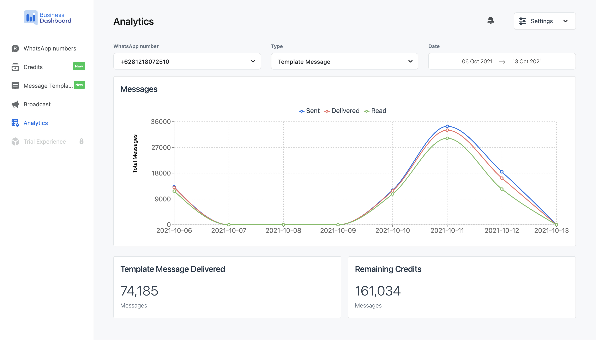

> Analytics page

The WhatsApp Business Dashboard has an analytics feature to view the remaining credits, the number of template messages delivered, sent, and read, and the total credits spent on sending template messages for a set period of time. To access this feature, go to the Analytics page.

Choose a WhatsApp number, type of message, and range of date. The data will be shown accordingly.
