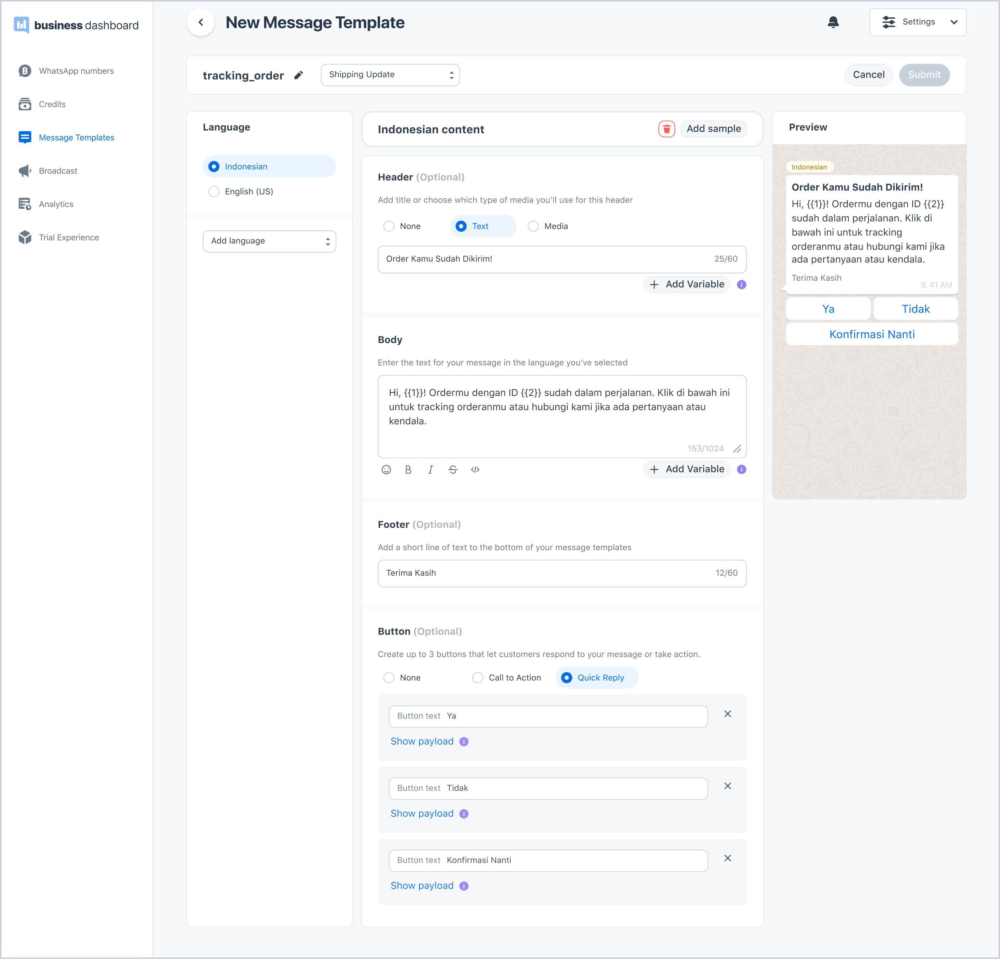
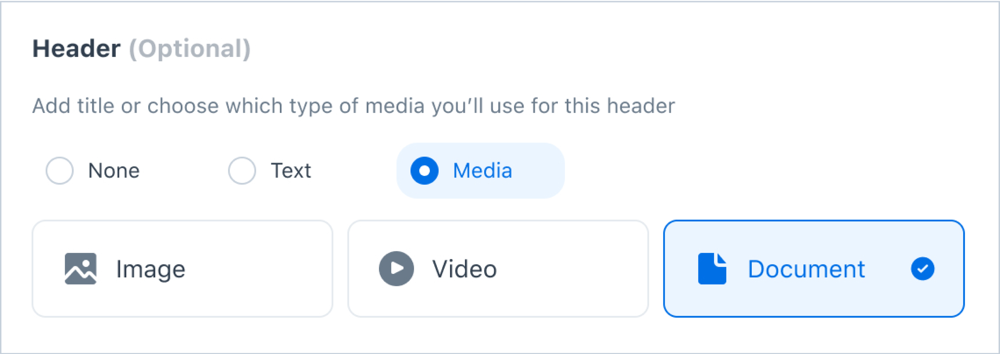
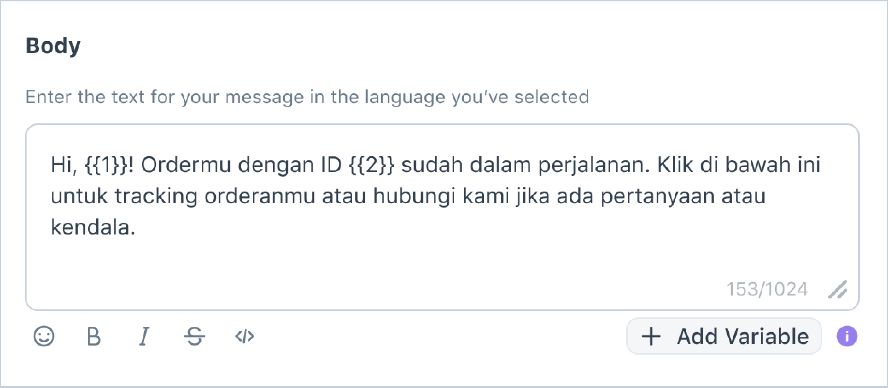
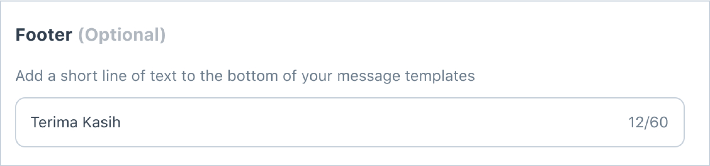
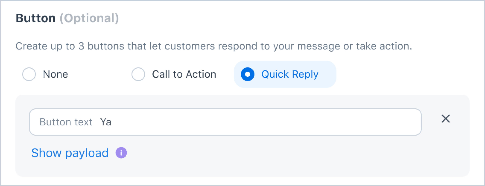
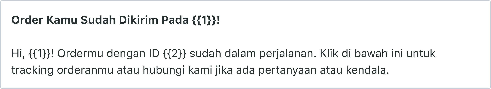
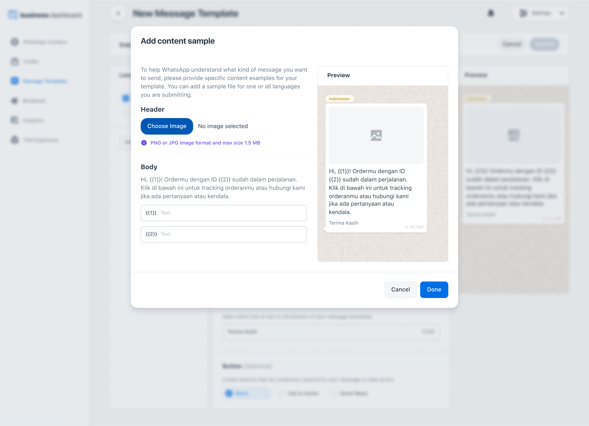

## What is a Message Template?
WhatsApp Message Templates are specific message formats that your business can use to send out notifications, alerts, and customer care messages to people who have opted-in to receive WhatsApp messages. Before it can be sent to your audience using the broadcast feature in Kata.ai’s Business Dashboard, your message template will be reviewed and should be approved by Facebook.

## WhatsApp Promotional Message
WhatsApp is a real game-changer for businesses seeking to deliver an exceptional customer experience. The company recently announced a significant change in its business messaging policy, introducing a promotional message template to Indonesia and Mexico.

WhatsApp overturned these restrictions with the following criteria:
- Businesses must have Indonesia or Mexico as the country setting in Business Manager to be eligible using the feature.
- Businesses must obtain opt-in* from target recipients in advance for sending all proactive notifications, including non-transactional notifications.

*Opt-in: Gained approval from end customers that they are willing to be contacted via WhatsApp for promotional purposes.

The example use cases for promotional messages include:
- **Re-engagement**: cart abandonment reminder, back in stock alert, time to reorder alert, and a reminder to book an appointment
- **Recommendations**: upsell and cross-sell product recommendations
- **General marketing**: promotional offers

## Create a New WhatsApp Message Template
Watch the video tutorial below to learn how to create a message template.

<iframe width="704" height="396" src="https://www.youtube.com/embed/fXY57qj5tlk" title="YouTube video player" frameborder="0" allow="accelerometer; autoplay; clipboard-write; encrypted-media; gyroscope; picture-in-picture" allowfullscreen></iframe>

1. Go to the **Message Template** page by clicking from the left side navigation, and click **+New Message** Template on the top right of the page.
2. Choose a category of your message template. For a non-promotional WhatsApp template message, you can choose any category based on your business needs and objectives. For promotional content, you have to set the category as **Account Update**.
3. Type in the name of the message template. The name can only be in lowercase alphanumeric characters (a-z, 0-9) and underscore *“*_*”*. Space, uppercase letters, and symbols are not allowed.
4. Choose the language of your message template. You can select more than one language to create a message template in multiple languages. Click **Next**.
5. Fill in all the required content fields for the languages you selected (see Message Template Content Structure section to get tips on how to fill the content). Once you fill all the required fields, click **Submit**. Your message template will be reviewed by Facebook, and you can check the status on the **Message Template page**. In the case of a rejected template message, you may reach out to our support team at [support@kata.ai](mailto:support@kata.ai).

## Message Template Content Structure

> Creating a message template

#### Header (optional)

A header can be a text or a media - image, video, or document. For a text header, the character limit is 60 characters and you can add a maximum of one variable (See variable section for more info).

#### Body

A body is where you add the content of your message. You can edit text formats, add emojis, and add variables (See variable section for more info). The character limit is 1.024 characters for the body section, with only letters, numbers, and emojis allowed. It shouldn’t have newlines, tabs, or more than four consecutive spaces.

#### Footer (optional)

A footer can be a closing sentence, or default info - such as an address, social media ID, email, etc. - about your company that you want to include in your message. For the footer section, the character limit is 60 characters.

#### Button (optional)

When creating a message template, you can choose to include one of the available buttons, **Call-to-Actions** (CTA) or **Quick Replies**.

> Call to action

A **call-to-action** button allows you to include your website URL and/or your business phone number so your audience can quickly visit your website or contact your business with a single tap. For the visit website URL button, you can choose a static or dynamic URL type. A dynamic URL type lets you personalize the website link by having a variable at the end of the link. The use case is for example when you want to inform a tracking order to your audiences.

A quick reply button lets your audience quickly reply to your message. You can create up to three quick reply buttons in a message template. When using quick reply, you have to define the payload for every button you created to return the correct reply when customers tap the buttons.

> Quick reply

#### Variable
Using variables in your message template is a way to personalize your message to your audience and to reuse your template message for different occasions. A variable is written in two enclosing curly brackets with a number inside a bracket, e.g.: {{1}}. It represents changing content and can be implemented in the text header and body content, as well as when you include a dynamic URL button on your message template.

Here is an example of using variables in a message:

You can use variables for cases such as when you want to mention your customers’ names, information on price, promoted items, promotion dates, location, etc. The contents for the variables should be provided in the CSV format when creating a new broadcast using a certain message template.

#### Sample Variable

> Add content sample popup

For all variables you created throughout your template message content, you have to add sample contents to help Facebook better understand the use case during the review process.
1. After you fill the message template form, click **add sample**.
2. A modal will appear. Fill in all the variable fields. You can also provide a sample for the media header (image, document, or video). After adding all samples, click **Done**.

## Message Template Best Practices

1. Template message with the floating parameters will not be approved by WhatsApp, please surround the parameter with context/information so it is clear what variable will be filled in the parameter.

    Example of floating parameter:
“Selamat datang di Toko Sejahtera {{1}}”

    In this example, there is no clear information on what variable will be inserted in parameter {{1}}
The CORRECT way to create the variable:

    i. “Nomor pesanan Anda: {{2}}”

    ii. “Berikut total pesanan Anda {{3}}”

2. Template with spelling mistakes will not be accepted, example:

    Instead of using two curly brackets, you mistakenly type the variable in one curly bracket

    Example:

    Correct: {{2}}, Wrong: {2}

    Please type the parameter based on sequenced numbers

    Example: {{1}}, {{2}}, {{3}}

3. ITemplate message contains potentially abusive/threatening content is not allowed:

    a. Threaten customers with a course of legal action will be rejected

    b. Threaten the customer if they don’t pay their loan will also be rejected
4. Additional best practice guidelines are outlined here.

