Facebook Messenger (commonly known as Messenger) is a messaging app and platform developed by Facebook. In this section, we will learn to connect our bot with Messenger. You can use the bot you created in the [Hello World tutorial](/tutorial/hello-world/) to start integrating your bot with Messenger.

## Create Messenger Channel in Kata Platform

First, login to Kata Platform and select the project that you want to integrate with Messenger. Then, go to the Deployment page by selecting “Deploy” > “Overview”. And then, click “New Deployment” to make a new deployment.

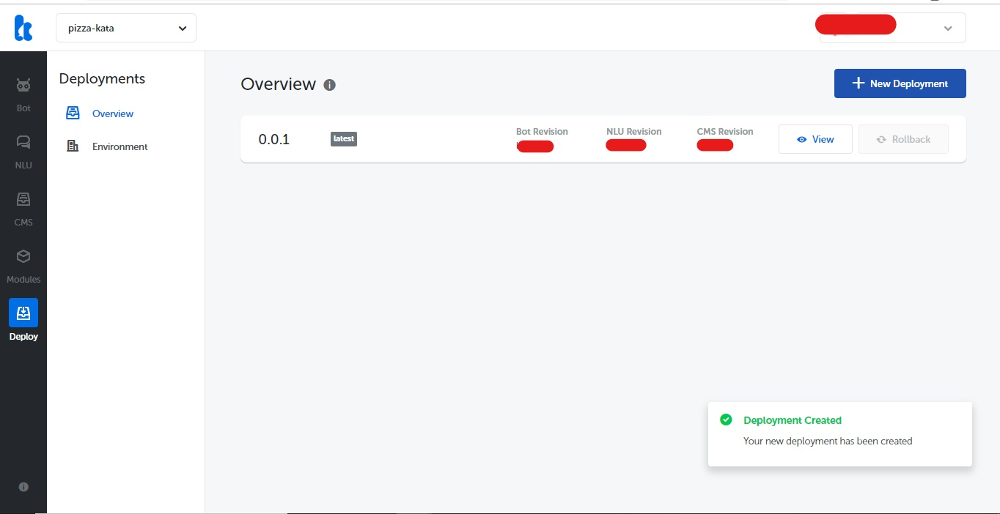

Move to Environment page. In the Environments screen, select your desired environment to create the Messenger channel.
Click “Create Channel”. You will now see the “Create Channel” screen. Insert the Deployment Version and Environment URL. Go to “+Create Channel” and select Messenger as the channel type. You can find the Page Access Token and App Secret in Facebook Developer.

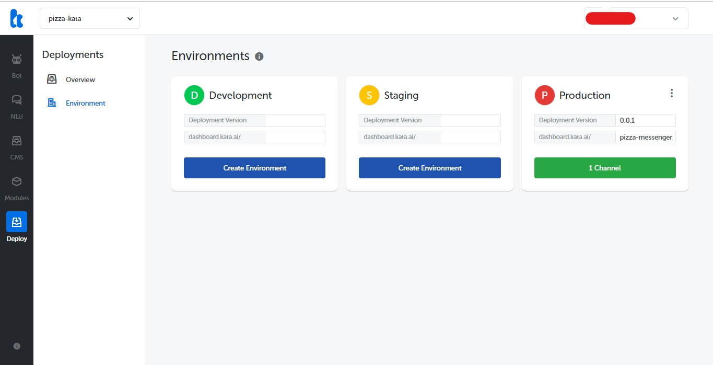

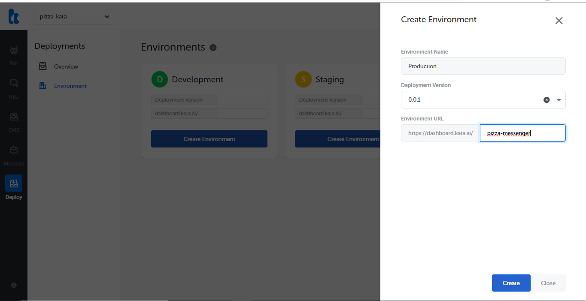

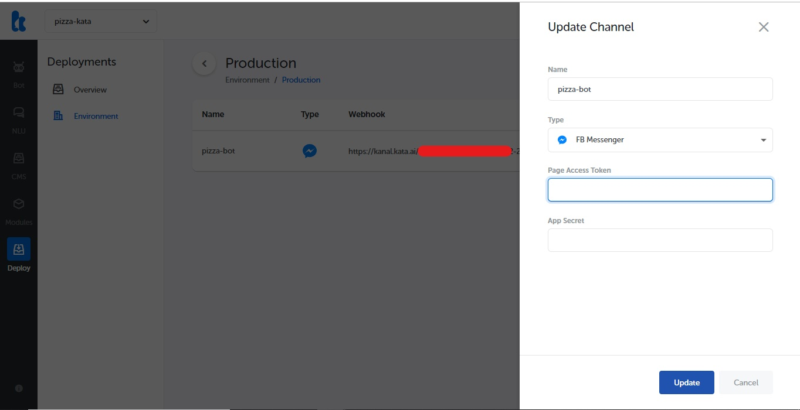

## Setup Webhook URL

First, you have to sign in (register first, if you don’t have a Facebook account) to https://developers.facebook.com/ and then, create a new app for your bot.

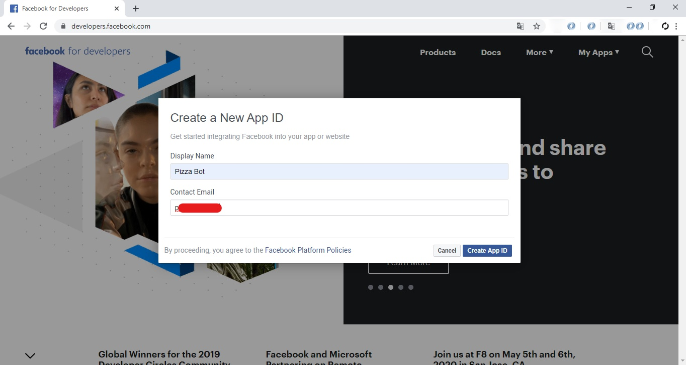

Go to “Messenger” → “Settings”.  You will see Access Tokens field. You need to add a Facebook Page. You can click “Create New Page” If you don’t have Page for your bot.

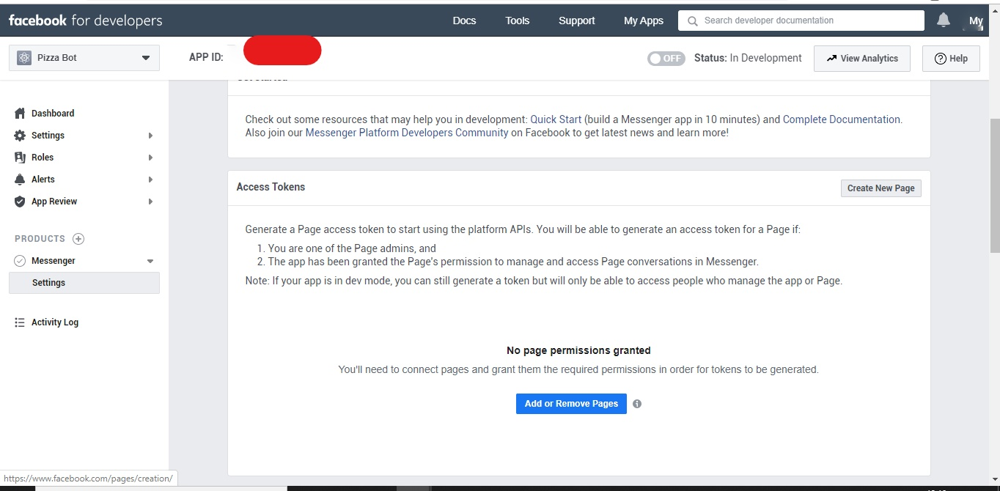

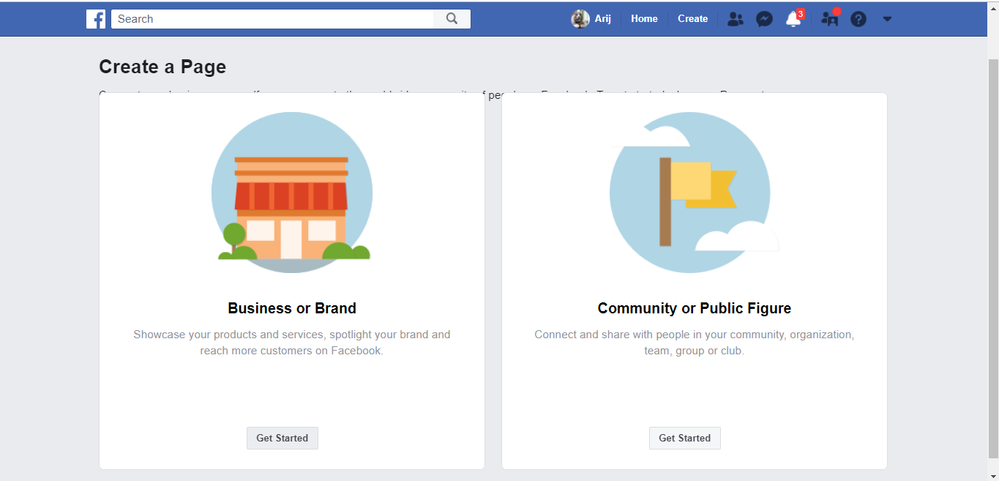

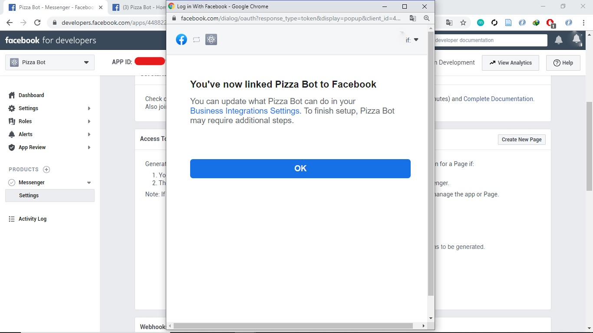

Click “Generate Token”. Here you can find the Access Token. Copy the Token and paste it to the new channel’s field in Kata Platform you’ve made before.

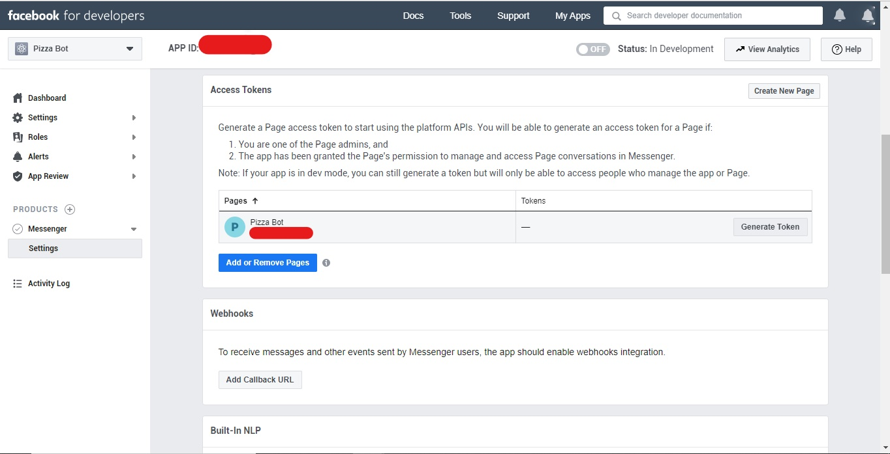

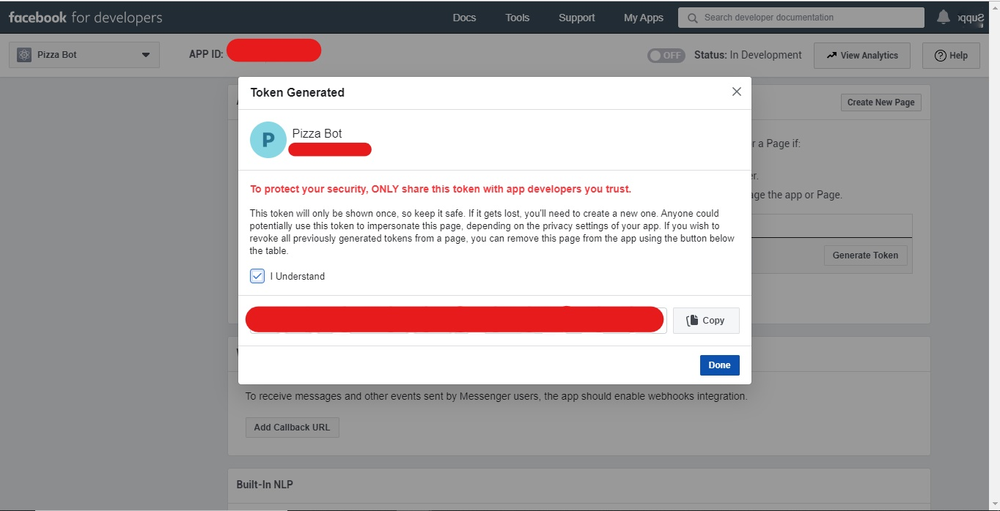

Go to “Settings” → “Basic” to find the App Secret. Click “Show”. Copy the App Secret and paste it to the new channel’s field in Kata Platform you’ve made before.

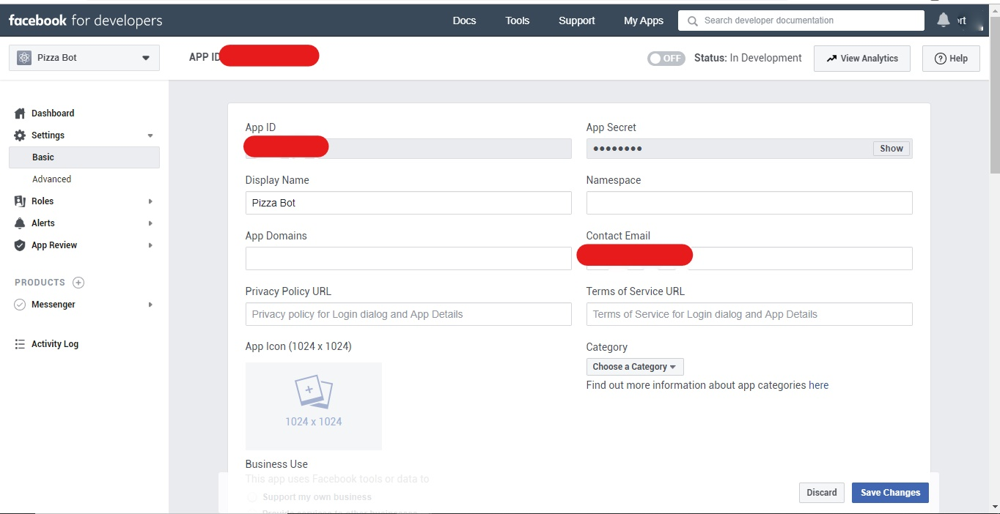

Then, move to Webhooks field in the “Messenger” → “Settings”. Fill the “Callback URL” with “Webhook” from channel you’ve made in Kata Platform. And fill “Verify Token” with “Challenge Token” form channel you’ve made in Kata Platform. Just copy and paste it.

After that, click “Add Subscription” and checklist the “messages” box and “messaging_postbacks” box.

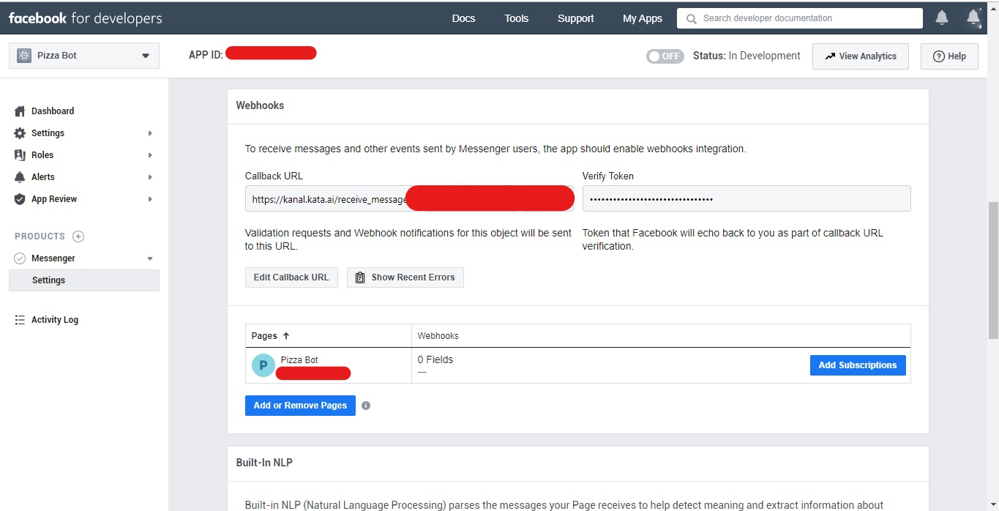

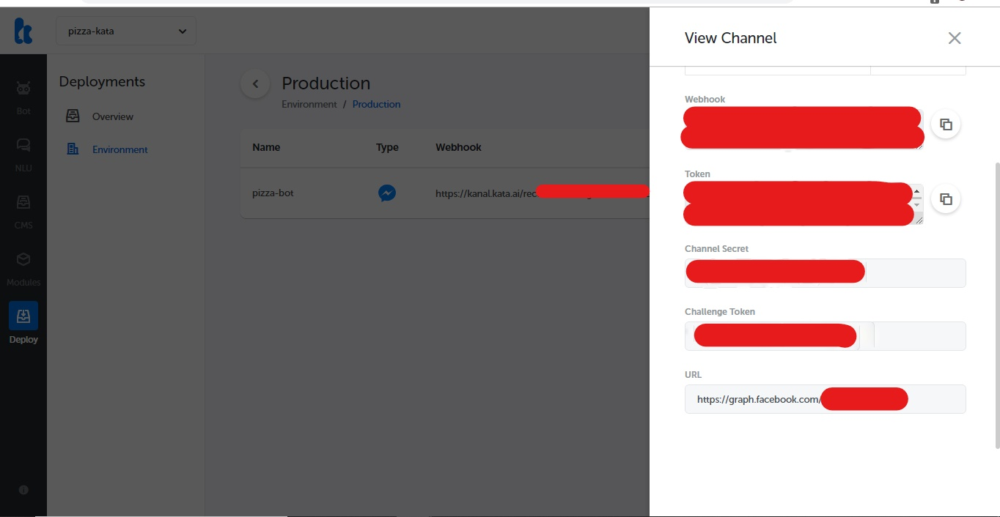

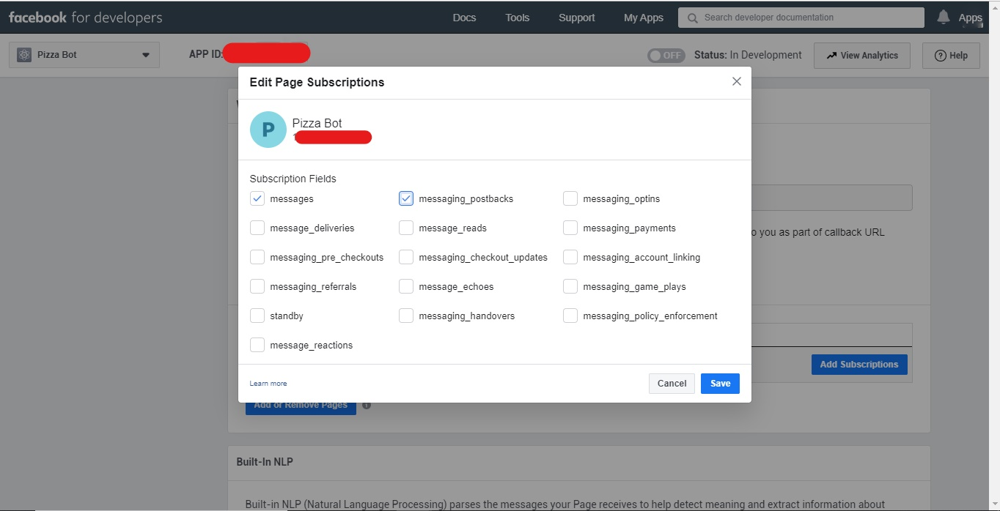

You’re all set! Let’s try the chatbot!

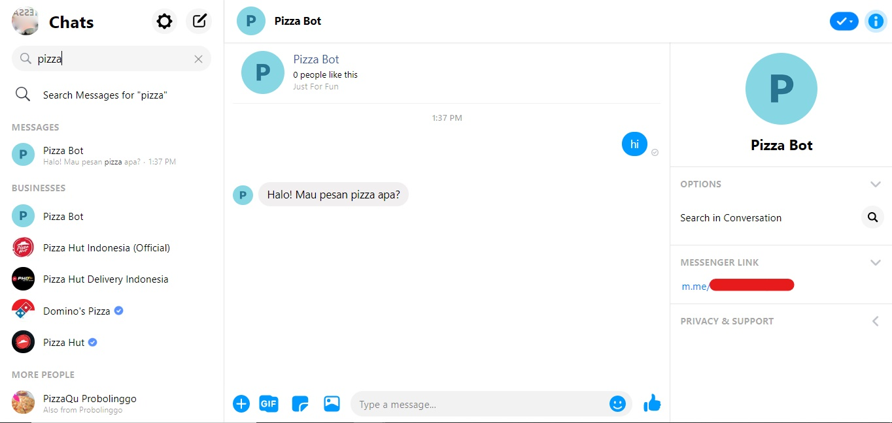

It works! You can now share your newly created chatbot with your friends.
