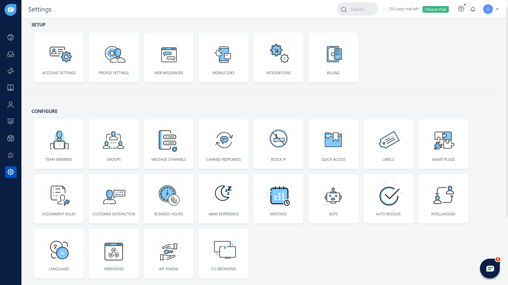
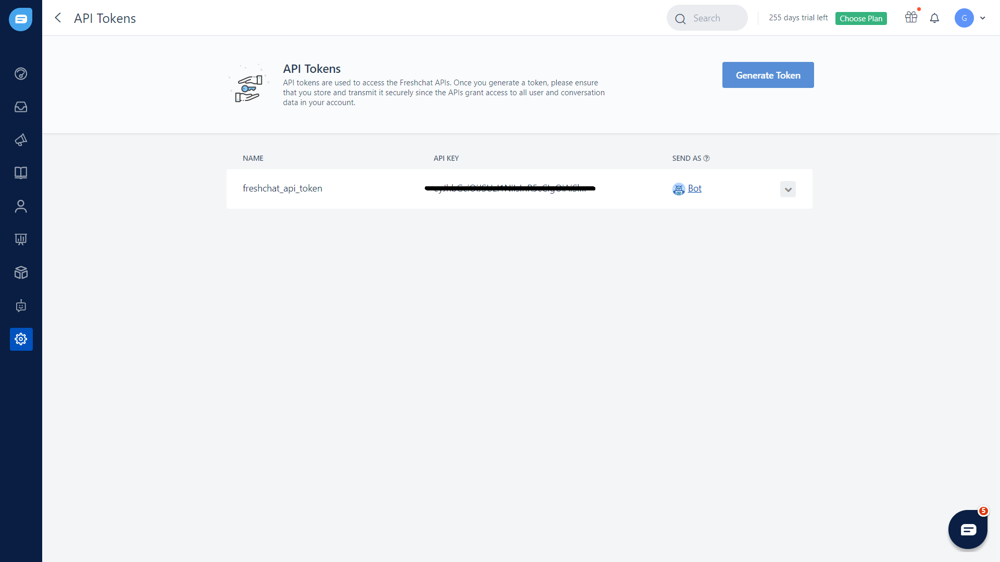
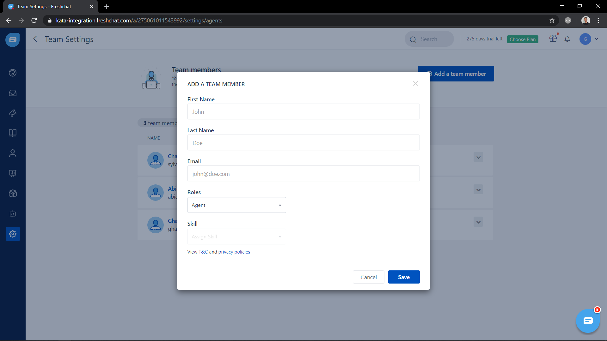
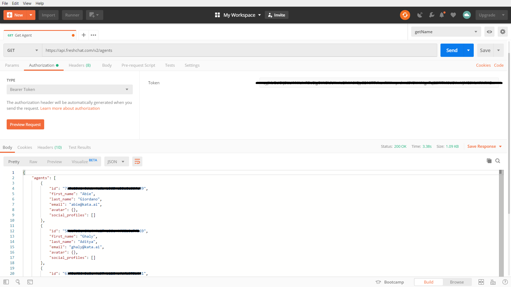
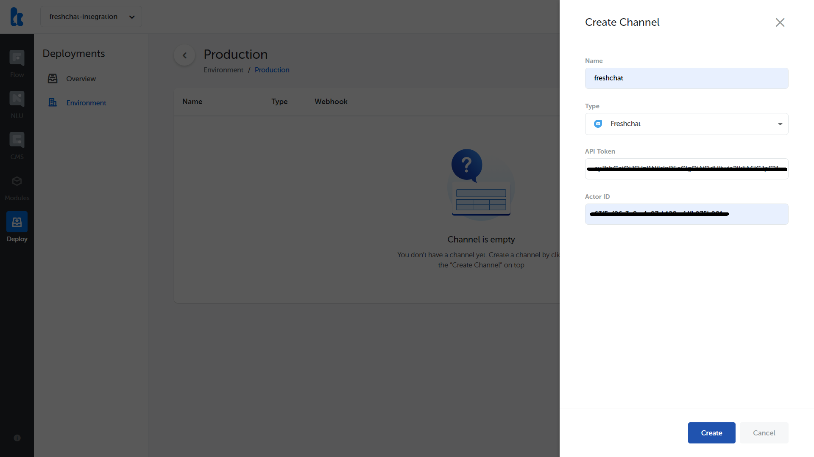
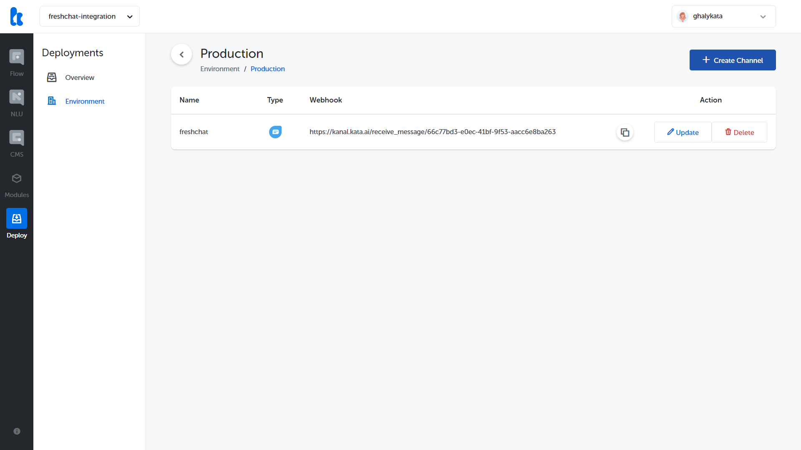
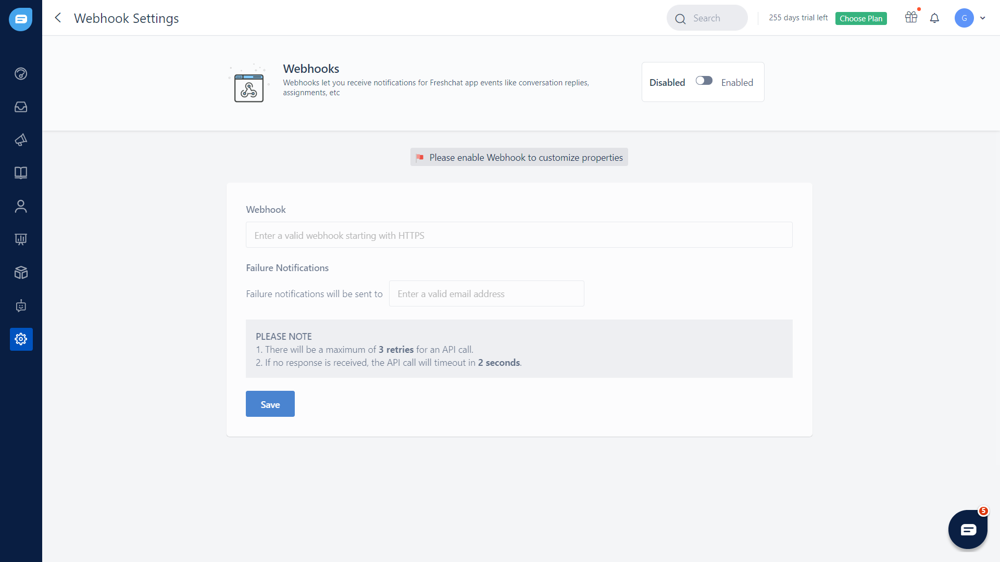
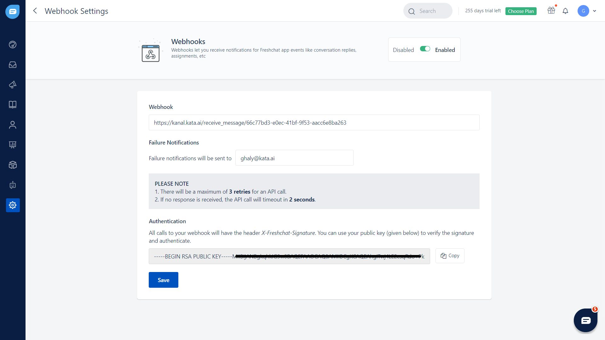
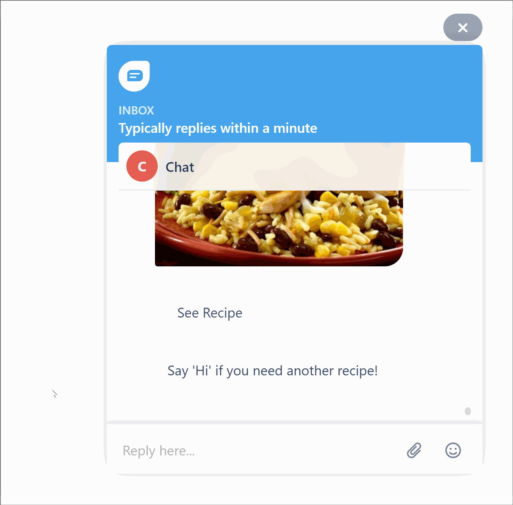

Freshchat’s live chat software is the fastest way for you to engage with your website visitors, provide assistance, and convert leads to happy customers. In this section, we will learn to connect our bot with Freshchat. You can use the bot you created in the Hello World tutorial (https://docs.kata.ai/tutorial/hello-world/) to start integrating your bot with Freshchat.

## Generate API Token and Actor ID

First of all, you need to sign in to your [Freshworks account](https://web.freshchat.com/) to do the integration. After you’re logged in, go to the Settings page to configure the API Token and Webhook.



1. In order to generate the API Token in Freshchat, go to Settings → API Tokens then click on the *Generate Token* button.



2. Now, let’s create the Actor ID for our Chatbot in Freshchat, go to Settings → Team Members then click on the *Add a team member* button, in the *Roles* field you should choose *Agent.*



3. With the API Token we got from the first step, get the Actor ID using Postman or cURL.



```
curl --request GET 'https://api.freshchat.com/v2/agents' \
--header 'Authorization: Bearer <token>'
```

## Create Freshchat Channel in Kata Platform

Login to [Kata Platform](https://platform.kata.ai/) and select the project that you want to integrate with Freshchat, then go to Deploy → Environment → Create Environment → Create Channel, select Freshchat in the Type field and fill in the API Token and Actor ID from the first and third step.



## Setup Webhook URL in Freshchat

Once finished, you will see the newly-created channel in the list and also see a webhook URL for your channel. This webhook URL will be added to the Freshchat.



Go back to Freshchat and enable the webhook configurations, go to Settings → Webhooks, then click on the *Disabled-Enabled* Toggle



Fill in the Webhook field with the webhook URL you got from Kata Platform and valid email address in the Failure Notifications field, so you will get the notification whenever there’s failure in the integration. Finally, click on the *Save* button



It works! You can now share your newly created chatbot with your friends.

Freshchat also have agent handover feature, useful for creating a seamless engagement experience for your customer to interact with your agent to meet their needs. Flow of the agent handover is quite simple:

1. User start a conversation with chatbot
2. In the beginning or middle of conversation, user may request to be connected with live agent
3. Chatbot function will be paused if there’s an available agent, if there are none, chatbot will notify the user to make another request after a few minutes



To know more about agent handover feature implementation in Freshchat, please contact: business@kata.ai
