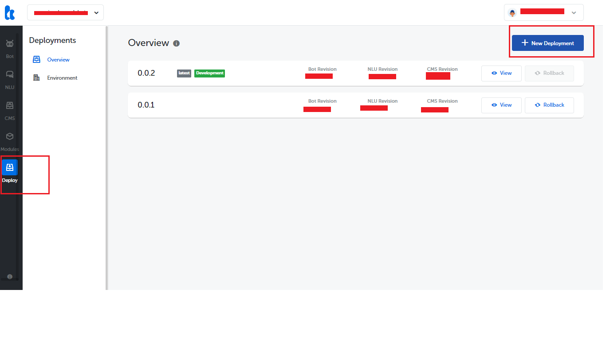
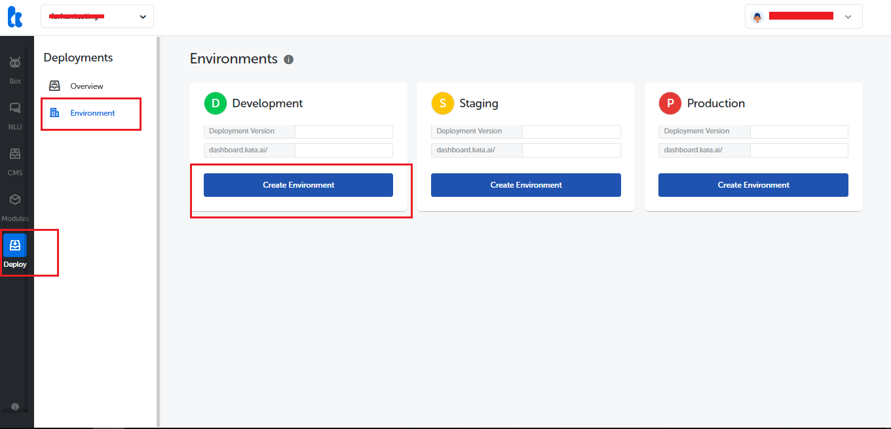
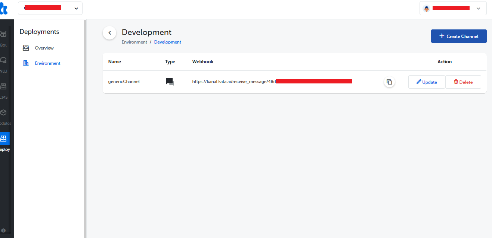
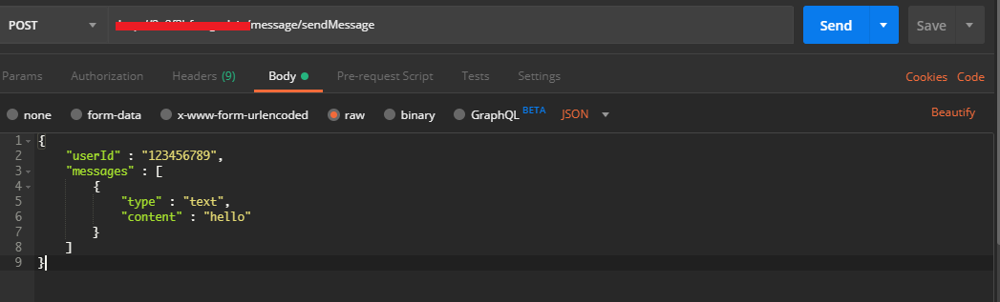
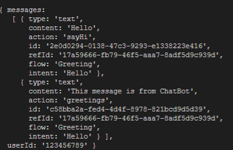

In this documentation, We will learn how to build chatBot app using Kata Platform and connected it to Generic Channel. Generic Channel can be used for the channel that is not yet available in Kata Platform, so you can make a “wrapper”. Here, we use our app that we build using NestJs *(you can use other programming language or framework to make your app)* to communicate with chatBot.

## Get Started

In this tutorial, we gonna create a generic channel using NestJs and connected it with chatbot.

## Deploy Your Chatbot in Kata Platform

If you have develop your chatbot, now You have to deploy your bot. You can use ***kata-cli*** or ***kata platform*** to deploy your chatBot.

1. Login to your account in kata platform <https://platform.kata.ai/>
2. Select the project that you want to deploy
3. Go to Deploy Menu on ***kata-platform*** sidebar, choose overview, and create ***New Deployment***


## Create Generic Channel in Kata Platform

1. Go to Deploy Menu on ***kata-platform*** sidebar, choose Environment, and ***Create Environment*** 
2. Afterthat, you must create channel and choose ***Generic*** type (./images/gc/create_channel.png)

Fill the form to create your channel:

```yml
Name: <type your channel name>
Type: Generic
Token: -
Refresh Token: -
Secret: -
URL: <Your endpoint to retrieve data from webhook, for example http://your_domain/message/retrieveMessage>
```

> Note: Make sure your endpoint have public access to retrieve data from webhook

After successfull make a channel you will get webhook and will use it to your app.


## PARAMETER

To send a message to chatBot you must have some parameters, see the parameter below:

***URL(POST REQUEST)***

 > <https://kanal.kata.ai/receive_message/>webhookId

***REQUEST BODY***
> {
    userId: "someUserId",
    messages: [messageObject]
  }

Here is the detail of messageObject that you can send to Kata Platform:
***TEXT MESSAGE***
>{
    type: "text",
    content: "Halo"
 }

***Data Message (Postback Button Pressed)***
>{
    type: "data",
    payload: {
        key1: "value1",
        key2: "value2",
    }
 }

***Data Message (Share Location)***
>{
    type: "data",
    payload: {
        type: "location",
        latitude: "-6.187011099999999",
        longitude: "106.84574350000003"
    }
 }

***Data Message (File Attachment)***
>{
    type: "data",
    payload: {
        type: "image", // you can use image, audio, video, and file
        url: "<https://somelocation.com/file">
    }
 }

## Reply Message From Kata To Generic Channel

Kata Platform will hit your webhook (POST Request) that registered in Generic Channel with request body below:

***Request Body***
>{
    messages: [messageObject, messageObject, messageObject],
    userId: "someUserId"
 }

Here is the detail of messageObject that we send to your webhook:

***Text Message***
>{
    type: "text",
    content: "Maaf, saya tidak mengerti kata-kata anda..."
 }

***Button Message***
>{
    type: "data",
    payload: {
        type: "template",
        template_type: "button",
        items: {
            title: "Title",
            text: "Some text",
            actions: [
                {
                    type: "postback",
                    label: "Label",
                    payload: {
                        key1: "value1",
                        key2: "value2"
                    }
                },
                {
                    type: "url",
                    label: "Label",
                    url: "http://google.com"
                },
                {
                    type: "message",
                    label: "Label",
                    text: "Your message"
                }
            ]
        }
    }
 }

***Carousel Message***
>{
    type: "data",
    payload: {
        type: "template",
        template_type: "carousel",
        items: [
            {
                title: "Title",
                text: "Some text",
                thumbnailImageUrl: "https://pbs.twimg.com/profile_images/980544485108064256/jfiHHXbR_400x400.jpg",
                actions: [
                    {
                        type: "postback",
                        label: "Label",
                        payload: {
                            key1: "value1",
                            key2: "value2"
                        }
                    },
                    {
                        type: "url",
                        label: "Label",
                        url: "http://google.com"
                    }
                ]
            },
            {
                title: "Title",
                text: "Some text",
                thumbnailImageUrl: "https://pbs.twimg.com/profile_images/980544485108064256/jfiHHXbR_400x400.jpg",
                actions: [
                    {
                        type: "postback",
                        label: "Label",
                        payload: {
                            key1: "value1",
                            key2: "value2"
                        }
                    },
                    {
                        type: "url",
                        label: "Label",
                        url: "http://google.com"
                    }
                ]
            }
        ]
    }
 }

***Image Message***
>{
    type: "data",
    payload: {
        type: "template",
        template_type: "image",
        items: {
            originalContentUrl: "https://pbs.twimg.com/profile_images/980544485108064256/jfiHHXbR_400x400.jpg",
            previewImageUrl: "https://pbs.twimg.com/profile_images/980544485108064256/jfiHHXbR_400x400.jpg"
        }
    }
 }

***Audio Message***
>{
    type: "data",
    payload: {
        type: "template",
        template_type: "audio",
        items: {
            originalContentUrl: "http://www.noiseaddicts.com/samples_1w72b820/4936.mp3",
            duration: "10000"
        }
    }
 }

***Video Message***
>{
    type: "data",
    payload: {
        type: "template",
        template_type: "video",
        items: {
            originalContentUrl: "http://techslides.com/demos/sample-videos/small.mp4",
            previewImageUrl: "https://pbs.twimg.com/profile_images/980544485108064256/jfiHHXbR_400x400.jpg"
        }
    }
}

***Location Message***
>{
    type: "data",
    payload: {
        type: "template",
        template_type: "location",
        items: {
            title: "Title",
            address: "Address",
            latitude: "-6.187011099999999",
            longitude: "106.84574350000003",
            locationImageUrl: "https://maps.googleapis.com/maps/api/staticmap?size=512x512&maptype=roadmap&markers=color:red%7C-6.187011099999999,106.84574350000003&zoom=18"
        }
   }
 }

## GENERIC CHANNEL APP

Here is the example of generic channel app build with NestJs framework.
source code: https://github.com/Farhanramadhana/Generic-Channel

Source code below is the Controller ***/message*** that have 2 function.

1. /message/retrieveMessage endpoint with POST method is to retrieve data from chatBot
2. /message/sendMessage endpoint with POST method is to send data to ChatBot

```typescript
@Controller('message')
export class AppController {
  constructor(private readonly appService: AppService) {}

  @Post('retrieveMessage')
  retrieveMessage(@Req() request: Request) {
    console.log(request.body);
  }

  @Post('sendMessage')
  sendMessage(@Req() request: Request) {
    let data = request.body;
    return this.appService.sendMessage(data);
  }
}
```

sendMessage() function will send user message to chatbot.

```typescript
sendMessage(data) {
    let options = {
      method: 'POST',
      uri:
        '<enter_your_webhook_here>',
      json: true,
      body: {
        "userId": data.userId,
        "messages":[
          {
            "type": data.messages[0].type,
            "content": data.messages[0].content
          }
        ]
      }
    }

    return rp(options)
      .then(function (parsedBody){
          data = {
            "status" : "Success",
            "messages" : parsedBody
          }
          return data
      })
      .catch(function(err) {
          data = {
            "status" : "error",
            "messages" : err
          }
          return data
      })
  }
```

## Testing Generic Channel with Postman app

Here, you can use Postman to test send message to chatBot 
and you will get response from chatBot to your app 
