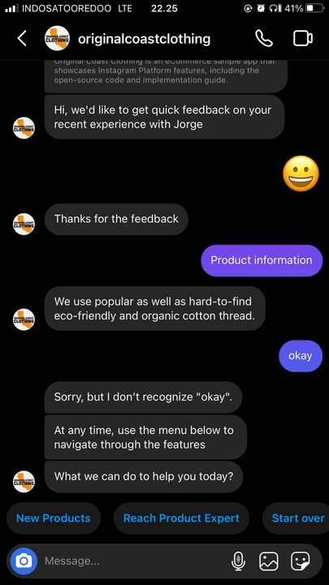
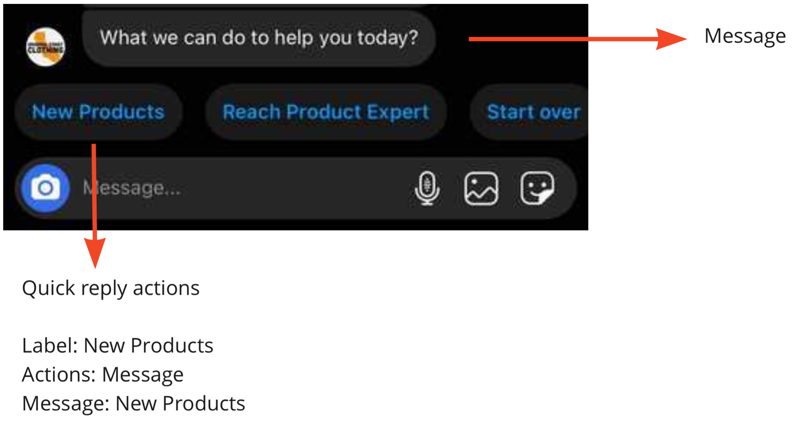
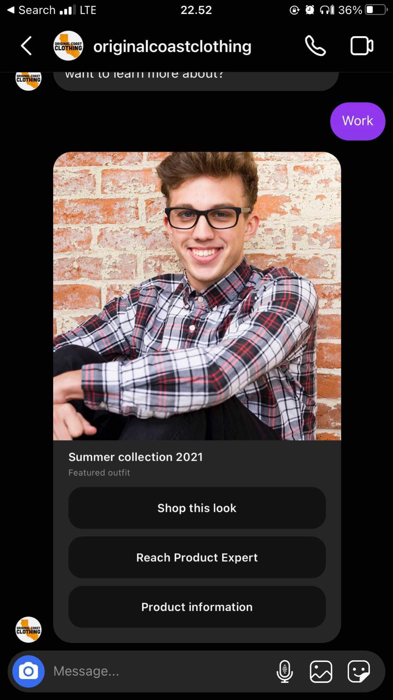
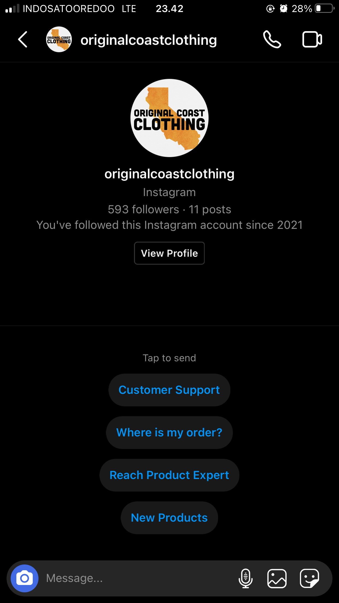
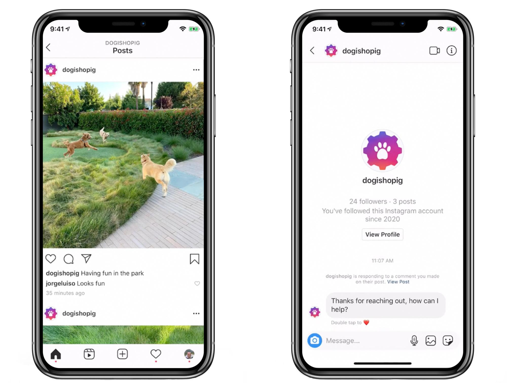

Automate your Instagram DM conversation by using our flow builder in Kata Platform. Create bots to reply to customers with text, images, quick replies, generic template, ice breaker, and (coming soon) sticker.

# Instagram DM Automation Features

## Instagram Story Reply

### About

Whenever your customers engage you via Instagram Story, you can send an automated reply to their DM.

### How to use

1. Go to the Kata Platform and select your project.

2. Click to **Flow > Conversation Flow > Intent > Create Intent.**

3. Choose **Data** for the **Intent Type **dropdown

4. Click **Add Condition** and fill in

```
payload.type == "story_reply"
```

5. Click **Save**

## Instagram Story Mention

### About

Whenever your customers mention your account in their Instagram Story, you can send automated replies to their DM.

Disclaimer:

-   Because Instagram Story will be deleted every 24 hours, it is expected that the story attachments will disappear too.

-   Chatbots cannot "read" the Instagram Story Mention content, but human agents can see the attachment. Tips: If your customers mention your account in the complaint context and your chatbot cannot satisfy them with the solutions, the agent can take over the conversation. Learn more about [take over conversation](/omnichat).

### How to Use

1. Go to the Kata Platform and select your project.

2. Click to **Flow > Conversation Flow > Intent > Create Intent.**

3. Choose **Data** for the intent type dropdown

4. Click **Add Condition** and fill in

```
payload.type == "story_mention"
```

5. Click **Save**

## Response Type

### Sending Texts Reply

Basic chatbot responses that show text to end-users.

#### How to Use

1. Go to the Kata Platform and select your project.

2. Click to **Flow > Conversation Flow > State > Action List**.

3. Choose **Text.** FYI, the Text limitation for Instagram automation is **1,000 characters** and allows for **emoji**.

4. Click **Create Action** to finalize your action

### Sending Images Reply

Basic chatbot response to send image to end-users

#### How to Use

1. Go to the Kata Platform and select your project.

2. Click to **Flow > Conversation Flow > State > Action List**.

3. Choose **Text.** FYI, the Text limitation for Instagram automation is **1,000 characters** and allows for **emoji**.

4. Click **Create Action** to finalize your action

### Sending Quick Replies Reply

This feature can be used for showing menu options to end-users and a good user experience to present to end-users what are your brand’s bot features. In Platform, this feature is named "Quick Reply" which is placed in **Flow > Conversation Flow > State > Action List**. Here is the screenshot of quick replies



#### How to Use

1. Go to the Kata Platform and select your project.

2. Click to **Flow > Conversation Flow > State > Action List**.

3. Choose **Quick Reply.** FYI, the Quick Reply limitations are (1) Max. 13 quick replies, (2) Each quick reply only allowed 20 char before being truncated.

4. Mapping for Quick Reply with real view to end-user can be seen as follow



5. Click **Create Action** to finalize your action

### Sending Generic Template ("Carousel") Type

This feature has an interactive way to show menus or options by adding images and buttons in one bubble. Even more, 1 bubble message can show multiple Generic Templates. Here is the screenshot



#### How to Use

1. Go to the Kata Platform and select your project.

2. Click to **Flow > Conversation Flow > State > Action List**.

3. Choose **Carousel.** FYI for generic template limitations are (1) Maximum 10 elements, (2) Maximum of 3 buttons per element, (3) Each element consists of: The title to display in the template which has 80 character limit, the subtitle to display in the template has 80 character limit.

4. Click **Create Action** to finalize your action

### Sending Ice Breaker Reply

As a chatbot user, we probably felt confused the very first time using a chatbot, especially if the bot hasn’t given a clear bot features."Ice Breaker" is a solution to this problem by showing a _getting started_ in a few topics after the end-user adds the brand’s account.

Disclaimer: Ice Breaker is only shown for first-time chat.

Here is the screenshot of the feature



#### How to Use

Ice Breaker setup must be done in [Omnichat](/omnichat). Hence, we need to create an Inbox and connect it to Instagram DM. Follow this tutorial on [how to create an Inbox](/omnichat).

Finally, you’re successfully created the Inbox. Let's jump to [create the Ice Breaker tutorial](/omnichat).

# Available Soon

## Instagram Sticker ("like heart")

### About

This feature allows your bot to send a sticker heart ❤️ and it is different from inline-like.

Tips: To develop this feature, you should be aware that your bot will reply with a "heart" whatever the customers’ asked. It’s somehow uncomfortable if your customer complains to your bot, then it shows a heart sticker.

### How to Use

1. Go to the Kata Platform and select your project.

2. Click to **Flow > Conversation Flow > State > Action List**.

3. Choose **Instagram Sticker.**

4. Click **Create**.

## Private Replies

### About

Your customers can receive automatic replies in their Instagram DMs (considered as "private") whenever they comment in your brand Instagram post. It is a powerful tool to reach your customer faster and privately whenever they complain or praise your brand.

### How to Use

It will be applied in the **intent** feature to trigger automatic replies from Instagram Posts. Further announcements will be updated in this documentation or newsletter.



# Tutorial for Instagram Chatbot

Go to this tutorial for creating a simple Instagram DM chatbot: [Create Instagram Bot Handover from Chatbot to Agent Tutorial](/tutorial/create-igdm-bot-handover-from-chatbot-to-agent)
