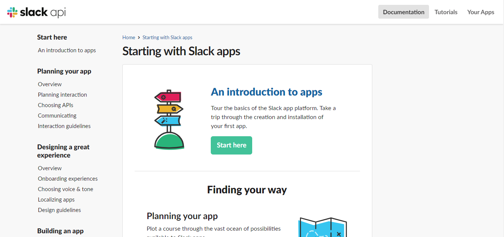
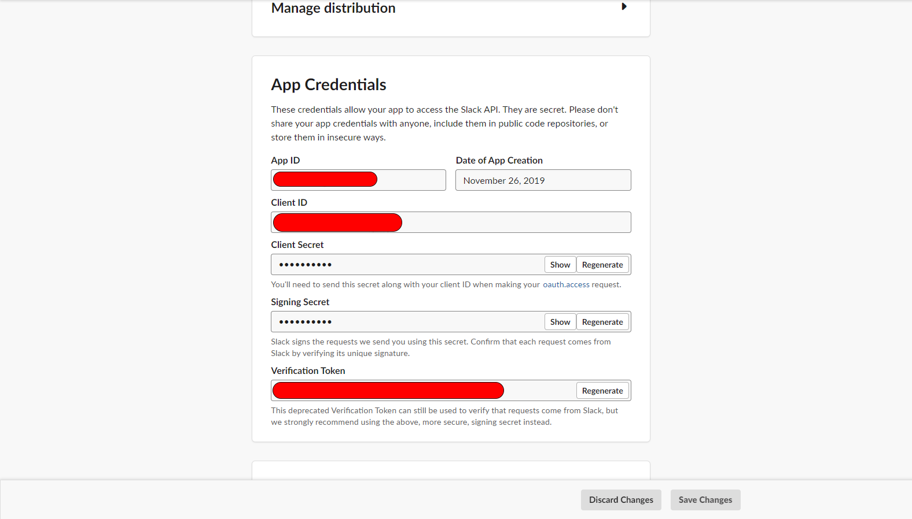
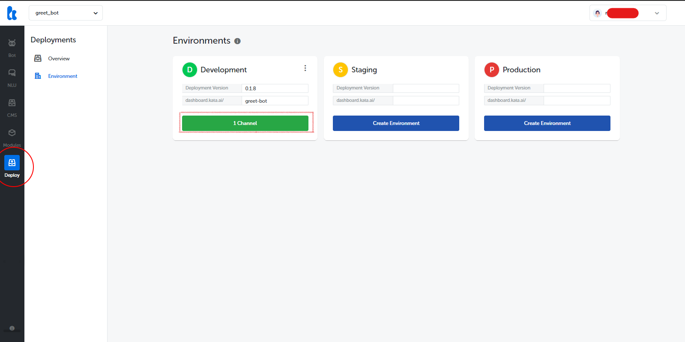
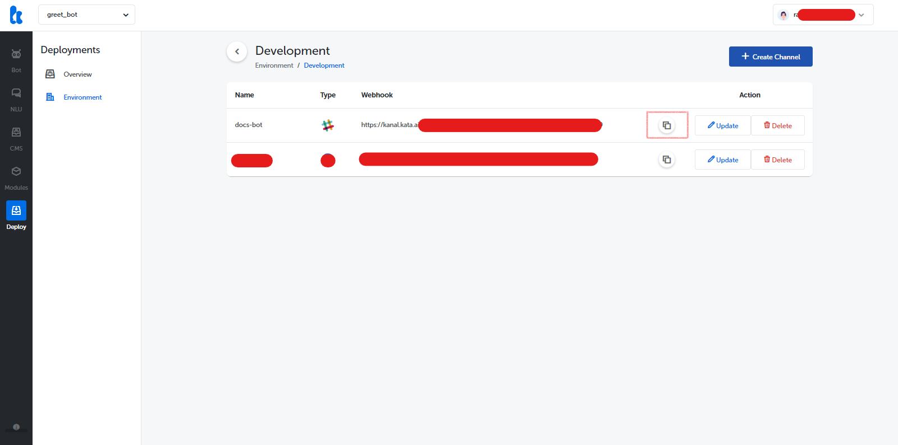
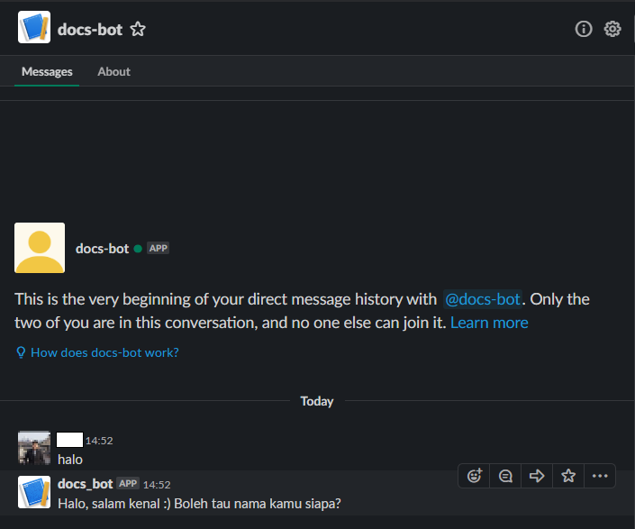

Slack is where work flows. It's where the people you need, the information you share, and the tools you use come together to get things done. In this section, we will learn to connect our bot with Telegram. You can use the bot you created in the [Hello World tutorial](/tutorial/hello-world/) to start integrating your bot with Telegram.

## Create Slack Channel

First thing first, you need to [sign in](https://slack.com/signin) into your Slack Team to create a new
app and get its token.
After logged in, open this [URL:](https://api.slack.com/slack-apps)

1. Click "Start here" then "Create a Slack app"

2. Fill "App Name". choose your "Development Slack Team" and click "Create App"

3. From "Basic Information" in App Credentials section you can see Verification Token, we will use it Later to deploy our bot.

4. Open "OAuth & Permissions" and in "Scopes" section you should fill the scope permission by adding below scopes.

5. Open "Bot User" in Features from the sidebar menu. Fill the "Display name" and "Default username" of your bot. don't forget to set "Always Show My Bot as Online" to "On" and press "Add Bot User" button to finish.

6. Go back to "Oauth & Permissions" and Select "Install App to Workspace" then click "Allow".

7. Still in the "Oauth & Permissions" you will get "OAuth Access Token" and "Bot User OAuth Access Token". we will use "Bot User OAuth Access Token" to deploy our bot using Kata Platform.

## Create Slack Channnel in Kata Platform

First, login to Kata Platform and select the project that you want to integrate with Telegram. Then, go to the Environment page by selecting "Deploy" > "Environment".

In the Environments screen, select your desired environment to create Slack channel.

Click "Create Channel". You will now see the "Create Channel" screen. Insert the channel name, and select Slack as the channel type. Then, copy and paste the previously acquired bot token, and click "Create".

## Setup Webhook URL in Slack Bot

Once finished, you will see the newly-created channel in the list. You will also see a Webhook URL for your channel. This webhook URL will be added to the Slack bot. Copy the webhook URL by clicking "View Channel" and clicking the copy button next to the Webhook URL field.

Next, back to the browser, and go to "Event Subscriptions" tab then switch "Enable Events" to "on"

You will see "Request URL" field. Then put the webhook URL that previously copied here.

Expand the "Subscribe to bot events" then add selected User Event like in the below image

Now you can search for your bot in your slack Workspace

It works! You can now share your newly created chatbot with your friends.

