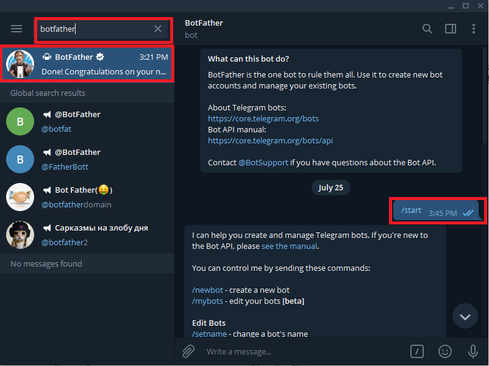
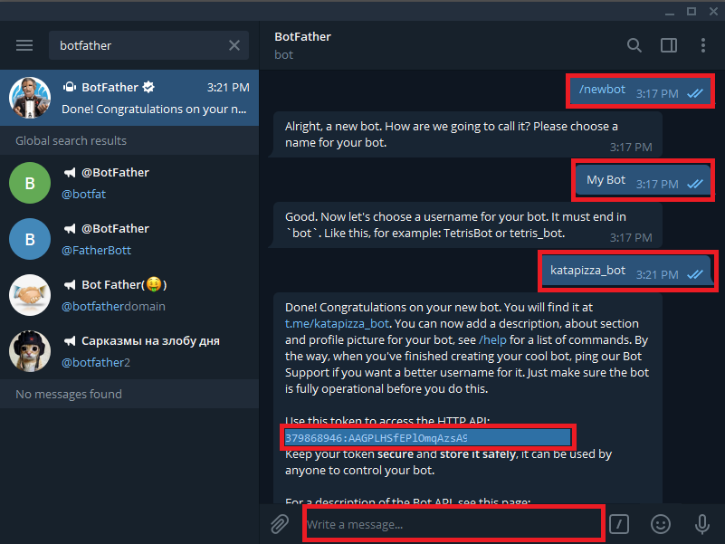
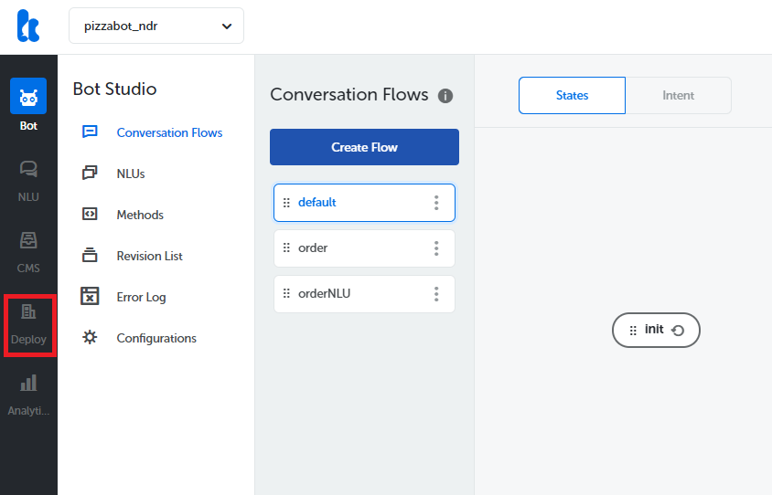
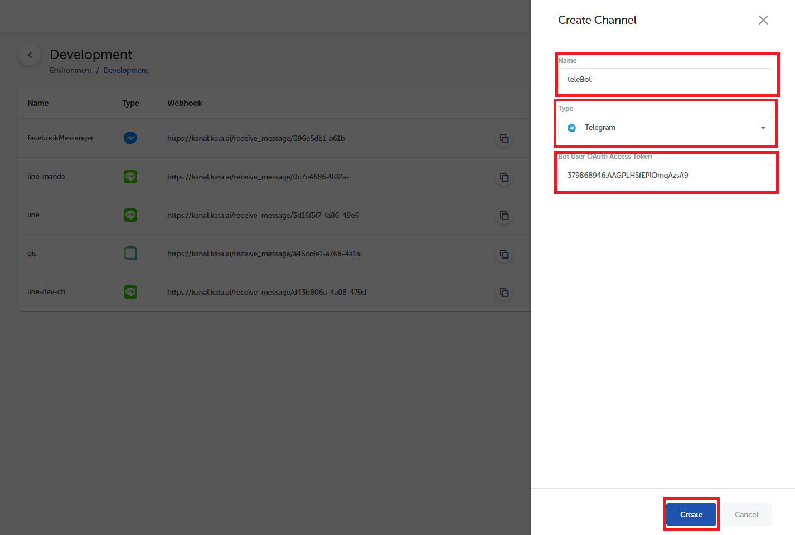
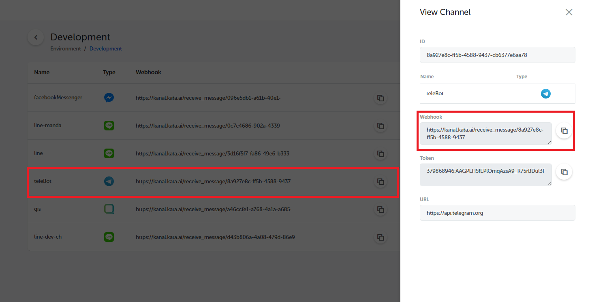
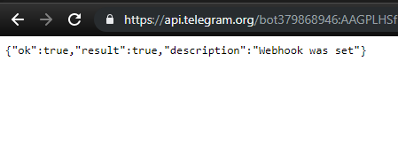
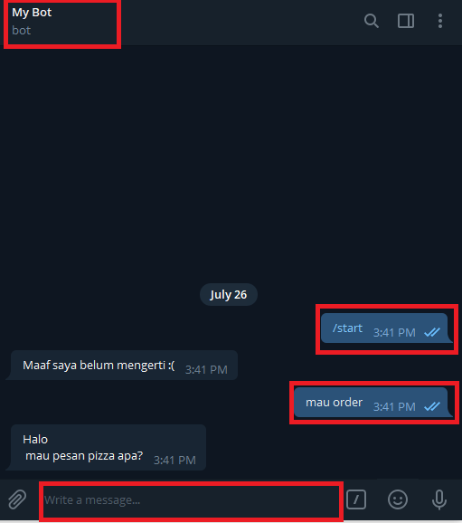

Telegram, as one of the social media that is rising in popularity, has become an option for a brand to engage the customer. In this section, we will learn to connect our bot with Telegram. You can use the bot you created in the [Hello World tutorial](/tutorial/hello-world/) to start integrating your bot with Telegram.

## Register Your Bot in Telegram

You have to download the [Telegram desktop app](https://desktop.telegram.org/) before the integration process. Remember, you must have a Telegram account to sign in. After you signed in to Telegram, you can register your chatbot from the BotFather account.



Type `/newbot` and BotFather will ask for your chatbot name. Feel free to use any name you like. After that, you will be asked to enter your chatbot username. Remember that your bot username has to either start or end with `bot`.

Once finished, BotFather will respond with a bot token to access the Telegram Bot API.



## Create Telegram Channnel in Kata Platform

First, login to Kata Platform and select the project that you want to integrate with Telegram. Then, go to the Environment page by selecting "Deploy" > "Environment".



In the Environments screen, select your desired environment to create the Telegram channel.

Click "Create Channel". You will now see the "Create Channel" screen. Insert the channel name, and select Telegram as the channel type. Then, copy and paste the previously acquired bot token, and click "Create".



## Setup Webhook URL in Telegram Bot

Once finished, you will see the newly-created channel in the list. You will also see a Webhook URL for your channel. This webhook URL will be added to the Telegram bot. Copy the webhook URL by clicking "View Channel" and clicking the copy button next to the Webhook URL field.



Next, open a new tab on your browser and enter this URL. Change `{my_bot_token}` into your own bot token you get when you created the bot. Also, change `{kata_platform_webhook_url}` to the webhook URL copied before.

```
https://api.telegram.org/bot{my_bot_token}/setWebhook?url={kata_platform_webhook_url}
```

Click "Go" or press Enter on the keyboard.



If you see the message "Webhook was set" you're all set! Let's try our chatbot. Open Telegram on the desktop or mobile, and start chatting with your bot.



It works! You can now share your newly created chatbot with your friends.
