Automate your WhatsApp conversation by using our flow builder in Kata Platform. Create bots to reply to end-users with several bot action types:

-   Text

-   Image and Image with Caption

-   🎉 **NEW** 🎉 List Message

-   🎉 **NEW** 🎉 Reply Button

# WhatsApp Bot Response Types

## Text

### About

Reply to your chatbot users ("end-users") by sending them text as a basic response.

Here is an example of a text response to end-users.

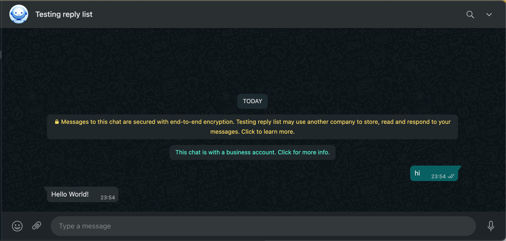

### How to Use

1. Go to the Kata Platform and select your project.

2. Click to **Flow > Conversation Flow > State > Action List**.

3. Choose **Text** and enter the text you want to send.

4. Click **Create Action** to finalize your action

## Image and Image with Caption

### About

Send images to your users on WhatsApp. You can also add a caption for the image.

Here is an example of image response and using caption to end-users.

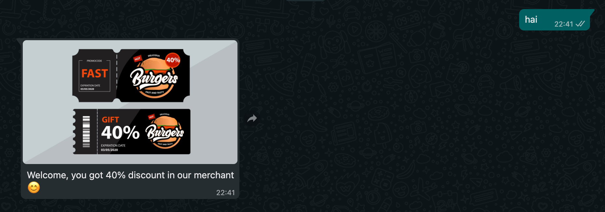

> Image with Caption Example

### How to Use

1. Go to the Kata Platform and select your project.

2. Click to **Flow > Conversation Flow > State > Action List**.

3. Choose **Image** and enter the Image and Thumbnail URL.

4. Image caption is optional.

5. Click **Create Action** to finalize your action

## 🎉 **NEW** 🎉 List Message

### About

Send a list of options your users can choose from. You can provide up to 10 options ("rows") from a List Message.

Here is an example of List Message response to end-users.

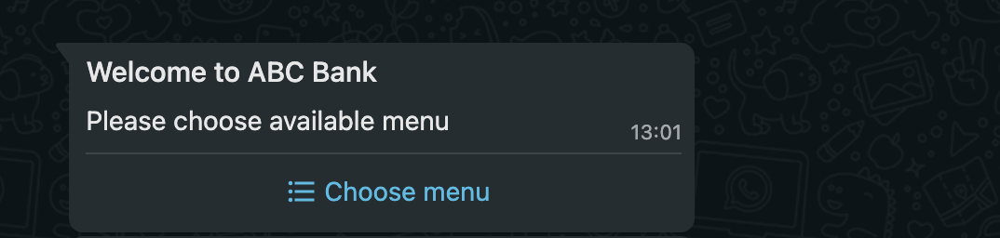

> Tapping button will show the options

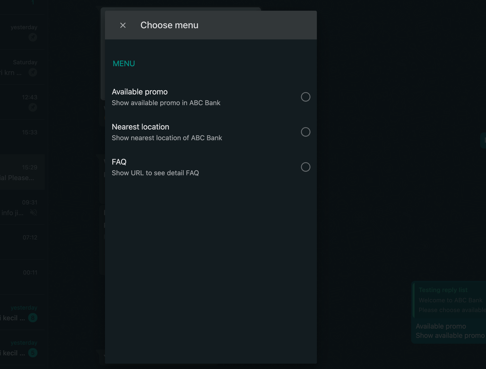

> Show pop-up dialog menu

### Composition

1. Header type

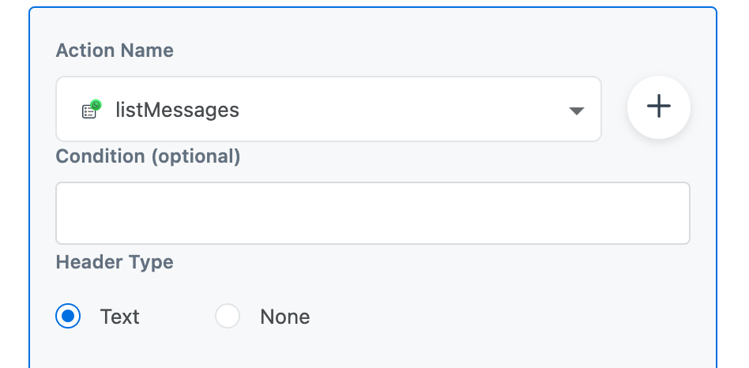

> List Message with header type "Text" and “None” in Platform

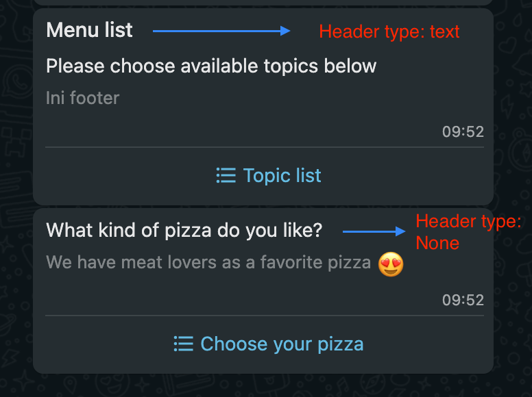

> List Message with header type "Text" and “None” in WhatsApp

2. Header composition

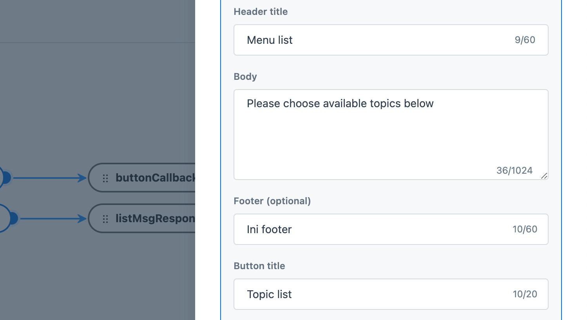

> List Message button composition (before showing menu list) in Platform

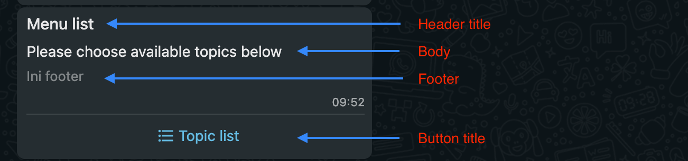

> List Message button composition (before showing menu list) in WhatsApp

3. Section and Row

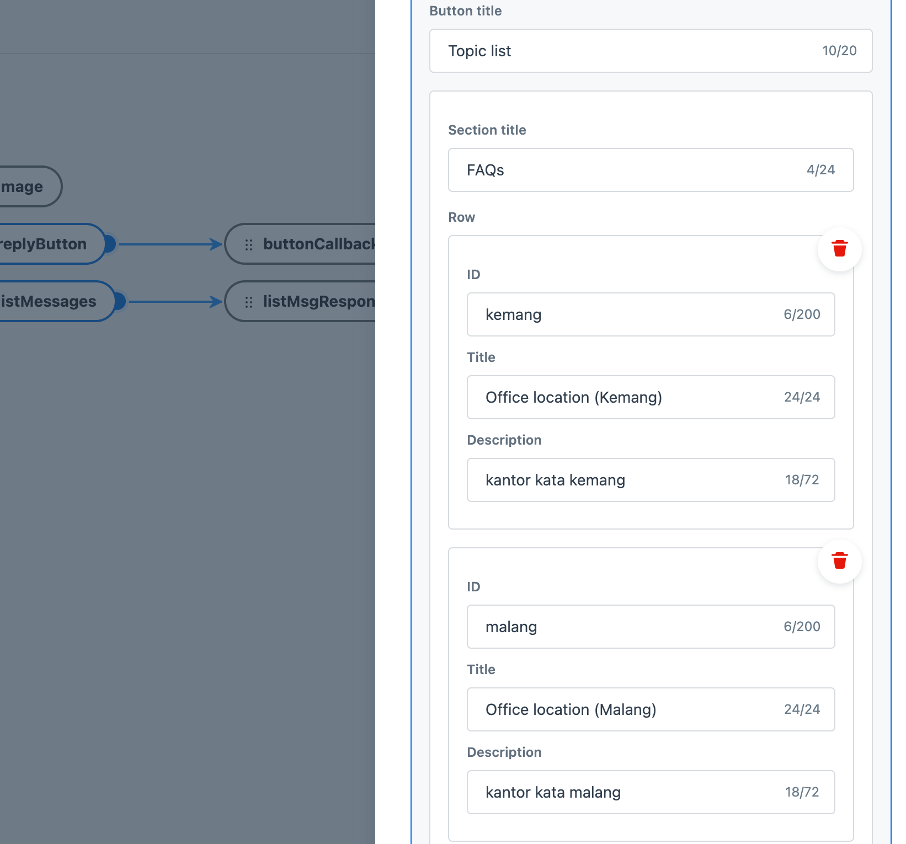

> List Message composition (showing menu list) in Platform

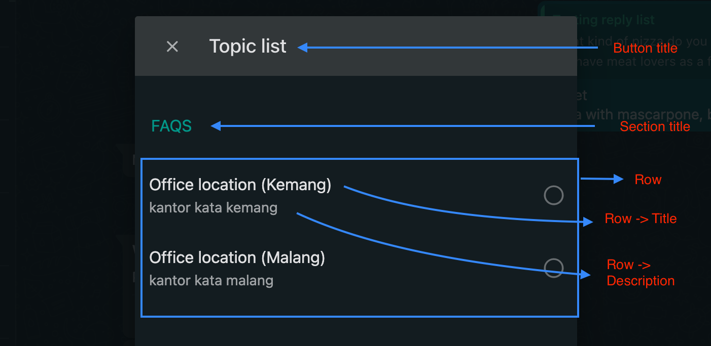

> List Message composition (showing menu list) in WhatsApp

### How to Use

1.  Go to the Kata Platform and select your project.

2.  Click to **Flow > Conversation Flow > State > Action List**.

3.  Choose **List Message.** This action type only works on WhatsApp. Adding this on other channels will result in error.

4.  Fill in the fields.

5.  Some important notes on List Message that you should know: (1) "**Section**" has no limit. You can add as many sections as you want. (2) You can create up to **10 rows** in total across sections. (3) "**Row ID**" in the same section must be unique. For example:

        a. You create a section called "FAQ Topics"

        b. Inside FAQ Topics, you have 3 rows.

        c. These 3 rows inside FAQ Topics can’t use the same ID.

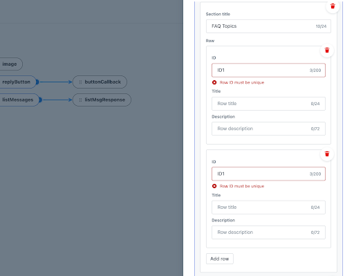

> Using similar Row ID, either under 1 section or different sections, is not allowed

6.  Click **Create Action** to finalize your action

## 🎉 **NEW** 🎉 Reply Button

### About

Reply button allows users to quickly send a reply to the chatbot. You can create up to 3 buttons.

Here are examples of Reply Button responses to end-users.

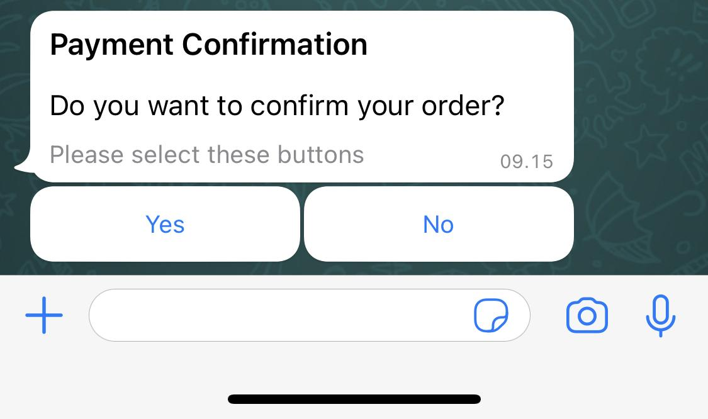

> Reply button with **Text** as header

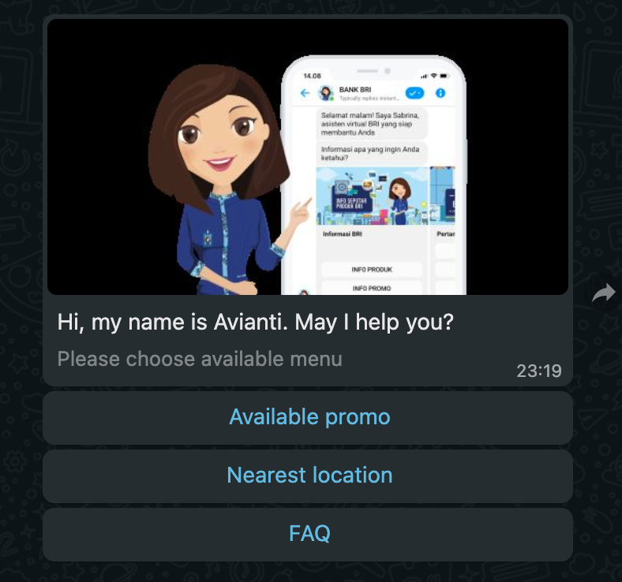

> Reply button with **Image** as header

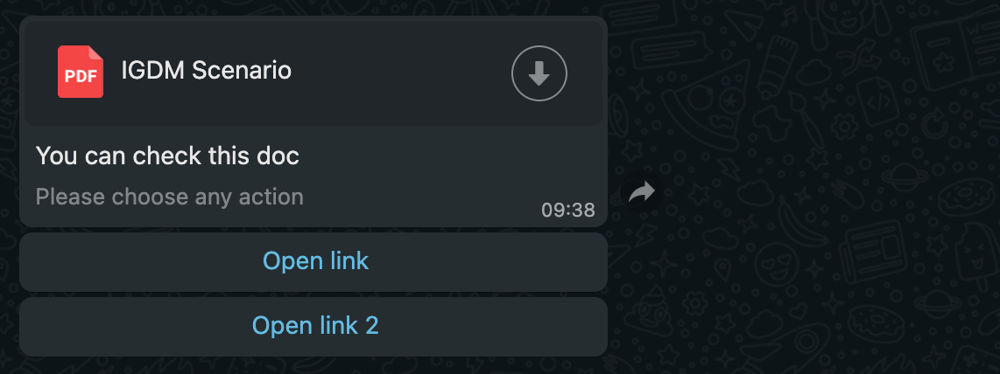

> Reply button with **Document** as header

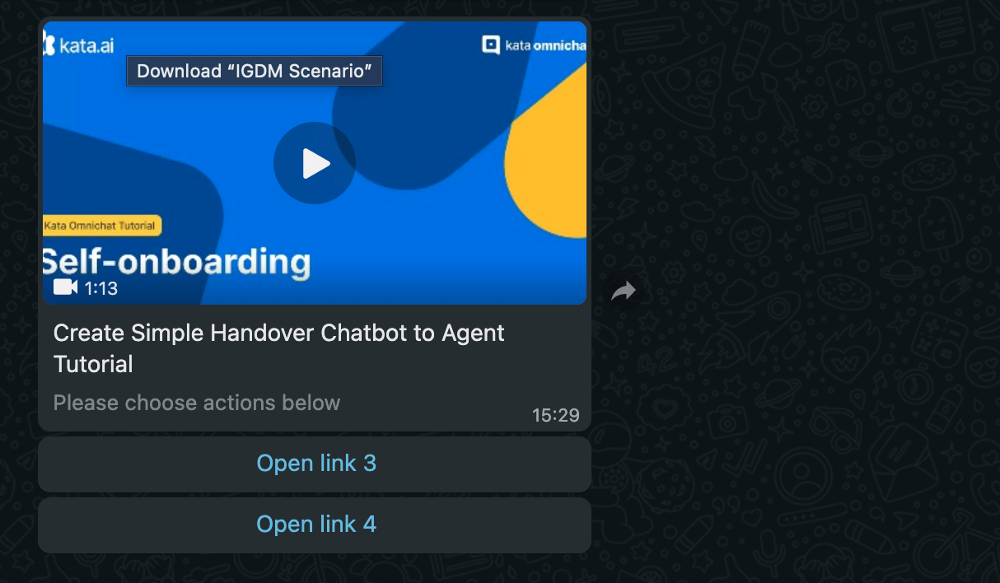

> Reply button with **Video** as header

### How to Use

-   Go to the Kata Platform and select your project.

-   Click to **Flow > Conversation Flow > State > Action List**.

-   Choose **Reply Button.** This action type only works on WhatsApp. Adding this on other channels will result in error.

-   Fill in the fields. Some important notes on Reply button that you should know:

    1. "**Button ID**" must be unique when creating action.

    2. Maximum number of buttons is 3 buttons.

    3. Header type video only allows .mp4 extension and we recommend the size is < 5 MB due to end-users may experience slow connection when loading the video.

    4. Header types image, video and document must use HTTP/HTTPS link.

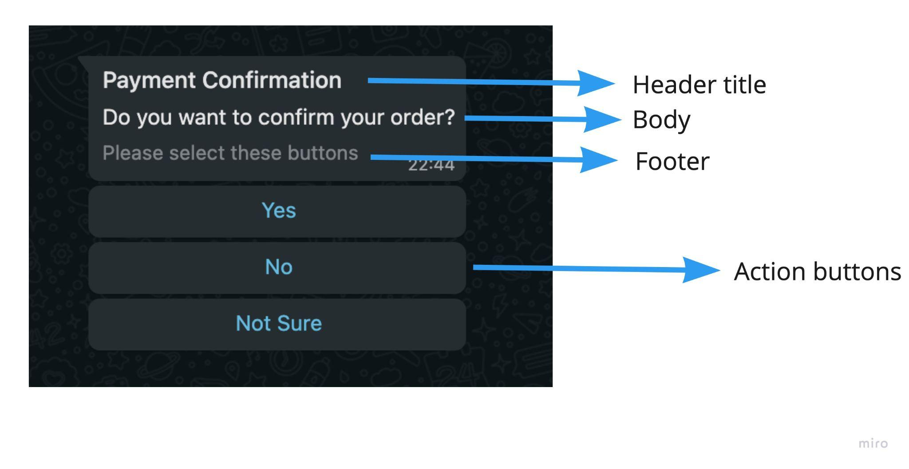

> Reply Button composition

5.  Click **Create Action** to finalize your action

# Tutorial for WhatsApp Bot Integration

You can create a simple bot using text by following this bot tutorial: [Creating a simple Hello World chatbot](https://docs.kata.ai/tutorial/hello-world).

You can deploy your bot by following these steps.

## Create a deployment

1. Click **Deploy** menu in the left sidebar

2. On the Deploy page, click on the **New Deployment** button on the top right corner. It will open up the Create Deployment menu.

3. Choose any deployment version you want to deploy and fill in the change log.

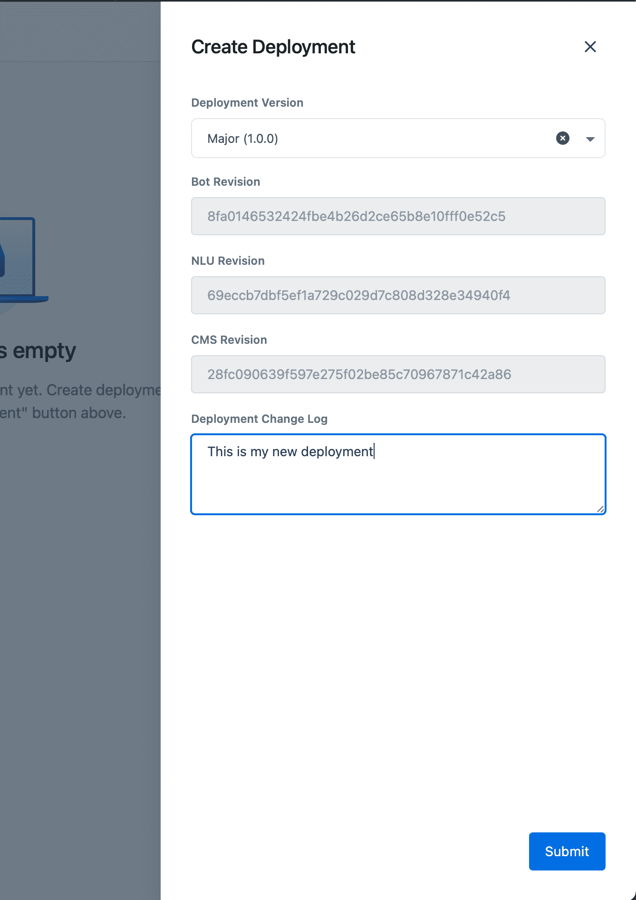

> Create new deployment

4. Click **Submit** to finish the deployment

## Create a new environment

If you already have an environment created, skip these steps.

1. Go to the **Deployments > Environment** menu.

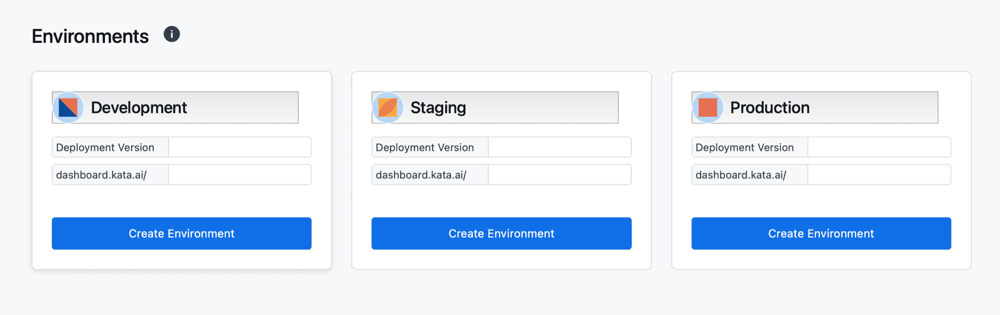

> Set up environment, then set up WhatsApp channel

2. Click the **Create Environment** button in any environment. You will see a drawer to create a new environment.

3. Choose the **development version** you want (in this tutorial, we use the 1.0.0 version)

4. Fill in the **environment URL**. This environment URL is used for CMS. [Learn more about CMS](https://docs.kata.ai/cms-studio/about/').

5. Click **Create** to create the environment.

6. Created environment now has a **Create Channel** button.

## Create WhatsApp business account

You can only deploy bots to a verified WhatsApp Business number. To get the number, you have to:

1. Go to [https://business.kata.ai](https://business.kata.ai)

2. [Create business dashboard account](https://docs.kata.ai/business-dashboard/get-started)

3. [Register your new WhatsApp number](https://docs.kata.ai/business-dashboard/how-to-register)

Then, you’re ready to get the access token from your WhatsApp business account.

1. In Business Dashboard, go to **Whatsapp Numbers** menu

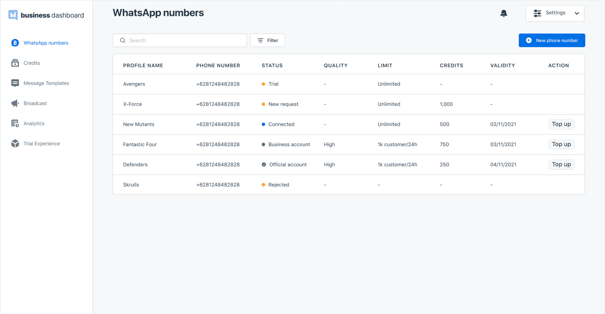

> WhatsApp numbers list

2. Then, click the WhatsApp number you want to deploy to. You will be redirected to **Manage WhatsApp Number** page

3. In the Manage WhatsApp Number page, scroll down to **API Credential.**

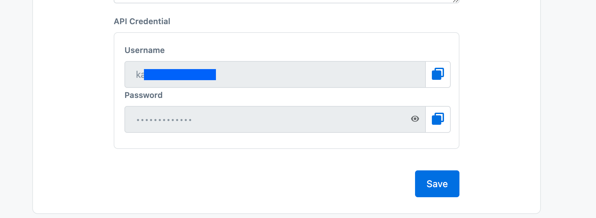

> API Credential

4. Next, you will need to download [Postman](https://www.postman.com/downloads/) to hit the WhatsApp API.

5. Copy the **username** and **password** from the API Credential section in the Business Dashboard into Postman.

6. Open Postman and fill in **URL** as follows:

```
URL: POST https://api-whatsapp.kata.ai/v1/users/login
```

7. Enter the username and password from Business Dashboard to the body. Examples:

```
body:
{
    "username": “amanda123”
    “password”: “Q1w2e3r4#kata”
}
```

8. Click **Send** in Postman. You will get the access token as shown.

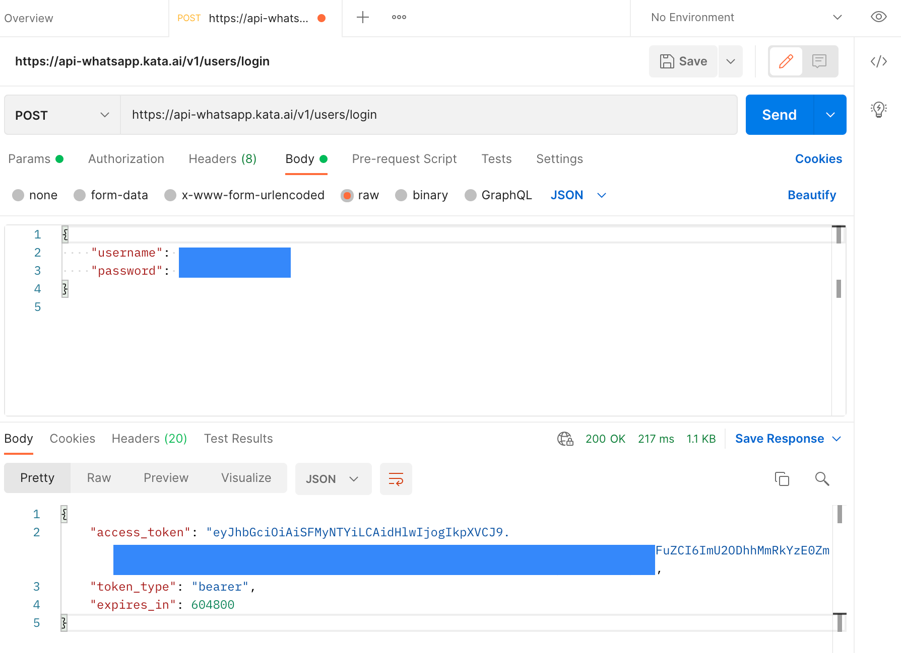

9. Copy the **access token** in the API result and save for the next step.

## Finalize deployment WhatsApp channel

1. Log in to Kata Platform ([https://platform.kata.ai](https://platform.kata.ai))

2. Click your project that already had a chatbot and deployed

3. Then, go to the menu: **Deploy > Environment**.

4. Click the **Create Channel** button to start adding channels to the environment. It will open up the Channel menu within the environment.

5. Click the "**+ Create Channel**” button in the channel table list. A menu to set up the channel will be shown.

6. Choose WhatsApp in Channel Type

7. Paste the access token into the field, and enter [https://api-whatsapp.kata.ai](https://api-whatsapp.kata.ai) in the URL field.

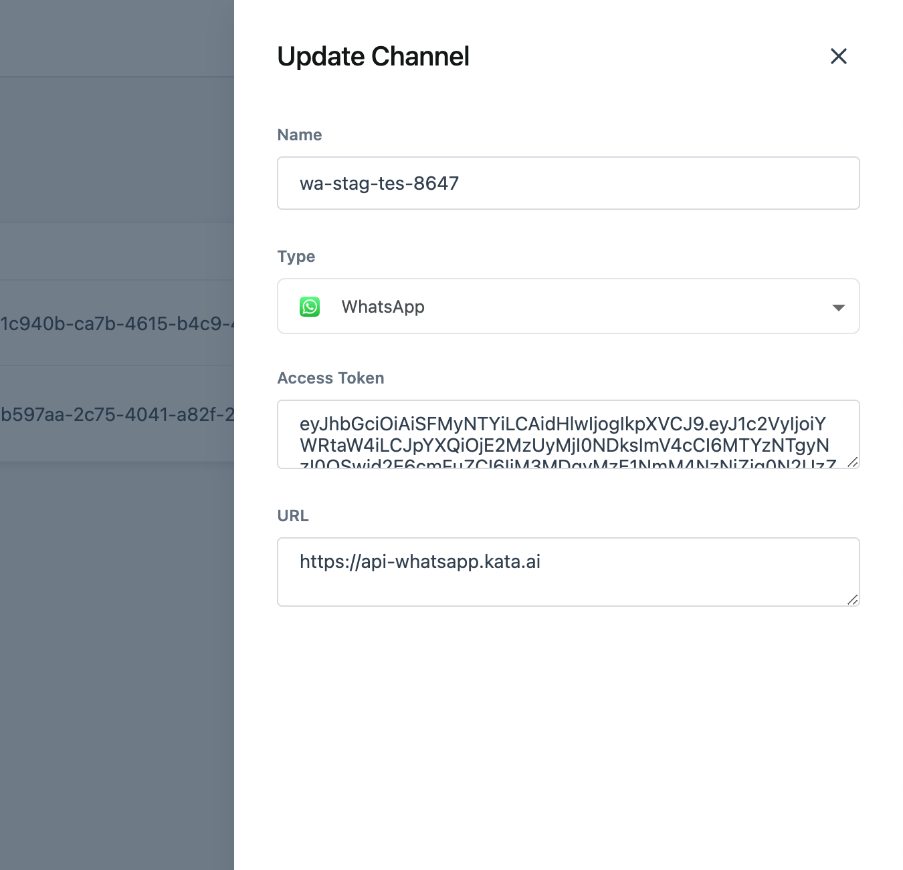

> Fill in the access token and URL

8. Click Save to deploy your bot

You’re all set! Now you can start chatting with your WhatsApp bot.


