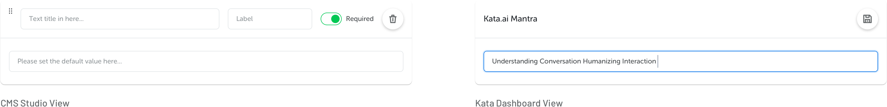
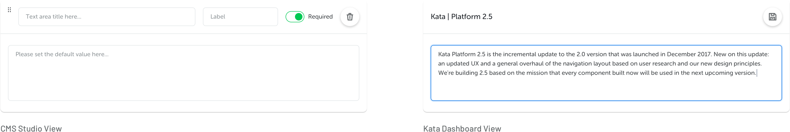
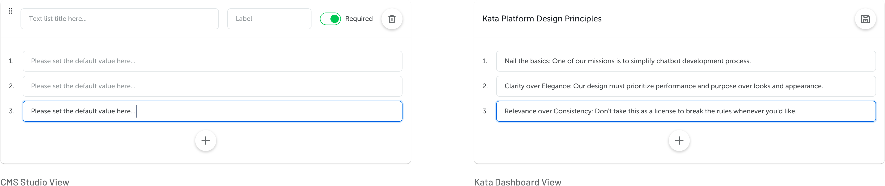
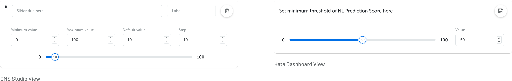
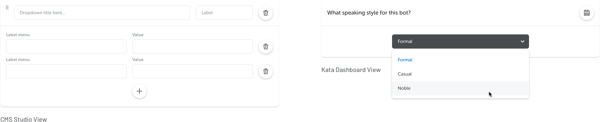
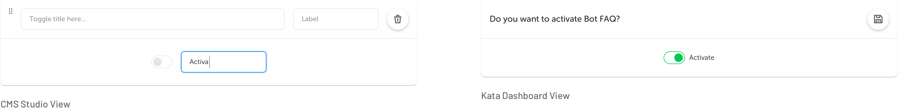
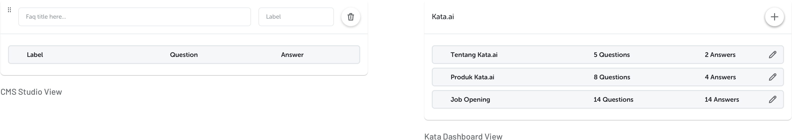

Elements are the component where you can set customizable bot contents in your CMS. Here are the elements we provide on CMS Studio:

## Single Elements

- **Text**

- **Text Area**

- **Text List**

- **Slider**

- **Dropdown**

- **Toggle**

## FAQ Table

Use this table to maintain FAQ-related knowledge of your bot. All content entered here will be automatically trained into your NL model.

You can create as many **labels** as you like, depending on how many topics you would like to handle under this FAQ. Every **question** will be considered as training data and will enrich the existing Natural Language Model. You can also put more than one **answers** as variations to avoid any repetitive responses.

