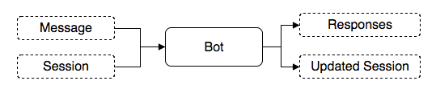

A bot is a dialogue agent that is capable of receiving a message and returning responses. These bots can be connected to various channels such as Facebook Messenger, LINE, Slack or even your App.

## Bot Anatomy

A bot is uniquely defined by botId and its version. We adopt semantic versioning (semver) for the bot versioning scheme. A bot consists of:

- Flow Definitions
- Configuration
- NLUs
- Methods

## Bot Management

Our Bot management also maintain the versioning of the bots. You can have multiple versions of a bot and you will be able to revert back to any previous versions. You can also tag a version with a specific label.
