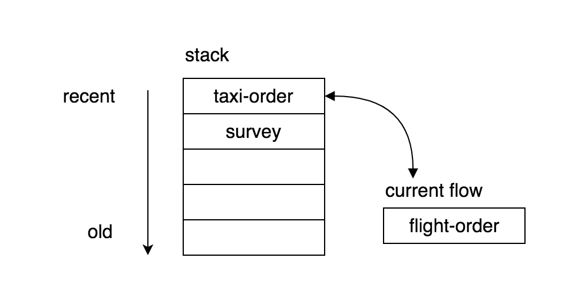

Flow is the main building block of a Bot. A flow corresponds to a discourse in a conversation.


A flow consists of intents, states, and actions. The processing of user message is divided into three pipelined steps:

1.  Intent Recognition Converting raw message into structured information (in form of intent and attributes)
2.  State Mapping Determining the state of the bot and the context variables
3.  Chosing Action Generate response by executing defined action


You can think the Intent - State - Action separation as an MVC model. Where the intents are the controller, the states as the model and the actions as the views.


## Flow Stack

A bot can have multiple flows and those can be active at the same time. Those information is stored in the flow stack. The bot also store which flow is the current flow.



Whenever a flow is opened, it will become the current flow. This will push the previously current flow to the stack. Those flows in the stack are on hold.

## Flow Selection

Whenever a new input arrives, the bot will first select a flow. When there is a current flow. That flow will be the preferred flow to look at. The bot will look for a matching _intent_ in that flow. In case there is no intent matched, it will look for _initial intents_ of other flows. If other flows matched, then it will push the current flow to the stack and put the new selected flow to the current flow. If the new selected flow already in the stack, then it will be removed from the stack.

## Flow Reenter

When a flow is closed, the flow at the top of the stack will become the current flow. The flow will be notified by the command reenter. This shall be captured by a _reenter intent_.

Example:

```yaml
intents:
  reenter:
    type: command
    condition: "content == 'reenter'"
```

## Volatile Flow

If you want to make a flow to be immediately closed, when a new flow is selected, you can set the flow as volatile.

```yaml
flows:
  myFlow:
    volatile: true
```

Setting a flow as volatile will omit it from being stored in flow stack.

## Expiring Flow

You can set a flow to automatically expire after some time. this is useful e.g. for short-lived flow like promotion etc.

```yaml
flows:
  myFlow:
    expire: 100000
```

## Fallback Flow

In case that no flow can be matched, the bot won't be able to process the conversation. To avoid this condition, you will need to assign a fallback flow with a fallback intent, so that in such case, it will fallback to the specified flow and intent:

```yaml
fallback: true
intents:
  fallbackIntent:
    fallback: true
```

## Context

Every flow has a **context** object that can be used to store flow-specific variables. This context variables can be stored during state mapping and can be used as condition in intent, transition and action selection.

Storing variable example:

```yaml
states:
  init:
    transit:
      context.isActive: "true"
```

Using variable in intent:

```yaml
intents:
  continueIntent:
    condition: "context.isActive == true"
```

Using variable in transition:

```yaml
states:
  init:
    transitions:
      done:
        condition: "context.hasName && context.hasPhone"
```

## Meta Context

Meta Context is read-only system defined context fields. It is accessible at `context.<meta>`. Following are generally available meta context, accessible at any time.

- `$init : boolean` - true if entering a new flow
- `$flow : string` - current flow
- `$state : string` - describing current state
- `$lastFlow : string` - describe last flow
- `$lastState : string` - describe last state
- `$now : number` - current timestamp
- `$timestamp : number` - session timestamp
- `$dataKey : string` - data key for connecting multiple sessions
- `$sessionId : string` - current session id
- `$channelId : string` - current channel id
- `$deploymentId : string` - current deployment id
- `$userId : string` - user / partner id from channel
