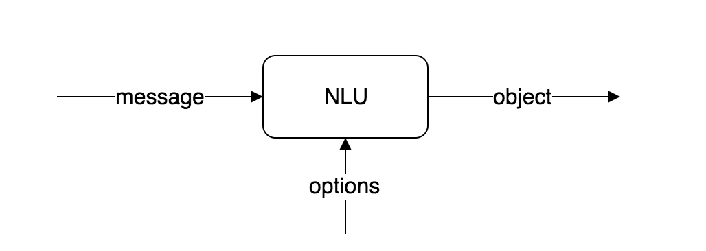

The Natural Language Understanding unit is an object that transform a text message into a structured object. To be able to support different understanding systems, such as Kata internal Verstand system or Wit.ai system, the NLU concept is designed to be high-level and flexible.



We provide various kind of NLUs. For more information please refer to KataML Spec.

## Process

You can use process to post-process output of the NLU as described in following example:

First we will use VerstandClassifier NLU to extract label and score of a text.

```yaml
myNLU:
  type: verstandClassifier
  options:
  model: someModelId
```

We know that the output of verstandClassifier is `string[]`, or `null` if no match found. Now we want to rename from snake-case to hyphenated case. So we create a method called hyphenate.

```yaml
methods:
  hyphenate(labels): "
    if (!labels) return null;
    return labels.map(label => label.split("_").join("-");
  "
```

Now we can add process into myNLU

```yaml
myNLU:
  type: verstandClassifier
  options:
      model: someModelId
  process: hyphenate
```

## Custom NLU

You can specify a custom NLU using method:

```yaml
nlus:
  customNLU:
      type: method
      method: myNLUMethod
      options:
          regex: "test (.*)"
          index: 1
```

```yaml
methods:
  myNLUMethod(message,options,config): "
      let match = message.content.match(new Regex(options.regex));
      return match ? match[options.index || 0] : null;
  "
```
