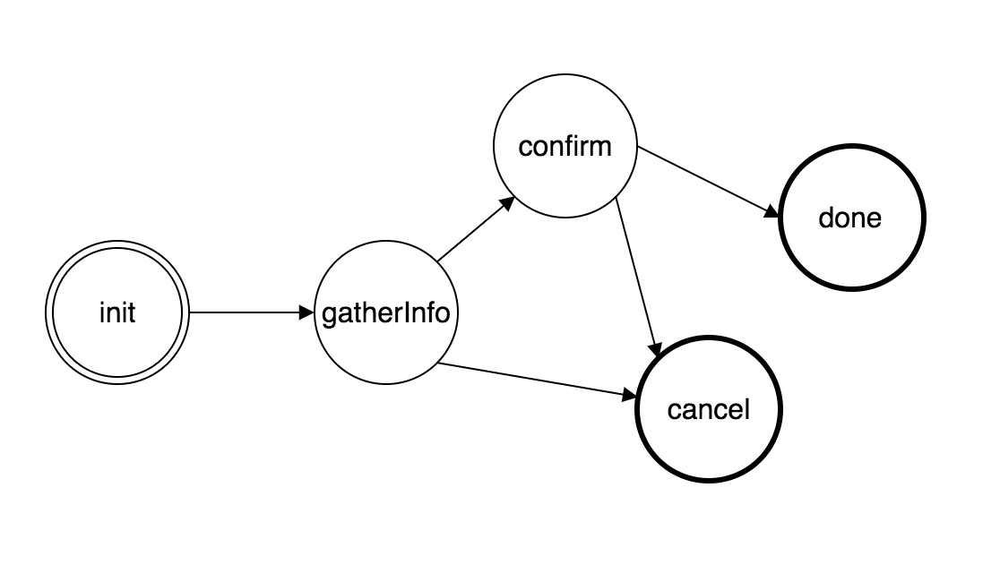
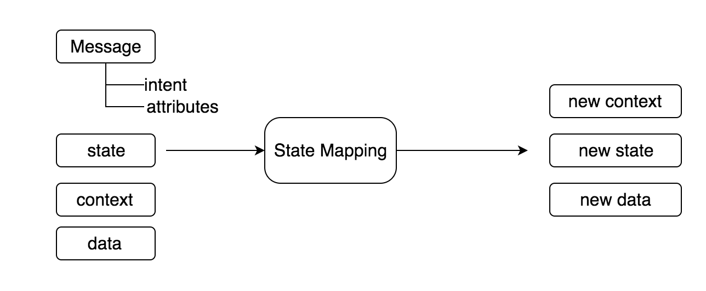
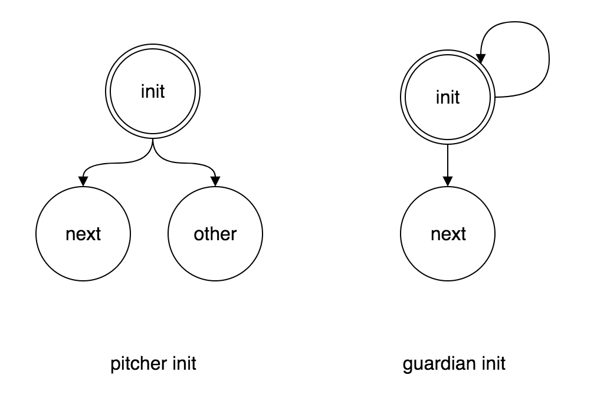

State represents the stage of the conversation. Imagine you are a Customer Service agent, you will provided with an SOP that requires you to respond appropriately in every state / stage of conversation. The state concept is basically a finite state machine with initial and end states.



We have discussed the three conversation phase: intent recognition, state mapping and action selection. In the state mapping phase, the parsed message together with current state, context and data will be mapped into a new state, updated context, and data.



A state can have an action or multiple actions attached that is being triggered at the end of state mapping lifecyle.

## Lifecycle

The lifecycle of a state mapping process is following:

1.  It starts from the last state (or init state if no last state is found)
2.  It will execute transit mapping, if it is defined
3.  It will search for available transition that meet condition, otherwise it will choose the fallback transition
4.  If a transition is chosen, it will execute transition mapping
5.  It will execute exit mapping
6.  It will execute enter mapping of the next state
7.  it will return the updated state, context and data
8.  The actions of the new state will be triggered

## Initial State

Every state mapping process must start from a state. If a flow is newly created, then it will start from the initial state. A flow can only have one initial state. There is two styles of initial state: the so called pitcher init or guardian init.



The pitcher init is an initial state that only used to start a flow and will never be revisited again. This style of init doesn't need to have an action attached, since it will never be the destination state.

```yaml
states:
  init:
    initial: true
    transitions:
      hi:
        condition: content == "hi"
      sorry:
        fallback: true
```

The second style is guardian init. This type of initial state will be revisited, until certain outcome (context change) is reached. Since this kind of init can be the destination state, it must have action attached.

```yaml
states:
  inquireName:
    initial: true
    transitions:
      inquirePhone:
        condition: context.name
      inquireName:
        fallback: true
```
