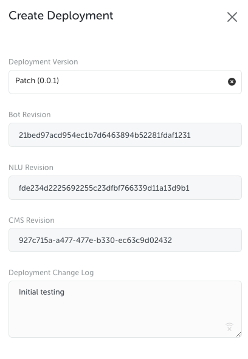
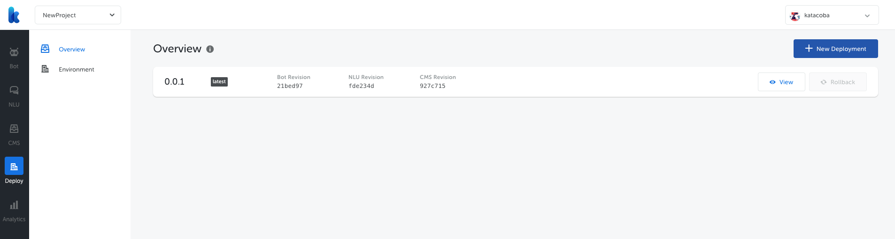
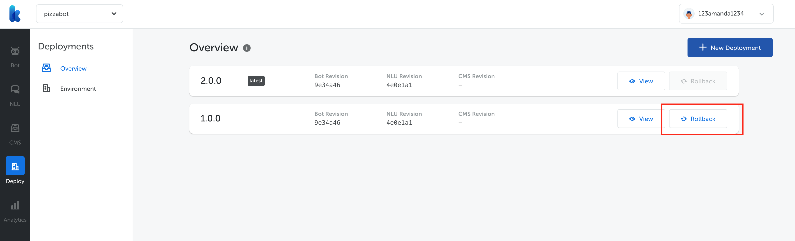
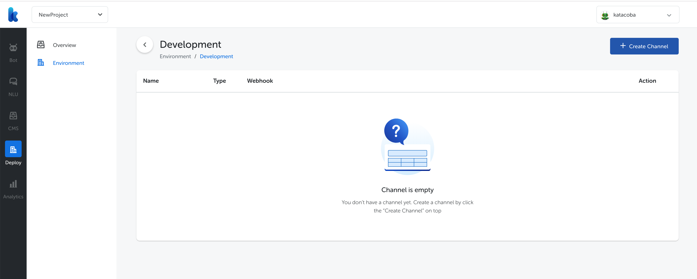
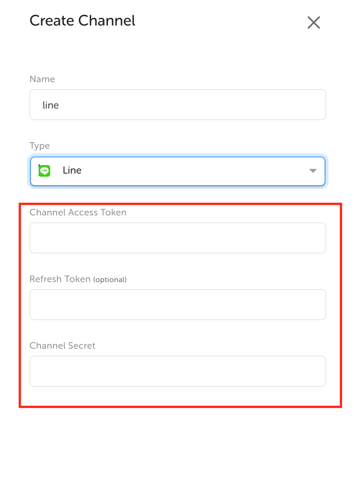

## How to Deploy

First of all, you need to create a project and a bot with at least a flow, a state and an intent. You may follow this tutorial to create a bot [Bot studio tutorial](https://temankata.quip.com/xln7AZ62Cno4). In this guideline, we will explain step by step on how to set up environments and deploy your project to LINE messenger.

### Create deployment

We have to create a deployment first. Find the “Deployment” menu on the left sidebar.

Click on Create Deployment button on top right.

Every deployment will use the latest revision of bot, NLU, and CMS. Those revision are shown in hash number, similar to Git. In short, the latest revision means latest published version.

This is how we use these three different terms for deployment version:

- Patch for tiny changes (e.g. copywriting, bugfix).
- Minor for new feature.
- Major for major revamp in the bot structure.

However, feel free to define this term with your own development team.

Next step, choose the Deployment Version, for example choose Patch.

Successfully created deployment will appear like this

### Rollback Deployment

You can see Rollback and View button in every deployment. Rollback feature will be enabled when you have more than 1 deployment (because you can't rollback to the latest version, of course.)

This is how it looks like if you have more than 1 deployment:

Rolling back to previous version will create a new deployment version, in this case version 3.00, using targeted revision hash number (version 1.00)

Please note that rolling back a deployment will also revert your training data to the targeted version. For example:

- Version 2 (latest) has 100 training data
- Version 1 has 50 training data.

Rolling back deployment to version 1 will result in you having only 50 training data. We do this to prevent inconsistencies in the bot structure. However, you can always rollback to version 2 should you need to.

### Create Environment

Kata | Platform 3.0 allows you to set up 3 separate environments in your project: Development, Staging, and Production. Inside each environment, you can add as many messaging channel as you like. You have to setup environment first before integrating to messaging channel.

In this tutorial, we will try to setup Production environment. Click on Environment menu under Deploy and you will be shown 3 available environments.

Click “Create Environment” button in Production.

The first field we have to fill in is deployment version. Choose 0.0.1 (shown on the previous step) as deployment version in Production.

Another field we have to fill in is environment URL. This URL is used to access CMS Client later.

Successfully created environment will look like this

Next, we need to create channel.

Click on Create Channel on Production environment and you will be redirected to Create Channel page.

Next, click “Create Channel” and fill in as follows

Then, continue to LINE developer console to fill in those fields. You can view the explanation in [Bot studio tutorial](https://temankata.quip.com/xln7AZ62Cno4)
