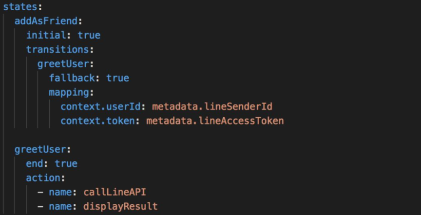
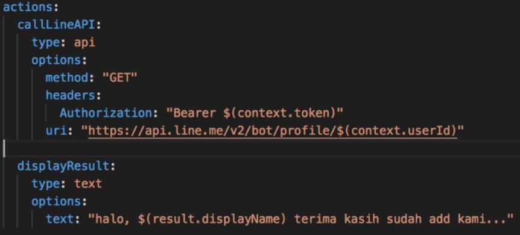

## What is the best practice for making a flow?

A flow should be “volatile” which means it gets closed when switching to another flow.

## How to remove a context after a specific time?

You may use `invalidate` function and filled it with timestamp type

## How to handle the intent that cannot catch user's input?

Always use a transition to the state itself named “default” if there are any branching state.

Also, you must create `reenter` intent with `command` type. This intent will help the bot ask a question again to user. Also, it will help you to maintain the active session longer.

## Is it possible to let users trigger a flow by a command?

Here is an example of using a command to trigger flow `login` in `greet` action

## How to make a different response on each channel?

We may use metadata for specific channel response. Each metadata consists of:

- Channel type
- Channel access token
- Sender id

## I found out my bot respond incorrectly for first-time users who add the bot. How to handle this?

You have to add below code to resolve the condition

Intent code to handle user's input:

Code to adjust Facebook Messenger :

## What's the best practice to create an action that calls API from a bot?

API that was called from bot must be returned with status code 200 and JSON Response Body. Otherwise the result in payload will be null.

## How to get the username from each channel?

You have to use API action in the bot to use specified API

- LINE: https://developers.line.me/en/docs/messaging-api/reference/#get-profile
- FB Messenger: https://developers.facebook.com/docs/messenger-platform/identity/user-profile
- For Telegram: access metadata.telegramSenderName

For example:

