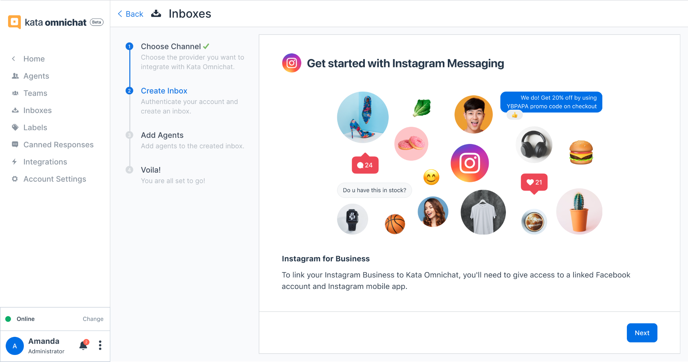
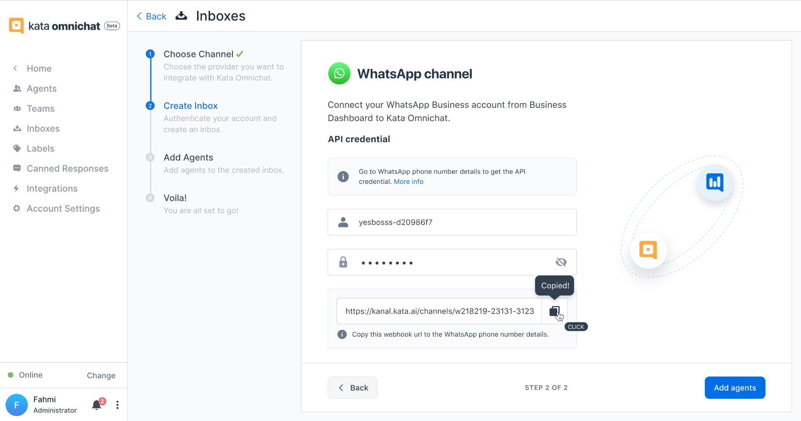
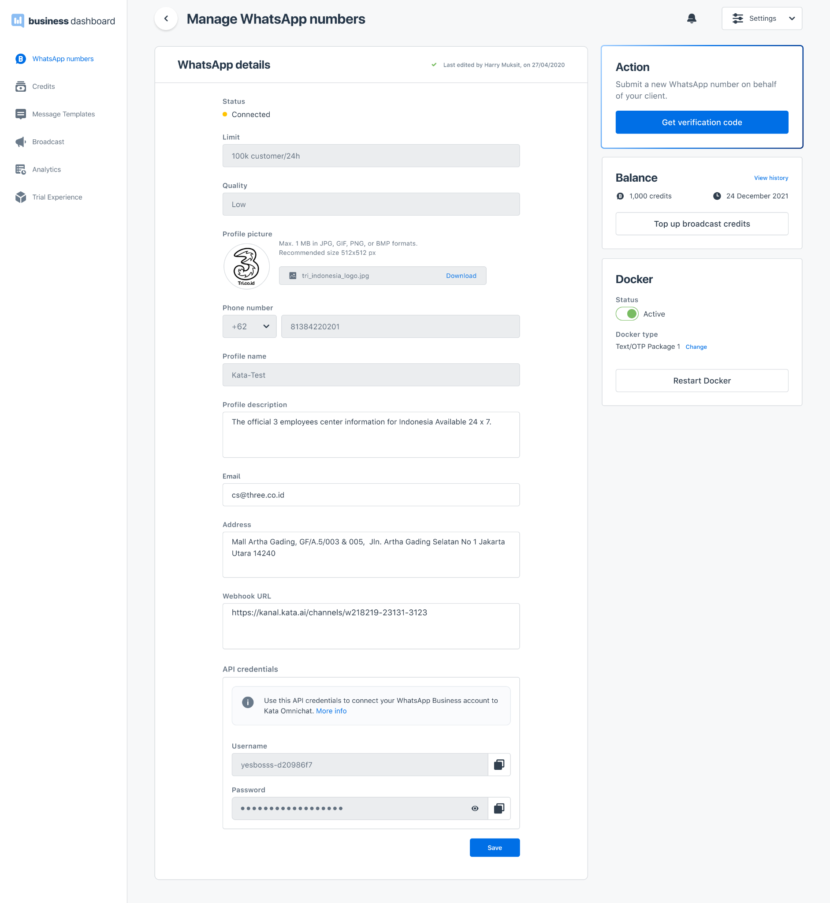

## Self-Onboarding

To watch the video, go to [https://youtu.be/VNgf-ciA-xA](https://youtu.be/VNgf-ciA-xA)

1. Go to [https://omnichat.kata.ai/](https://omnichat.kata.ai/) and click **"Create New Account"**. After that, fill in your **Work email** and **Password.**

2. After clicking the **Create account** button, you’ll be directed to the Onboarding page. You have to fill in some information related to your business and your personal details.

3. After you’ve done the **Onboarding** process, you’ll be directed to the Getting **Started**page with an unverified account.

4. To verify your account, you have to check your email (the verification link is automatically sent to your email) or click the **Verify account** banner on top of your screen to resend an email verification.

5. After you click the verification button in email, you will go back to the **Getting Started** page with an activated account. You will also receive a product tutorial link in your email.

## Connect Omnichat to Instagram Messaging

1. In the **Getting Started** page, you have to click the **Connect** button in **Instagram Messaging**. Or, you can go to **Inboxes** menu, click **Add new inbox** button and click **Instagram** channel.

2. You will see the **Get Started** page of Instagram Messaging and follow all the steps, including answering some of integration questions.

3. The system will automatically check the eligibility of your Instagram accounts. If it’s eligible, you will get a success message and if it’s not eligible you will be declined to use Instagram Messaging in Kata Omnichat.

## Register Your WhatsApp Business

1. In the **Getting Started** page, you have to click the **Register** in **WhatsApp Business.**

2. You will be directed to [https://business.kata.ai](https://business.kata.ai) and have to follow all the steps for registering your WhatsApp Business number.

3. After you successfully register your WhatsApp Business, you can go back to Kata Omnichat to set up WhatsApp as your channel in this dashboard.

## Connect to Your WhatsApp Business API Account

1. In the **Getting Started** page, you have to click the **Connect** button in **WhatsApp Business API**. Or, you can go to **Inboxes** menu, click **Add new inbox** button and click **WhatsApp Business API** channel.
   1
2. You will see the **Get Started** page of WhatsApp Channel, then you have to create the **Inbox Name** and fill in the **username** and **password** from your WABA’s API credentials.

3. You have to open your **Business Dashboard account > WhatsApp details** and then copy username and password from API credentials. Paste the username and password to Kata Omnichat, then the system will automatically generate the webhook URL.

4. Lastly, copy the Webhook URL that has been generated, paste it into **WhatsApp Details > Webhook URL** in Business Dashboard.

