## Change Password

1. Go to **Profile Settings** in the bottom right corner.

2. Change Password.

3. Click the **"Update Profile"** button.

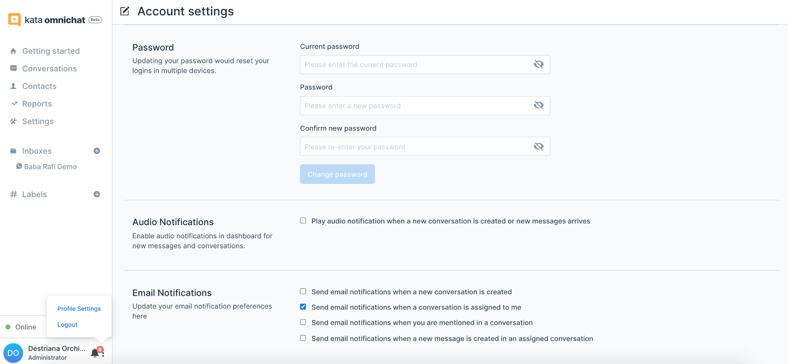

## Inbox Management

1. Click the **"Inboxes"** menu in the sidebar, then click **“Settings”** on any Inbox.

2. **For IGDM**, there are 5 submenu under Settings: **Account, Collaborators, Business Hours, Quick Reply** and **Ice Breaker.**

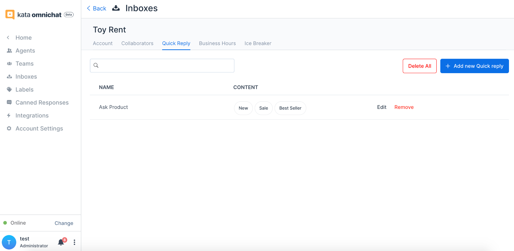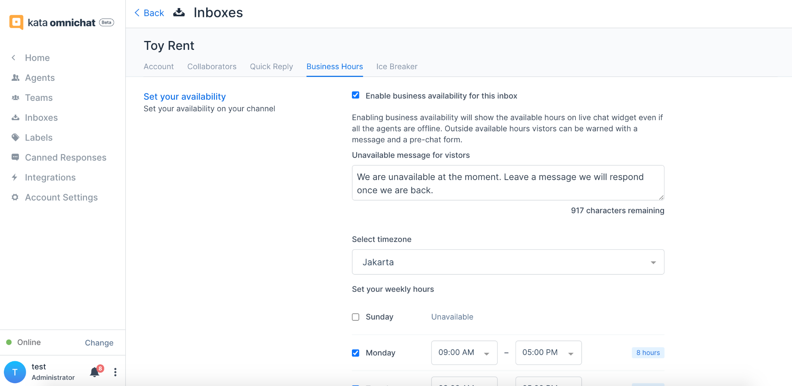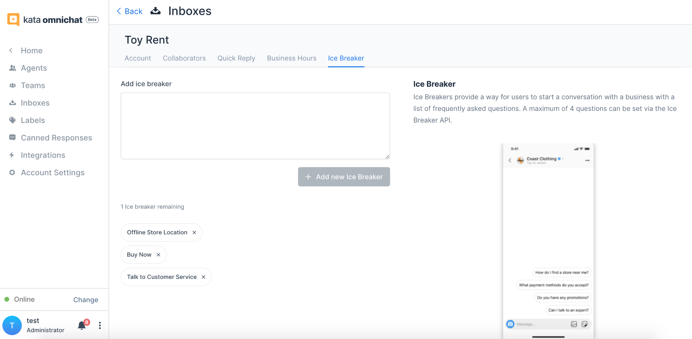

3. **For WABA API**, there are only 3 submenu under settings: **Account** and **Collaborators** and **Business Hours**.

4. In **Account**, you can modify your account.

5. In **Collaborators**, you can assign (add) which agents to handle the Inbox. Also here, you can remove agents from Inbox.

6. In **Business Hours**, you can enable the _away message_ and set up the available days and hours.

7. In **Quick Reply**, you can manage any **Quick Reply** that they want to show to their customers using _button-type_ reply.

8. In **Ice Breaker**, you can manage up to 4 _button-type_ options to automatically open up the first conversation with customers.

## Agent Management

1. Go to Home, then click **Settings.**

2. Click **Agents**, then click **Add Agents** button to add a new agent or "Edit" in each agent that you want to edit.

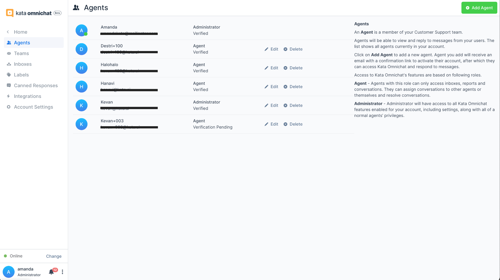

3. Add **Agent Name**, **Email** and **Role,** then click **Add Agent** to send an invitation to your agent.

4. Once your agents accept the invitation by setting up the password, they can start to explore the dashboard.

## Canned Responses

1. Go to Home, then click **"Settings".**

2. Click **"Canned Responses"**, then click **“Add Canned Responses”.**

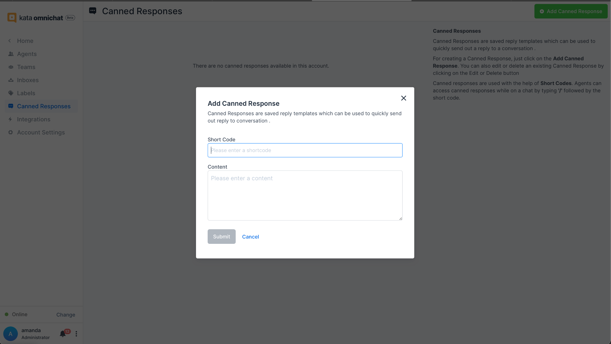

3. Create the **Short Code** and fill in the content we want to send it quickly to customers.

## Conversation in Agent-side

1. Agents will get an invitation link in email. By clicking it, agents can set the password and log in to the Omnichat Dashboard.

2. After agents have been assigned to an Inbox by admin, they can receive messages from customers.

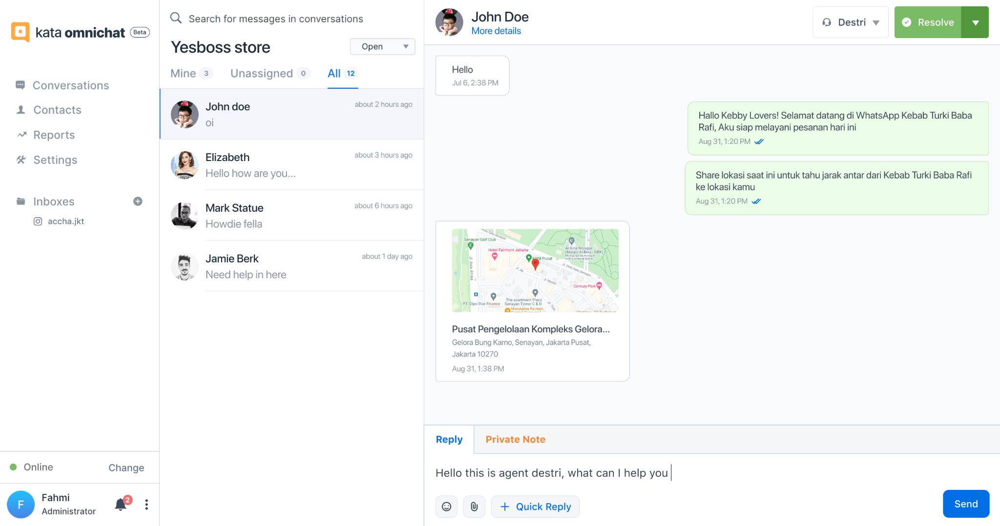

3. Agents can reply using text, emoticon, image/file and canned responses.

4. Specifically for **IGDM Inbox,** agents can send the **Quick Reply** to customers.

## Editing Contacts

1. Agents can add customer information by clicking on the **"Customer Details"** menu, then **“Edit Contact”.**

2. After inputting some information, you can save it and see it on the **"Contacts"** menu.

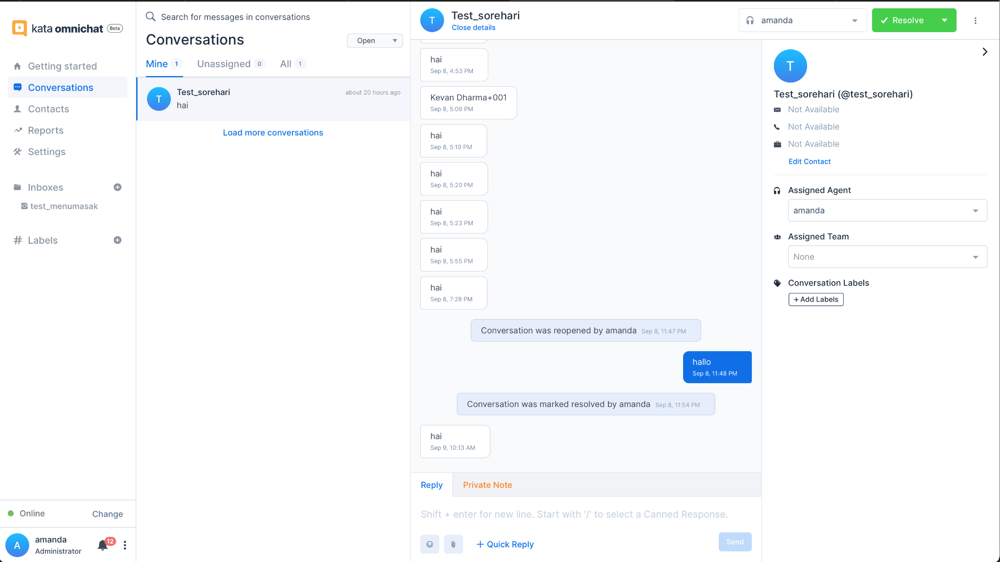

3. Agents can close the conversation by clicking on the **"Resolve"** button, then the conversation will back to bot.

4. Agents can add **"Private Note"** that might help other agents to understand the latest context of each conversation.

## Conversation in Customer-side for WABA Automation

1. Customer started to chat to users’ WABA number

2. During chatbot and customer conversation, customers can request handover to agents or agents can take over the conversation if users add an "agent bot" in the inbox. Learn more about [setup agent bot in Omnichat](/kata-omnichat/how-to-setup-agent-bot).

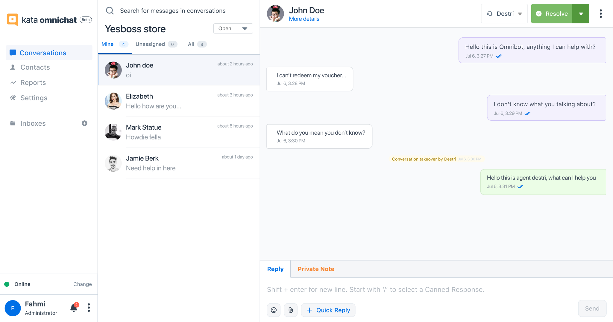

3. Customers can send and receive messages until agents resolve the conversation (if they choose to be handovered) and the conversation will be handed off again to agent bot or end the conversation with chatbot.

## Conversation in Customer-side for WABA Direct with No Automation

1. Customer started to chat to users’ WABA number

2. Customers can send to and receive messages from agent using these types of messages: text, image, video and document

## Conversation in Customer-side for IGDM Automation

1. Customers send messages to the Instagram account

2. Also, customers can reply to the brand's Instagram Story (**Instagram Story Reply**) or mention the brand's Instagram account in the customer's Instagram Story (**Instagram Story Mention**). Disclaimer: Customers’ Instagram account must be public if they want to send Instagram Story Reply and Instagram Story Mention to a brand, otherwise it cannot be replied by bot. If customers’ accounts are private, then the brand must request to follow the customers first.

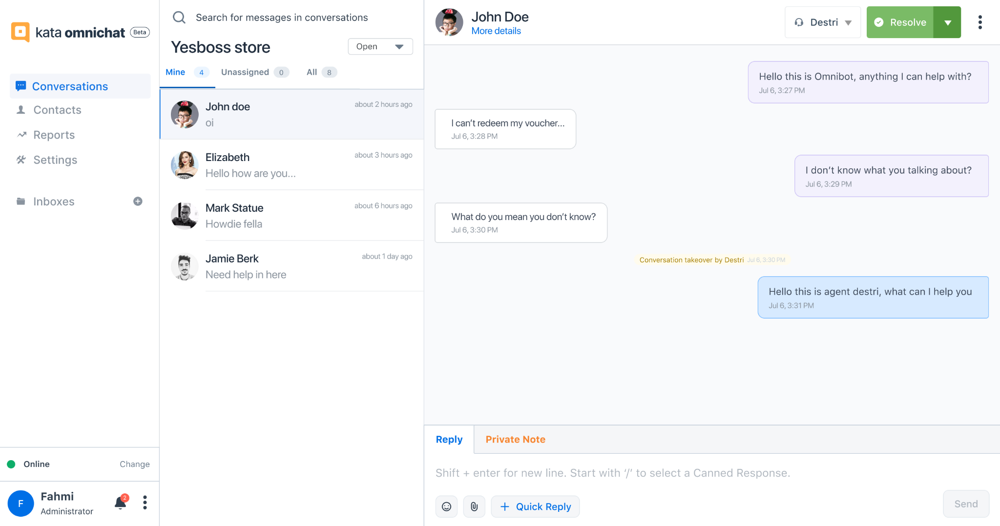

3. If the conversation is new, customers can select Ice Breaker topics or directly type a message.

4. If the conversation is _not new_, customers can directly send any messages.

5. Customers will be offered to choose whether they want to be handovered to agents or not. If they choose "yes", then there will be an agent assigned for them.

6. Customers will receive Instagram automation various responses such as: text, image, carousel ("generic template"), quick replies, and “heart” sticker when liking a message (coming soon). Learn more about [how to use Instagram DM automation](/channels/instagramDM).

7. During chatbot-customer conversation, agents can take over the conversation if users add an "agent bot" in the Inbox. Learn more about [set up agent bot in Omnichat](kata-omnichat/how-to-setup-agent-bot).

8. Customers can send and receive messages until agents resolve the conversation (if they choose to be handovered) or end the conversation with chatbot.

## Conversation in Customer-side for IGDM Direct with No Automation

1. Customers send messages to the Instagram account.

2. Also, customers can reply to the brand's Instagram Story (**Instagram Story Reply**) or mention the brand's Instagram account in the customer's Instagram Story (**Instagram Story Mention**). _Disclaimer: Customers’ Instagram accounts must be public if they want to send Instagram Story Reply and Instagram Story Mention to a brand, otherwise it cannot be replied by bot. If customers’ accounts are private, then the brand must request to follow the customers first._

3. If it’s a new conversation and you’ve already set up the Ice Breaker, customers will see the conversation topics.

4. If the conversation isn’t new or you haven’t set up the Ice Breaker, customers can directly send any messages.

5. Customers can send text, image, video, story mention and inline liking.

6. Agents can send text, image, video and inline liking.

7. Customers can have conversations with agents until agents resolve it.

## See Conversation between Chatbot and Customer

1. Go to the **Conversation** menu to see all your messages, both new and past messages.

2. In this page, you will see a dropdown which consists of **Open, Resolved, Bot**.

    1. Open means all new messages and not responded yet by agents.

    2. Resolved means all resolved messages from human agents.

    3. Bot means all conversations between chatbot and end-users.

3. Choose **Bot** and click 1 on-going conversation.

4. Finally, you will see purple messages which indicate responses from chatbot and white which indicate incoming messages from the end-user.

## Take-over Conversation between Chatbot and Customer

1. Go to the **Conversation** menu to see all your messages, both new and past messages.

2. Choose **Bot**.

3. To take over the conversation, click the **Open** button which is placed next in the agents list dropdown.

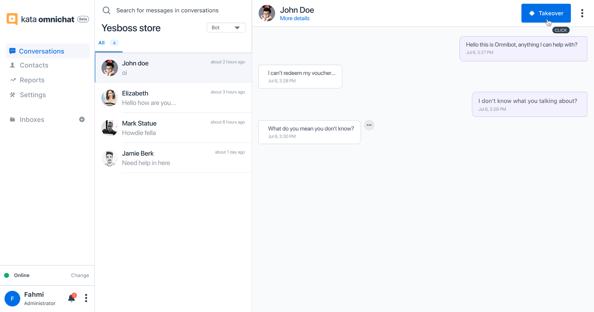

4. Conversation with chatbot is paused and you can type to reply to the end-user. Your reply will be seen in the blue message.

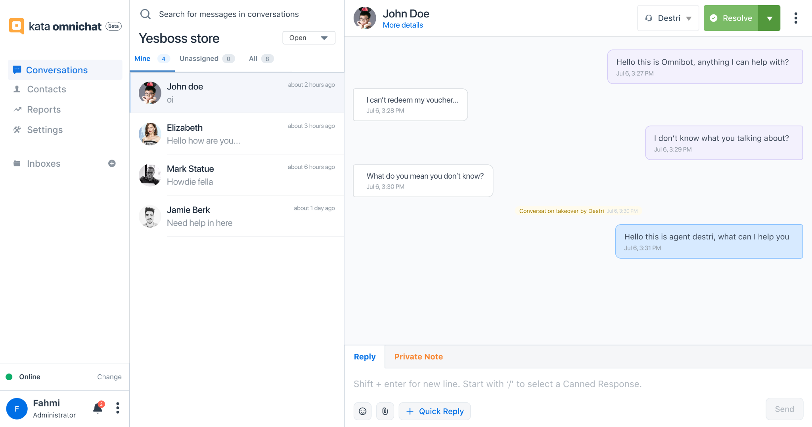
