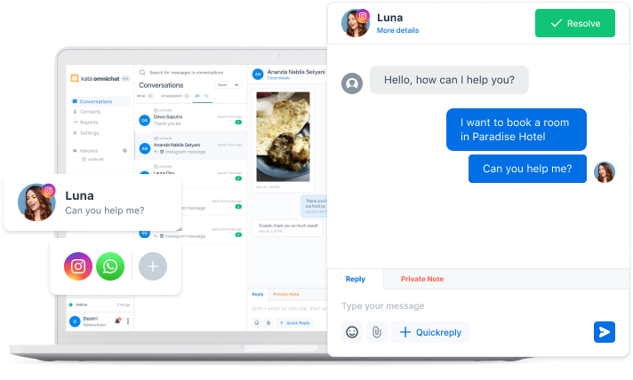

# Introduction

Kata Omnichat is a centralized dashboard where you can handle messages from multiple channels. For now, you can integrate 2 channels; Instagram Messaging and WhatsApp Business API.

With Kata Omnichat, you can easily manage, distribute, and review your agents’ performance, providing you better insights on your customer service department. You can also integrate chatbots to Kata Omnichat, allowing your customer service agents to work hand-in-hand with machine intelligence. It’s an all-in one solution for your customer service department.
