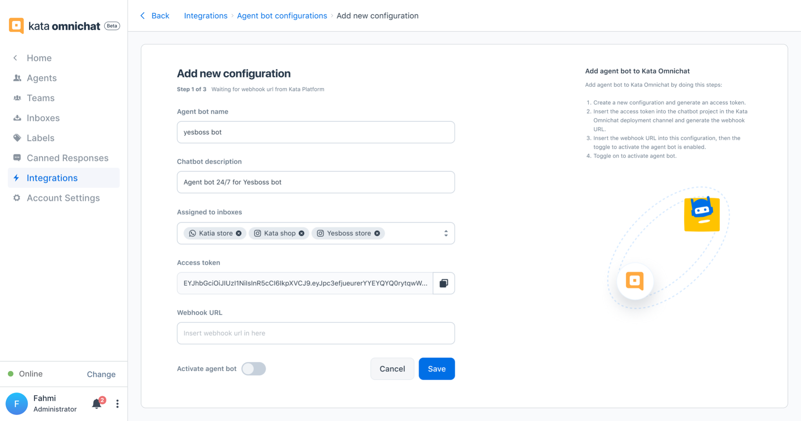

Agent bot is a feature to integrate your Kata Platform chatbot with Omnichat as "agent". This feature will let you see the conversation stream between bot and end-users and take over conversation from bot when needed. Learn more about [creating a chatbot handover to an agent](/tutorial/create-igdm-bot-handover-from-chatbot-to-agent).

## Setup Agent Bot in Kata Omnichat

<iframe width="600" height="300" src="https://www.youtube.com/embed/n4FbWd1dHF0" title="YouTube video player" frameborder="0" allow="accelerometer; autoplay; clipboard-write; encrypted-media; gyroscope; picture-in-picture" allowfullscreen></iframe>

1. Go to the **Settings** menu in Omnichat.

2. Then, click on the **Integrations** menu. You will see 2 cards: Agent bot and Webhooks.

3. Click the **Configure** button in **Agent bot** card.

4. Click **Add new configuration** to set up a new agent bot.

5. Fill in the **agent bot name and description**, then choose **inboxes** that you’ve created before. You can add multiple inboxes in 1 agent bot setup.

6. Finally, you’re ready to finalize the first step by clicking the **generate access token** button. You must paste the access token into Platform. Go to create [simple chatbot handover tutorial](/tutorial/create-simple-bot-handover-from-chatbot-to-agent) to continue

## Create Agent Bot from Kata Platform

For this tutorial, go to [Create Simple Handover from Chatbot to Agent Tutorial](/tutorial/create-simple-bot-handover-from-chatbot-to-agent)
