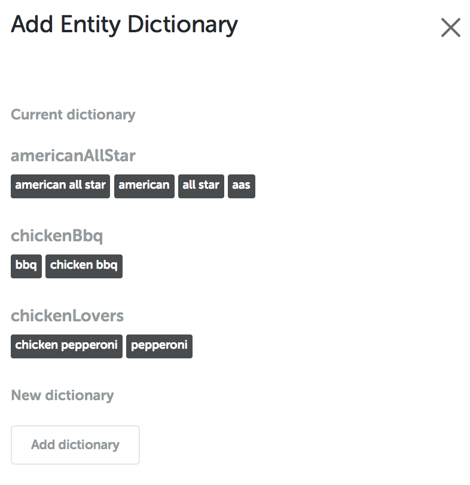
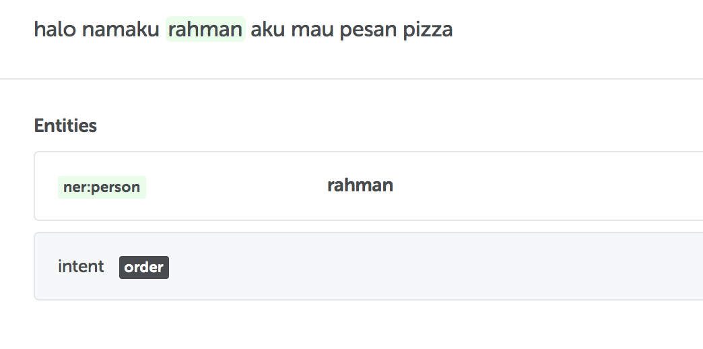

Entity is a thing that you want to extract from a human language input. For example, given a human language sentence, you want to get information about person name and location name from it. Therefore, person name and location name are the entities in your NLU.

To extract the informations, you need a trained machine learning model. The model is responsible to extract a specific entity based on its task. Knowing that, it can be concluded that **_each entity has its own model._**

Below is an input example and its extracted entities.

```
# Input

    Nama saya Budi, saya tinggal di Jakarta.

# Output

    - entity_person = "Budi"
    - entity_location = "Jakarta"
    - entity_intent = "give_credential"
```

To create an entity, you need to include these parameters:

- `name : string`\* - entity name, should only contains alphanumeric character and written in `camelCase` or `snake_case` format.
- `type : "dict" | "phrase" | "trait"`\* - type of entity, consists of:
  - dict - (dictionary) _word tagger_ with dictionary support from user.
  - phrase - _word tagger_ for common words.
  - trait - _text classifier_. Classify a sentence into particular classes.
- `profile : string`\* - profile represents a model to complete certain tasks. What profile can be used, depends on the type of its entity.
- `root : string` - root is used to define the hierarchical relationship between entities and help both training and prediction processes.
- `belongsTo : string` - to define relationship between entity. Feature belongsTo can only be used for entity in same NLU.
- `labels : string[]`\*\* - labels are used to determine what classes an entity will be classified. Label should only contains alphanumeric character and written in `camelCase` or `snake_case` format.
- `inherit : string` - inherit is used to duplicate a _pre-defined entity_ (entity that has been created in other NLU). In addition to the entity structure, inherit will also duplicate the trained model even though the training data itself won't be included. This ability makes the entity can immediately do prediction without training data.
- `dictionary : { [key : string] : string[] }` - dictionary keywords for entity type `dict`.

**Footnotes**

\*) required field<br />
\*\*) required field for entity with type `trait`

## Dictionary

Entity with type dict (dictionary) aims to simplify and speed up the training process for specific words that need to be detected according to its domain, for example product names. It is not recommended to create an entity dictionary for general words such as question words and verbs. Profiles that can be used for this entity type dict are:

- **default**
  - _Entity Tagger default_ with dictionary (keyword) input by users
- **klitika**
  - Same as _default_ but automatically able to predict correctly if a word is followed by klitika in Bahasa Indonesia (-ku, -mu, -nya)

There are several rules you must follow when defining a dictionary:

- All list of words in dictionary must be written in lowercase. It can detect if the input words is in uppercase, but when defining the dictionary it need to be written all in lowercase.
- Dictionary key should only contains alphanumeric character and written in `camelCase` or `snake_case` format. You can put any symbols in the list of words, but do not put on the dictionary key.

Below is an example of entity with type dictionary. In this case, we create a bot for 'pizza delivery' in which the NL need to discover 'type of pizza' from user's input.




Below is an example on how you SHOULD NOT define the dictionary:

```yaml
entities:
  product:
    type: dict
    profile: default
    dictionary:
      pizza:
        - PIZZA # do not use uppercase character in list of words
        - Pizza
      soda-1.2: # do not use symbol as dictionary key
        - soda
        - soda 1.2
```

## Phrase

Entity type phrase is an entity tagger that aim to tag general words for its specific case. Profiles that can be used for this entity type phrase are:

- **default**
  - Default Word Tagger that can be used to tag freely. May fill _field labels_ as needed. Can be used if you have a large amount of training data.
- **currency**
  - Word Tagger to predict money and currency. No need to fill _field labels._
  - Example: `IDR 12,000`, `USD 15`, `seribu rupiah`
- **email**
  - Word Tagger to predict words in e-mail format. No need to fill _field labels._
  - Example: [`admin@domain.com`](mailto:admin@domain.com), [`admin-2017@domain.co.id`](mailto:admin-2017@domain.co.id)
- **entitySentiment**

  - Word Tagger that can predict sentiment from the tagged word.
  - Steps to use this profile :

    - Define an entity (eg: items) that you want to tag
    - Define entitySentiment with root to created entity. Fill in the label with sentiment (eg: positive / negative)
    - Train each sentence by tagging words according to entitySentiment
    - Example: rasa pizza aas sangat enak → tag train `aas (entitySentiment, label: positive)`

- **location**
  - Entity Tagger to find location names. No need to fill _field labels_
  - Example: `Jakarta`, `Indonesia`, `Jalan Jendral Sudirman no. 5`
- **name**
  - Entity Tagger to find names of people. No need to fill _field labels_
  - Example: `Jokowi`,`RA Kartini`, `Budi Eko`
- **ner**
  - Entity Tagger to find NER locations and names of people. Recommended labels: `[location, person]`
  - Example: `Malang (label: location)`, `Siti (label: person)`
- **number**
  - Entity tagger to find number in the form of digits and words. No need to fill _field labels._
  - Example: `100`, `8.9`, `satu`, `lima juta`, `10 ribu`
- **phone**
  - Entity Tagger to find Indonesian telephone number format. No need to fill _field labels._
  - Example: `(021) 712391`, `+62872284752`, `1500-677`
- **pos**
  - Entity Tagger to find POS (Part-of-Speech) Tags for each word. Fill labels with defined tags (Ex: Noun, Verb, Adj, Adv, etc). Tag each word in training data with correct tag to produce a good model.
  - Example: `Ibu (label: Noun)`, `pergi (label: Verb)`, `ke (label: Prep)`, `pasar (label: Noun)`
- **preps**
  - Entity Tagger to differ words based on Indonesian prepositions ("ke", "dari", "di") around the word. Example implementation is useful to distinguish locations which are origin and destination.
  - Implementation can be creating 1 entity with label [origin, destination] or making 2 entities where first entity to find 'origin' and the second entity to find 'destination'.
  - Example: pergi ke `Malang (entity: destination)`, dari `Bali (entity: origin)`
- **time**
  - Entity Tagger to find words related to time.
  - Example: `hari ini`, `2 minggu yang lalu`, `01-18-2010`, `3 Desember`, `dari pagi sampai malam`, `jam 2 siang`
- **units**
  - Entity Tagger to find words in unit format.
  - Example:`2 meter`, `8 liter`, `sepuluh jam`, `2 ribu gram`
- **url**
  - Entity Tagger to find words in url format
  - Example: [`http://platform.kata.ai`](http://platform.kata.ai/)

Here is an example for training entity with type phrase in label 'person'.



## Trait

Entity type trait is used for general text classification task. You need to define list of labels for this entity. Profiles that can be used for this entity type trait are:

- **default**
  - Text Classification that can be used for any task by providing large amounts of data.
- **faq (Frequently Asked Questions)**
  - Optimized for data that generally in FAQs form.
- **intent**
  - Classifier to determine intent from a sentence.
  - This model is influenced by predictions results from other models (entity in phrase type or dict type) in one NLU.
- **qisg**
  - Classifier to categorize sentences into question sentences, commands, statements and greetings. Label recommendations: [question, instruction, statement, greetings]
  - Kata Team has predefined entity qisg that can be directly used as root or duplicate using inherit
- **sentiment**
  - Classifier to determine sentiment of a sentence. Label recommendations [positive, negative] or something similar
- **topic**
  - Classifier to find out topic from a sentence. Example:
    - Categorize complaint reports based on problem type
      - banjir nih di kemang, butuh perahu karet → **topic: flood**
      - ketinggian air sudah mencapai 40 cm → **topic: flood**
      - ada tabrakan antara avanza dan xenia di pintu masuk tol → **topic: accident**
      - ditemukan heroin di rumah tetangga saya → **topic: drugs**
      - berat ganja dan sabu2 mencapai 10 gram → **topic: drugs**
    - Categorize products types from e-commerce reviews
      - Anak saya suka membaca buku karyanya → **topic: book**
      - Karya-karya penulis ini sudah dicetak dan diterjemahkan ke dalam banyak bahasa → **topic: book**
      - Kok laptop saya baru dipakai sebentar keyboardnya sudah copot2 ya? → **topic: computer**
      - mouse nya berjalan dengan baik, desainnya juga oke banget → **topic: computer**
      - saya sangat suka peralatan masak ini karena bagus dan tidak mudah kotor → **topic: kitchenware**
      - udah gak takut kompor meledak sejak pakai tabung gas lpg yang pink → **topic: kitchenware**

## Root

An entity can root to other entity in same NLU or other entity in different NLU. Kata Team already create several NLUs and entities that can be utilized.

This following examples are several root concept usages with entities made by Kata Team.

**kata:ner/ner[:location or :person]**

Can be used to help carry out tagging to words which are location name or the name of a person.

Implementation example:

```yaml
entities:
  person_name:
    type: phrase
    profile: ner
    root: kata:ner/ner:person
  origin:
    type: phrase
    profile: preps
    root: kata:ner/ner:location
  destination:
    type: phrase
    profile: preps
    root: kata:ner/ner:location
```

Using the structure above, you can discover words which is `origin` or `destination`. Words that are origin and destination are assumed to be location name. Another implementation if you don't want to use entity from Kata Team is by creating your own entity `location` and make the entity `origin` and `destination` root to your own entity `location`.

**kata:qisg/qisg[:greetings or :instructions or :question or :statement]**

Can be used to assist in the classification process of a sentence.

Implementation example:

```yaml
entities:
  greeting_type:
    type: trait
    profile: default
    root: kata:qisg/qisg:greetings
    labels:
      - morning
      - afternoon
      - evening
      - night
      - hi
      - bye
  question_type:
    type: trait
    profile: default
    root: kata:qisg/qisg:questions
    labels:
      - whatIs
      - howTo
      - where
      - when
  intent:
    type: phrase
    profile: default
    root: kata:qisg/qisg
    labels:
      - greet
      - ask_receipt
      - order_pizza
      - thank_you
```

From above structure, it is assumed that `question_type` entity and `greeting_type` are each specific forms from `qisg` entity with `question` label and `greeting`. As for `intent` entity which have more general labels, use root `qisg` to help classification process without specifying what labels affect.

Above examples are samples for root usage and utilization. For the implementation itself, it is not required to be exactly as same as above example.

## Inherit

This feature can only be utilized from entity in different NLU. Inherit would duplicate both structure and trained model of an entity so you can't update the structure of it, but you can add more training data from your entity. Kata Team already create several trained NLUs and entities that can be inherited.

Following are some entities belong to Kata Team that have been trained and able to be duplicated. Even though you can make predictions without giving any data training, if the prediction is wrong / incorrect, just add more training data to the NLU.

- **kata:ner/ner** — Trained entity tagger can discover words either people names or location names. The Entity will be classified into two labels, namely `PERSON` or `LOCATION`
- **kata:number/number** — Trained entity tagger and can discover numbers (in digits and words form)
- **kata:currency/currency** — Trained entity tagger and can discover money or currency.
- **kata:time/time** — Trained entity tagger and can discover date and time. Found word will be labeled `ABSOLUTE` or `RELATIVE` or `INTERVAL`.
  - ABSOLUTE for definite date. Example: 7 December 2019, 17/08/1945
  - RELATIVE for words that indicate the current time based. Example: today, tomorrow, the day after tomorrow
  - INTERVAL for words that have start and finish times. Example: from yesterday to tomorrow, from August 18 to September 4
- **kata:unit/unit** — Trained entity tagger and can discover words in unit form. These words will be given one of following labels [`DURATION`, `LENGTH`, `AREA`, `VOLUME`, `WEIGHT`, `TEMPERATURE`, `QUANTITY`]
- **kata:qisg/qisg** - a text classifier that will classify a sentence into o following 4 labels [`QUESTION`, `INSTRUCTION`, `STATEMENT`, `GREETINGS`]
- **kata:sentiment/sentiment** - Trained text classifier and will classify sentences into one of following sentiments : [`POSITIVE`, `NEGATIVE`, `NEUTRAL`]
