## What is bulk training?

Great NL models are a fundamental part of making a great chatbot and approximately 70% of all chatbot projects use NL models instead of a keyword-based approach.

Previously, the bulk training process was very technical because developers needed to use KataCLI and view the results on the Platform GUI ([www.platform.kata.ai](http://www.platform.kata.ai/)). This back and forth switching of tools was required to do training.

Now, you can use the new Bulk Training on the Platform GUI itself to train more than 200 sentences/training data at once. These are the screenshots of our newest feature.

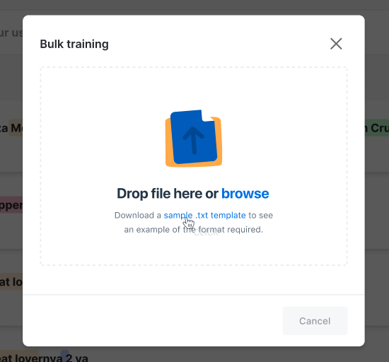

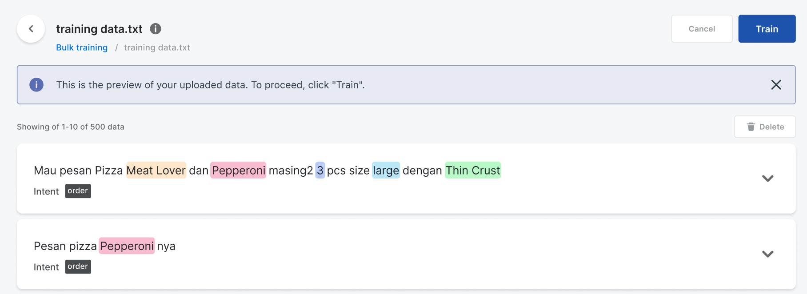

You can click on this [video tutorial](https://youtu.be/qcxQqMI-Khs) or go to the NLU -> Training menu (check the screenshot below).

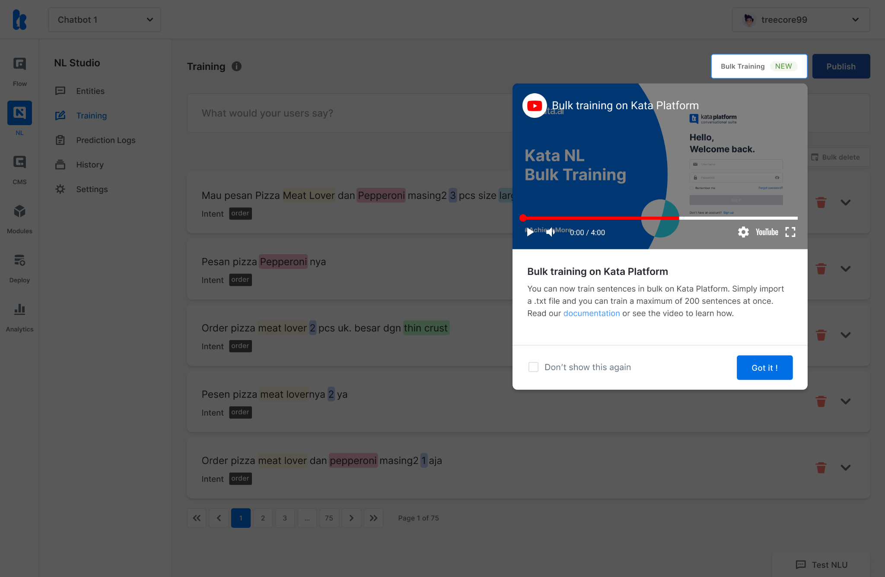

## Why do we need this feature?

Training NL models is one of the most time consuming processes in chatbot development, which could take approximately 6 weeks. On average, a complex chatbot project requires 1,000 data for their NL models. It&#39;s not ideal to train the sentences one by one, as a typical 1,000-sentence NL model would easily take more than 4 hours to train.

Hence, bulk training can significantly reduce the training effort with a simplified user flow

## How to use bulk training

### Create a project

Mission: Create a new project.

Prerequisite: You already have a Platform account and have logged in.

1. Click on the **Create Project** button.
2. Fill in required fields for the project.
3. Click **Create Project.**

###

### Create entities and labels with type &quot;trait&quot;

Mission: Create NL models to be trained and type entity &quot;trait&quot;. Learn more about [entity type &quot;trait&quot;](https://docs.kata.ai/nl-studio/entity/#trait).

Prerequisites: You already have a project.

1. Go to **NLU**.
2. Click on **Entities**.
3. Click the **Create Entity** button to start creating entities and labels. Learn more about [entities and labels](https://docs.kata.ai/nl-studio/entity/) or you may want to explore [how to design the NLU](https://docs.kata.ai/nl-studio/designing-nlu/).
4. Fill in fields with this example.

```
Entity name: intent
Type: trait
Profile: default - Text classification
```

5. To create labels, you need to type and press &quot;enter&quot; to save a new label. Fill in with these examples.

```
Labels: greetings, thank you
```

6. The result goes here:

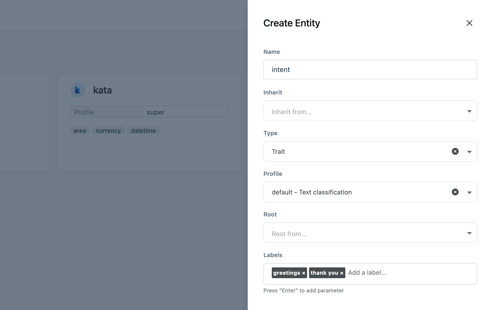

7. Click **Create** to finalize creating a new entity with &quot;greetings&quot; and &quot;thank you&quot; labels.

### Create entities and labels with type &quot;phrase&quot;

Mission: Create NL models to be trained and type entity &quot;phrase&quot;. Learn more about [entity type &quot;trait&quot;](https://docs.kata.ai/nl-studio/entity/#phrase).

Prerequisites: You already have a project.

1. Click the **Create Entity** button to start creating entities and labels. Learn more about [entities and labels](https://docs.kata.ai/nl-studio/entity/) or you may want to explore [how to design the NLU](https://docs.kata.ai/nl-studio/designing-nlu/)
2. Fill in fields with these examples:

```
Entity name: object
Type: phrase
Profile: default - Default phrase
```

3. To create labels, you need to type and press &quot;enter&quot; to save a new pile. Fill in with this example:

```
Labels: person
```

4. The result goes here:

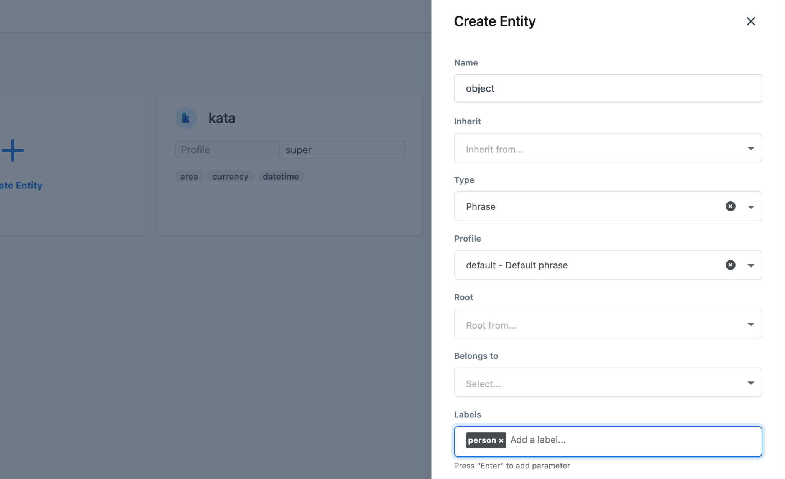

5. Click **Create** to create new entity with &quot;person&quot; label.

### Guideline to create a training data

Before we use the NL bulk training, we will create training data using simple syntax. &quot;#&#39; for entity type &quot;trait&quot; and &quot;@&quot; for entity type &quot;phrase&quot;. Learn more about [entity type &quot;trait&quot;](https://docs.kata.ai/nl-studio/entity/#trait) and [entity type &quot;phrase&quot;](https://docs.kata.ai/nl-studio/entity/#phrase).

This syntax is only allow for entity type &quot;trait&quot;

```
Saya mau pesan pizza #intent:order
```

This means that the sentence is classified into **entity name: intent** with **label: order**

```
Totalnya berapa ya? #intent:ask #questionType:how_much
```

This means that the sentence is classified into **entity name: intent** with **label: order** and **entity name: questionType** with **label: how_much**

This syntax is only allow for entity type &quot;phrase&quot;

```
Saya mau pesan tiket ke (@destination Malang) atas nama (@ner:person Budi) #intent:order
```

Means that the word &quot;Malang&quot; is tagged for **entity name: destination** and &quot;Budi&quot; is tagged for **entity name: ner** with **label: person**

### Create new training data

Mission: Create new training data in a .txt extension file. In this step, you will need to open a text and source code editor such as Notepad (in Windows), [notepad++](https://notepad-plus-plus.org/downloads/), [Sublime](https://www.sublimetext.com/), etc.

Prerequisites: You already have a project and entities.

1. Open your text and source code editor (Notepad, notepad++, sublime, etc.)
2. Create a new file.
3. Type following sentences example to create training data to train our NL models. You can add up to 200 sentences/training data. Or, you can download [this example](https://drive.google.com/file/d/1ErLuDwa6_1hyfnV7zVNBrlleE7l3KCb0/view?usp=sharing).

```
selamat pagi #intent:greetings
welcome #intent:greetings
nama saya (@object:person amanda), salam kenal ya #intent:greetings
kemarin saya lihat (@object:person amanda) dan (@object:person rizyan) bercengkerama
hari ini cerah ya kata (@object:person destri)
morning everyone!! #intent:greetings
```

4. Save the following training data into a file named: training-data-example.txt

### Upload training data and perform data training

Mission: Upload training data to be previewed in Platform GUI.

Prerequisites: Training data has been created as a .txt extension file.

1. Go to **NLU > Training** in Platform.
2. Click on the **Bulk Training** button.
3. Click on **Browse** button to open the file explorer/finder or drag and drop the file into the browse file dialog.
4. Wait for the upload process.
5. After the upload is complete, you can review the training data file in Platform GUI.

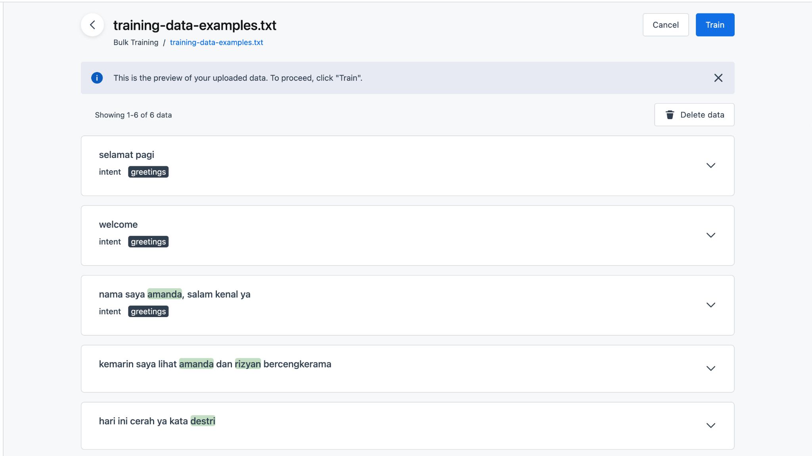

6. Click on the **Train** button to train the data.
7. You will see a customer satisfaction survey after using the feature.
8. Fill in the survey, then click X to close the dialog.
9. You have successfully trained your NL model with the uploaded data.

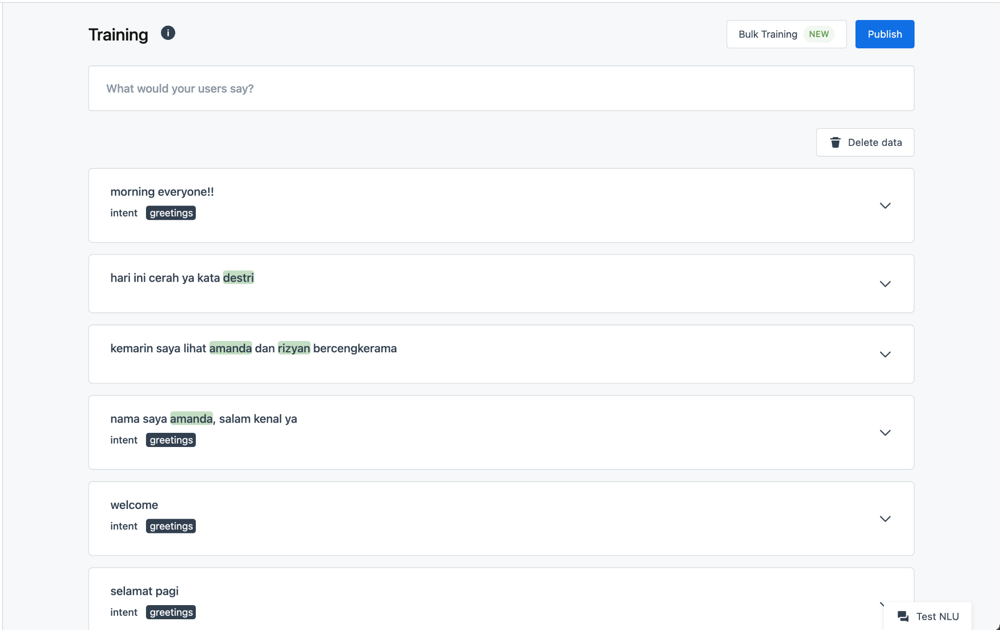

## Error messages

During the upload process, you might receive any of the error messages below. Let&#39;s see what they are and how to solve each one of the errors.

### Your file won&#39;t be uploaded if you close the dialog box now.

It will show if you&#39;re trying to close the upload dialog box or click the **X** symbol during the file uploading process. Please do not click the **X** button.

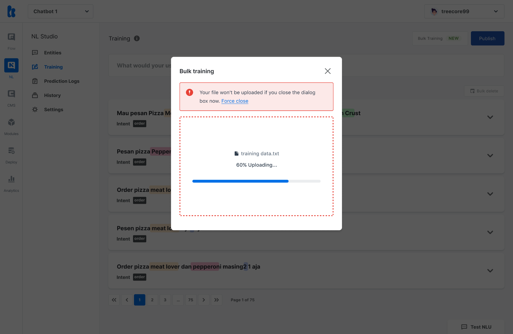

### Invalid file format. Only .txt files are supported.

This error message will be displayed if you uploaded different types of files. Bulk Training feature only accept .txt file format.

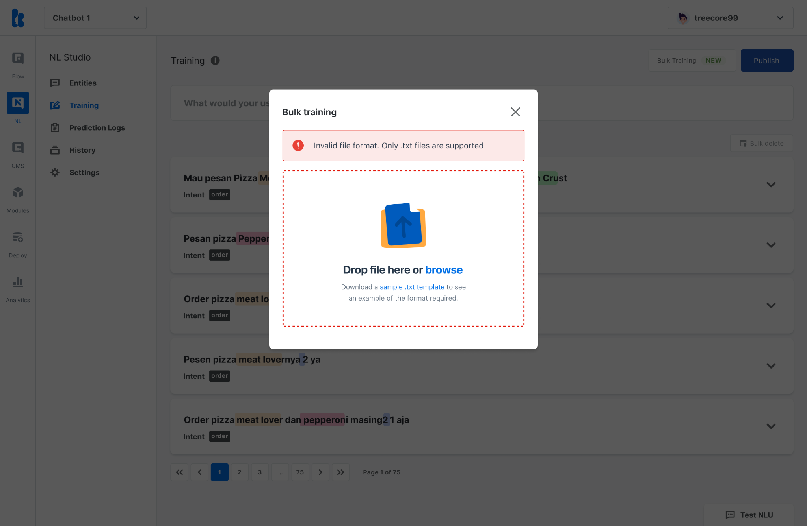

### Your .txt file is empty.

If you uploaded an empty .txt file, this error message will be shown. Please check and make sure you have written the data training content in the .txt file. For more about the data training file format, please refer to the [guideline to create training data](#guideline-to-create-a-training-data).

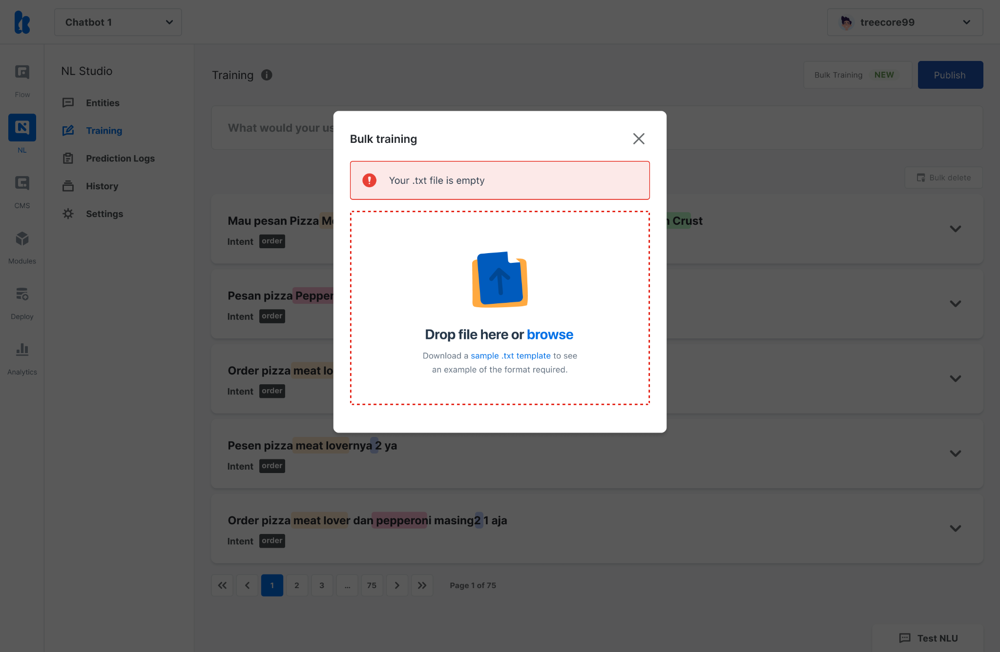

### Your connection was interrupted. Please check your connection. Try again.

If your internet connection was interrupted during the upload process, this error message will be shown. Please make sure that your internet connection is stable and re-upload the data training file again.

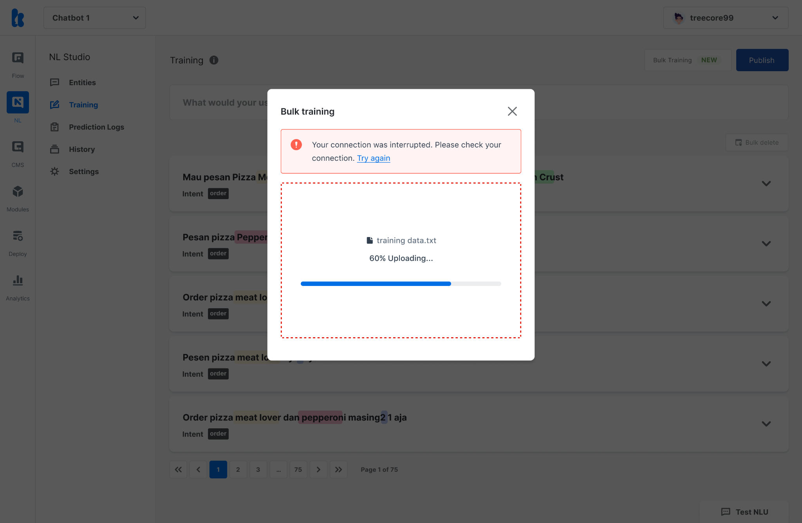

### The .txt file contains entities or labels that you don&#39;t currently have. Please check your file or Entities.

This error message will be displayed if your data training file contains no entities or labels that matched your current entities on the project. Please check your NL project then go to the entities menu and create the entities or labels that you want to train with the Bulk Training feature.


