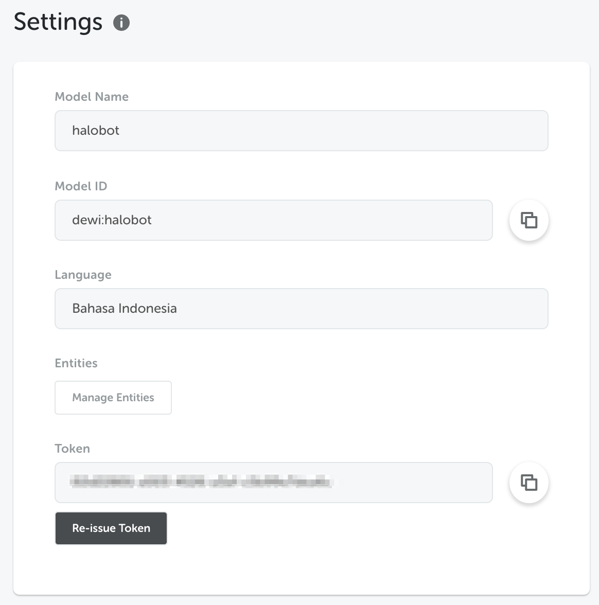

Now you can use your Natural Language Model everywhere. We provide an NL Prediction API, so you can integrate this to your application.

To get your API Token:

- Go to NL Studio
- Go to Settings Menu
- Get your Token



## Request Format

Use this format to predict:

**Endpoint**

```
https://geist.kata.ai/nlus/{nluId}/predict
```

**Header**

```
Authorization: Bearer <token>
```

**Body**

```json
{
  "text": "test sentence"
}
```

**Response**

```
{
  result: {
    entity1:
    [
      {
        type: 'trait' | 'dict' | 'phrase',
        start: number,
        end: number,
        score: number,
        value: string,
        label: string,        // optional
        belongsTo: {          // optional
          name: string
          index: number
          score: number
        },
        resolved: JsonObject  // optional
      }
    ],
    // entity2: ...
  }
}
```

## Example

**Body**

```json
{
  "text": "ada satu bebek dan lima kucing di sawah"
}
```

**Response**

```json
{
  "result": {
    "ner": [
      {
        "type": "phrase",
        "score": 0.9999965645021311,
        "value": "sawah",
        "label": "LOCATION",
        "start": 34,
        "end": 39
      }
    ],
    "animal": [
      {
        "type": "dict",
        "score": 0.7501584501364904,
        "value": "bebek",
        "start": 9,
        "end": 14,
        "resolved": {
          "dictKey": "duck"
        }
      },
      {
        "type": "dict",
        "score": 0.7246852050864251,
        "value": "kucing",
        "start": 24,
        "end": 30,
        "resolved": {
          "dictKey": "cat"
        }
      }
    ],
    "number": [
      {
        "type": "phrase",
        "score": 0.9376105664167582,
        "value": "satu",
        "start": 4,
        "end": 8,
        "belongsTo": {
          "name": "animal",
          "index": 0,
          "score": 0.6410337624317093
        }
      },
      {
        "type": "phrase",
        "score": 0.9378051647076224,
        "value": "lima",
        "start": 19,
        "end": 23,
        "belongsTo": {
          "name": "animal",
          "index": 1,
          "score": 0.6193946079043309
        }
      }
    ],
    "qisg": [
      {
        "type": "trait",
        "start": 0,
        "end": 39,
        "score": 0.9999999997454097,
        "value": "statement"
      }
    ]
  }
}
```
