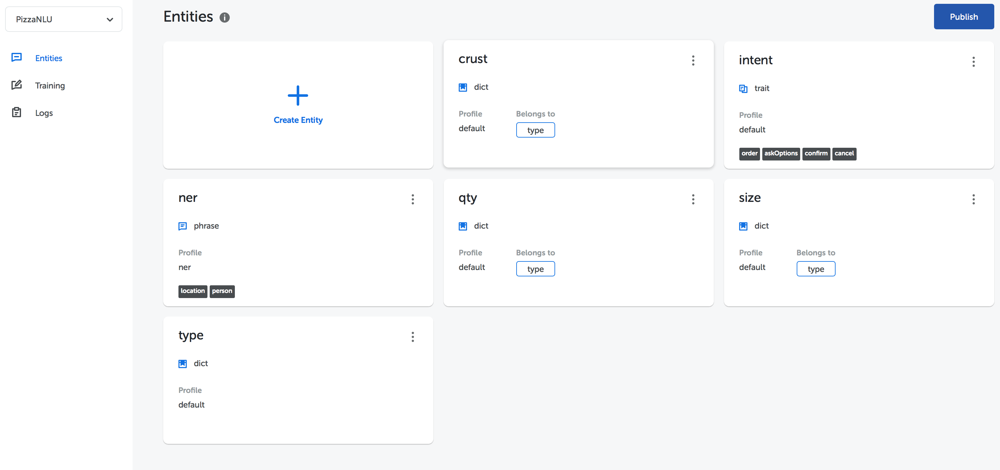

Here is an explanatory concept in NL Studio and some tips for using it.

## NLU

Natural Language Processing (NLU) in NL Studio is a collection of machine learning models which are used for transforming human language into a form that is more easily processed by machines. The model itself is a form and collection of rules resulting from training data becoming that is useful as a decision maker for an input. **_One NLU may have several entities_**



## Entity

Entity is everything you want to extract from a human language text with NLU. For example, given a human language sentence input that wants to know the words whether its person name or the location name. Therefore, person name and location name are entities you want to extract for.

Ability to extract an entity require a trained machine learning model. The model is responsible for extracting each entity from a given text. So that, it can be said that **_each entity has its own model._**

Following example is an extraction process from human language to parameters of entity.

```
# Input

    My name is Joko, I live in Jakarta.

# Output

    - entity_person = "Joko"
    - entity_location = "Jakarta"
    - entity_intent = "give_credential"
```
