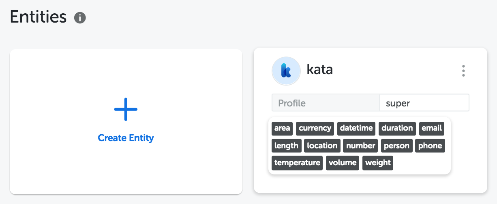

Super Model is a highly maintained entity that you can use right out of the box. This feature lets you build your NL faster and easier without training.

## Kata Entity

Kata Entity is our first of many Super Model to come. Kata Entity lets you extract specific words in a sentence, like a person's name, location, and more.

### About Kata Entity

- This entity will be added automatically when you create a **NEW** Project. You can find it on Entities page.
- You can use this entity right away, without adding any training data.
- Training this entity won't affect the prediction result, but we encourage you to do so if you find any mispredictions, as we will use it to improve the models.
- The model for this entity is maintained by Team Kata and all users will automatically get the updated version whenever Team Kata improved it.
- Once you delete this entity, you can't retrieve it back, be careful when doing that.

### Labels

There are 13 common labels that you can utilize.

| **Label**   | **Description**                                                                   | **Examples**                                                                        |
| ----------- | --------------------------------------------------------------------------------- | ----------------------------------------------------------------------------------- |
| Person      | Person's name                                                                     | Budi, Siti, Rina Putri                                                              |
| Location    | General location, city, country, address                                          | Jakarta, Indonesia, Jln Pangeran Antasari 18A                                       |
| Email       | General email                                                                     | business@mail.com, jobs@company.com                                                 |
| Phone       | General phone                                                                     | +62 80123456789, (021) 3456789, 021-5678-9012                                       |
| Datetime    | Date and time                                                                     | hari ini, 17 Agustus 1945, tahun 2019, besok, 17/9/45, jam 3 siang, pagi ini, 19:00 |
| Number      | Number in digit, number in word, sequence of number, mix number in digit and word | 123, 92, 9.000, satu, dua, tiga ribu, dua tiga, delapan tujuh, 9 juta, 5rb          |
| Currency    | Currency name, money                                                              | IDR, SGD, rupiah, US dollar, Rp 5000, 5 ribu rupihah, \$3, 9 USD                    |
| Area        | Unit area                                                                         | 5 meter persegi, sepuluh m2, 200 ha                                                 |
| Duration    | Unit duration                                                                     | 3 jam, 10 detik, 5 jam 30 menit, sehari, dua hari                                   |
| Length      | Unit lenght                                                                       | 5 meter, delapan cm                                                                 |
| Temperature | Unit temperature                                                                  | 40 derajat celcius, -5 derajat                                                      |
| Volume      | Unit volume                                                                       | 6 liter                                                                             |
| Weight      | Unit weight                                                                       | tujuh kilogram, 5 gr, 9kg                                                           |

## FAQs

**How to use this entity for my bot?**

Same as using any other NL from NL Studio, simply add the NL in Bot's NL and you can use it as attributes. For more details, refer to [documentation](/kata-ml/nlu/#nl-studio-nlu)

**How to add this entity to my existing Project?**

Currently, Kata Entity is only available for new projects. You can create a new project and use it as stated above.

**Why is the prediction result is not improved after I add training data?**

The training data you add does not directly influence the model to ensure the model's quality. If you find any misprediction in the model, feel free to make a correction. We will save and evaluate your suggestions to improve the model.

**Can I add or delete labels in entity `kata`?**

Kata Entity can not be edited or updated. Feel free to give us suggestions if you feel there are labels that should be included.

**I accidentally deleted the entity. How can I retrieve it?**

You can't retrieve the entity once you deleted it. You can simply create a new project to use it.

**Is this available in English?**

Currently, Kata Entity only available for NLU Bahasa Indonesia
