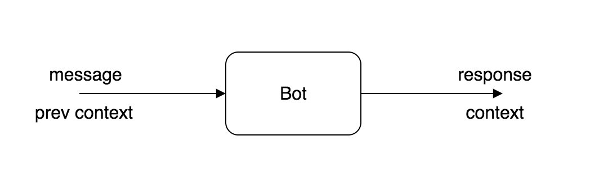
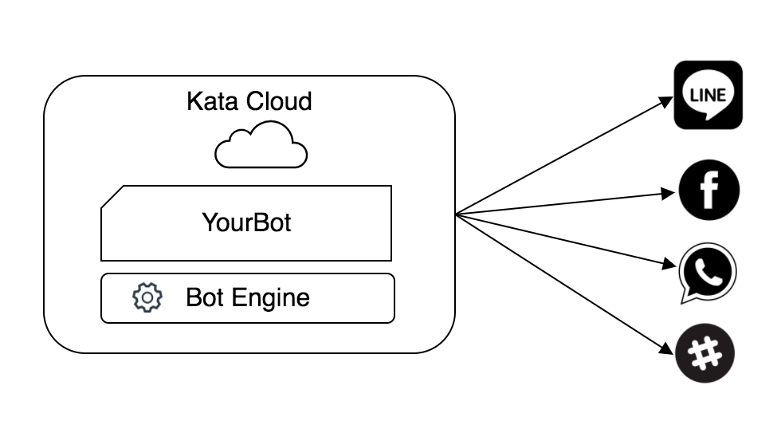

Kata Bot Platform is a platform for building enterprise scale bots with ease. The platform allows you to:

- Build your bots using Bot Studio or KataML and Javascript
- Deploy and connect your bot to Messaging Services
- Create and train Natural Language Understanding Models using NL Studio
- Monitor your bots with our Bot Analytics
- Do automated testing with our testing framework

## What is Chatbot

A bot is an application that interact with user in a conversational way. A bot react to a message sent by user with a response. What truly differentiate bot and traditional application is the statefulness: a bot usually keep track of the context of the conversation as messages without context are normally meaningless.

In Kata Bot Platform, the processing of user message is divided into three pipelined steps:

1.  Intent Recognition Converting raw message into structured information (in form of intent and attributes)
2.  State Mapping Determining the state of the bot and the context variables
3.  Choosing Action Generate response by executing defined action

## Create Once, Chat Anywhere

Kata Bot Platform allows you to craft highly capable bot. With \*create once, chat anywhere\* concept, the platform completely abstract messaging specific capabilities like displaying carousel, button, image etc. so that you can fully focus on creating the best bot experience. We manage the infrastructure for you, so you don't have to worry about scaling to millions of users.

