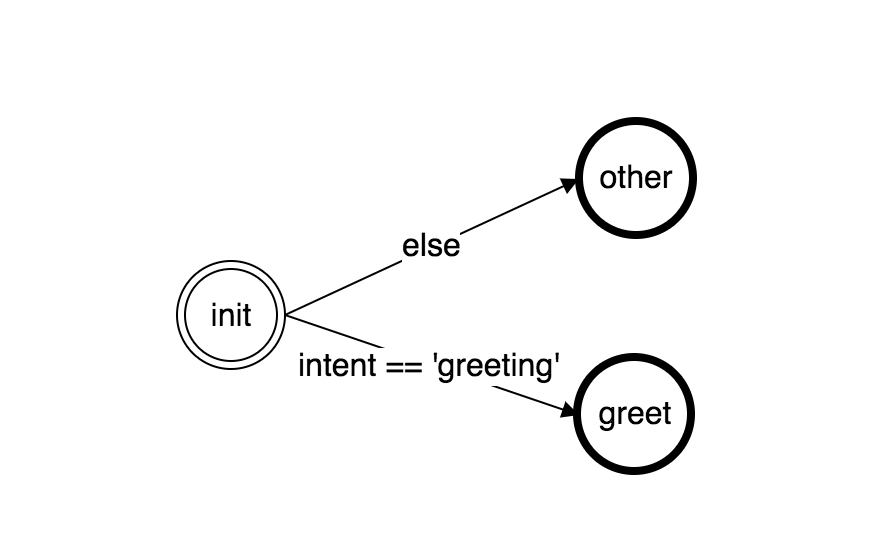
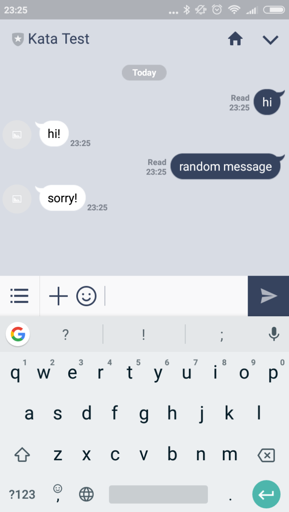

## Creating an Account

To create an account, go to [platform.kata.ai](https://platform.kata.ai/) and sign yourself up there.

As prerequisites, make sure you have Node.js version 6.x or later

Install Kata-CLI at your device:

```
npm install -g kata-cli
```

now you can use command `kata` globally.

## Login

Login using your account as user:

```
$ kata login
username: <username>
password: <password>
```
Login as team after successfully login as user

```
$ kata switch team <teamName>
```

Login using token

```
$ kata login -t <token>
```

## Your First Bot

Create a new folder called firstbot and go to that directory. Now create `bot.yml` file with following content:

```yaml
# Schema definition
schema: kata.ai/schema/kata-ml/1.0
# Bot name
name: firstbot
# Bot description
desc: My First Bot
# Bot id, will be generated after push
id: <your-generated-bot-id>
# Bot version
version: 0.0.1

# flow definitions
flows:
  # Hello Flow
  hello:
    # set flow as fallback flow, that means, in the case
    # no flow is matched, it will go to this flow
    # there shall be one flow defined as fallback flow
    fallback: true

    # hello flow intents definition
    intents:
      # greet intent
      greeting:
        # initial means the intent can be matched from outside
        # of the flow
        initial: true
        # will match if the text is 'hi'
        condition: content == 'hi'
      # fallback intent, will match if no other intent matches
      fallback:
        fallback: true

    # hello flow states definition
    states:
      # initial state. Will start with this when bot enter this flow
      init:
        initial: true
        # as initial flow it will immediately transit to
        # other states
        transitions:
          # from init to greet
          greet:
            # will do if intent is 'greet'
            condition: intent == "greeting"
          # from init to other
          other:
            # default transition
            # every state needs a default transition
            fallback: true
      # greet state
      greet:
        # will close the flow when reached this state
        end: true
        # respond with a text 'hi!'
        action:
          name: text
          options:
            text: hi!
      other:
        # will close the flow when reached this state
        end: true
        # respond with a text 'sorry!'
        action:
          name: text
          options:
            text: sorry!
```

Now open terminal in that folder, and type:

```
$ kata push
CREATED BOT SUCCESSFULLY
```



Above picture describe the states of the bot. The bot begins in the init state and will immediately move to either greet or other state, depending on the intent. As other and greet are both end state, the bot will close the flow afterwards and each new message will begin at the init state.

## Testing Your Bot

You can easily test your bot by opening kata console in your bot folder:

```
$ kata console
firstbot>
```

Now you can try to text the bot:

```
firstbot> text("hi")
```

You will get following result:

```js
{ messages:
   [ { type: 'text',
       content: 'hi',
       id: '6856baaa-04a1-4ec3-b3c3-9ed59be4d588',
       intent: 'greet',
       attributes: {} } ],
  responses:
   [ { type: 'text',
       content: 'hi!',
       action: 'text',
       id: '59a397d2-1e74-4863-a457-863766926605',
       refId: '6856baaa-04a1-4ec3-b3c3-9ed59be4d588',
       flow: 'hello',
       intent: 'greet' } ],
  session:
   { id: '209ebe5b-109c-4208-8625-6babee15b2d0',
     dataKey: null,
     states: {},
     contexes: {},
     history: [],
     current: null,
     meta: { lastFlow: 'hello', lastState: 'greet', end: true },
     timestamp: 0,
     data: {},
     createdAt: 1505657482945,
     foreignKey: '209ebe5b-109c-4208-8625-6babee15b2d0' },
  duration: 47 }
```

The result consists of following information:

- `messages` contains the message that being sent by the user, it will include all internal messages that is created by the bot.
- `responses` contains all the responses that is being returned by the bot
- `session` the session information
- `duration` how long does it take for the bot to generate the result in milliseconds

When pass text other than 'hi' , i.e. text("random message"), it will display 'sorry!' as a result.

## Deploying Your Bot

Deploying your bot is easy, simply type:

```
$ kata deploy dev
```

Whereas dev is the deployment name. You can deploy to multiple deployment, each with their own channels.


This way you can manage e.g. separate development and production development, each with specified version channels.

## Adding Channel

In order to connect your bot to a messaging platform, you need to at least add one channel. Adding channel can be done as following:

```bash
# dev is the deployment name
# line is the channel name
$ kata add-channel dev line
type: <line | fbmessenger | slack | generic>
token: <channel access token>
refreshToken : [refreshToken] # can be empty
secret: <channel secret>
url: <url> # Example: 'https://api.line.me' for LINE
```

For example, we want to add line as channel. Executing the above command will give response similar to below format:

```js
{
  id: <channel-id>,
  name: 'dev',
  botId: 'firstbot-<youruserid>',
  botVersion: '0.0.1',
  channels: { line: <channel-token-id> } }
```

Follow Line official documentation on how to create an account for chatbot through Line Business Center (https://business.line.me/en/), and do the following:

- Take notes on the channel secret and issue channel access token to fill up kata add-channel information.
- Take notes on the channel token id generated when executing kata add-channel command.
- On Line webhook url, fill up with `https://kanal.kata.ai/receive_message/<channel-token-id>` and verify.

This is how it looks like when you setup the channel parameters correctly in Line:


