**12 July 2018**

Same powerful Kata Platform, only look and feel better. Should you have any questions, feel free to email **support@kata.ai**

## What's New

### Error logs

The new Error Log lists any errors during bot development. What went wrong and when it went wrong.

### Bot templates

Get a head start creating your bot with our starter-pack templates:

#### API Bot

Learn how your Bot can integrate to third-party API.

#### Button Bot

Not only through conversation, your bot can also interact with users through buttons.

#### Shopping Bot

Our famous Pizza Bot is now available for anyone. Build your own Shopping Bot using our recipe.

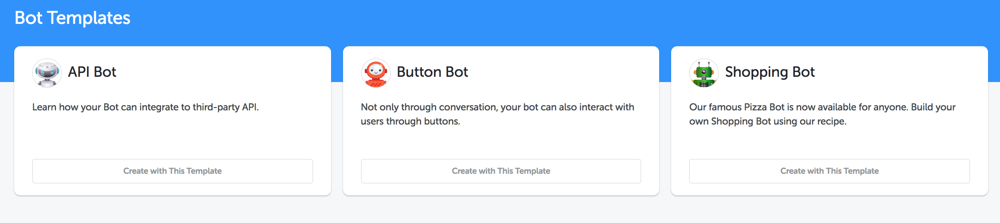

### Documentation

Getting complicated with our new Platform? Keep calm and check our documentation menu.

We simplified our table of contents for ease of access.

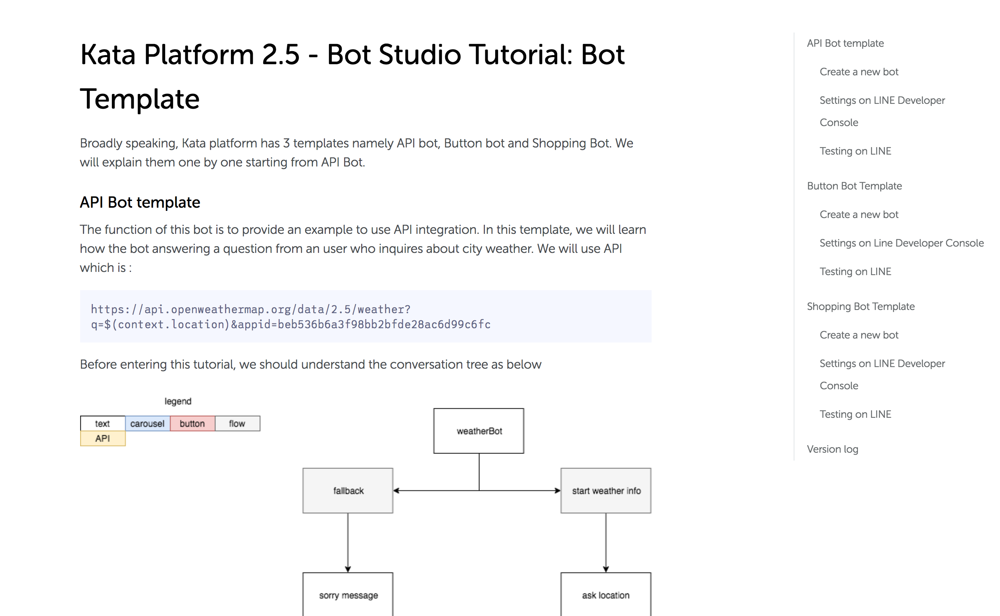

Bot tutorial is now included in the documentation.

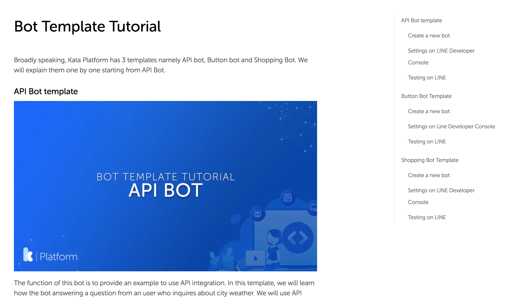

Documentation is now responsive, viewable on any devices.

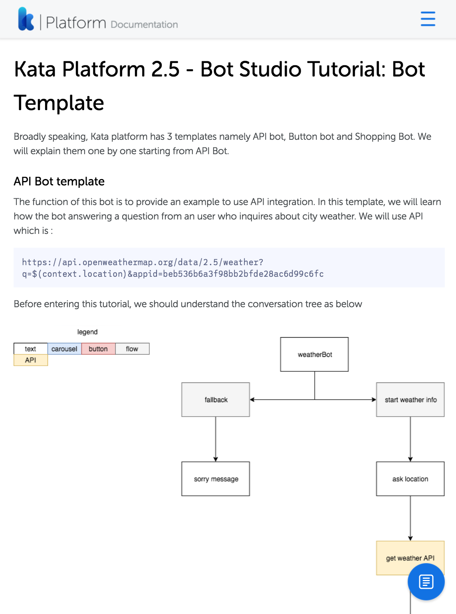

## What's Improved

### General

Our new Design System is used throughout the platform to ensure consistency for your experience to help build bot faster and better. (ps: We're going to release our own Design System later on this year. Stay tuned!)

Card design pattern is used for NLUs, Methods, Deployments and many more to give you better visibility of the items you have.

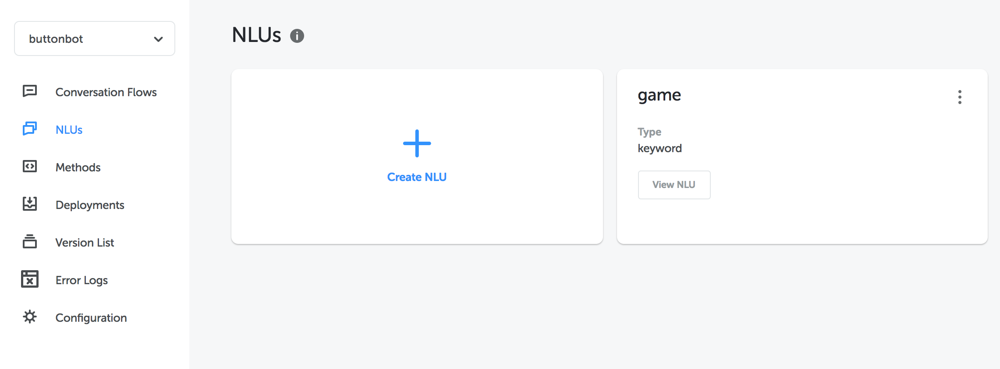

Drawers are used to create, edit, and update without losing context of what you're doing.

Hover on any (i) icon to show the tooltip with further explanation.

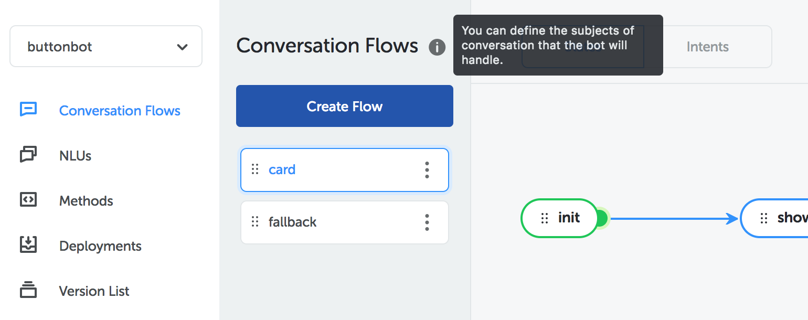

Easily switch between Bots and NLUs from the new switcher on the sidebar.

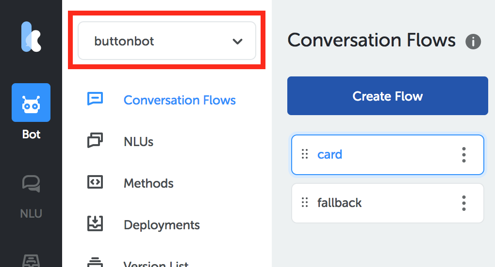

Menu is now moved to the sidebar, so you have better visibility of what can you do on Kata Platform.

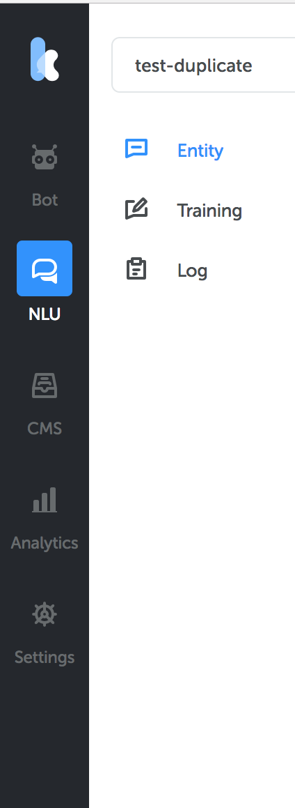

Manage your account, team, and sign out easily using the profile button on the bottom left hand side.

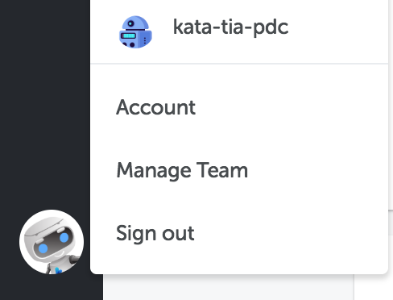

### Bot

Set the priority of your flows by drag and drop operation, the top flow has higher priority.

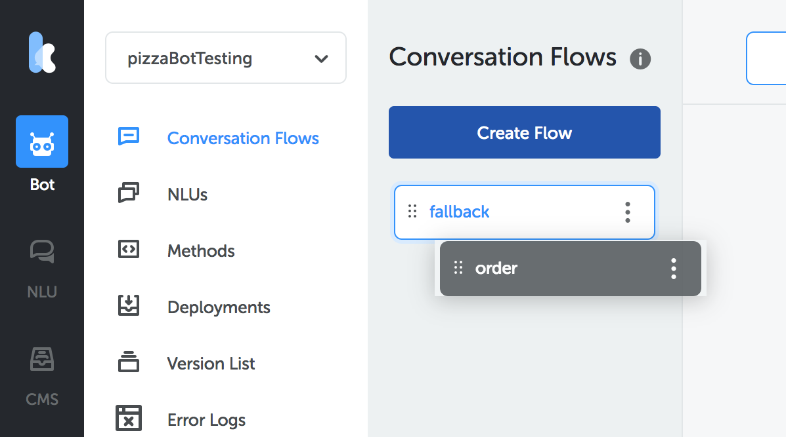

The legend in State Editor tells you what the color of the state and transition line means.

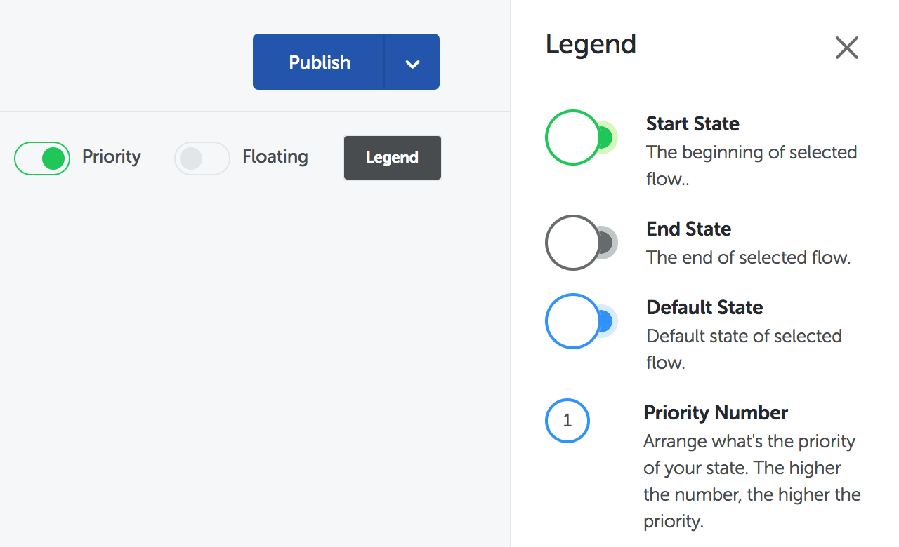

You can show/hide the priority states number and floating states line.

Hover your mouse on one of state node to see where that state transitions to. Grey Node means it's an end state, meanwhile, Blue Node means it still carries on the conversation to another state.

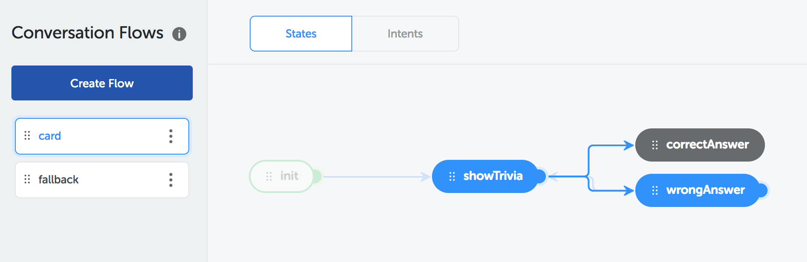

Flow expiration time is now represented in hour, minute, and second input.

Actions can now be created and reused in the same place.

And we now support 12 Actions Type. (Channel support for each action type may vary).

We replaced the fallback terminology to default as it is more concise and clear.

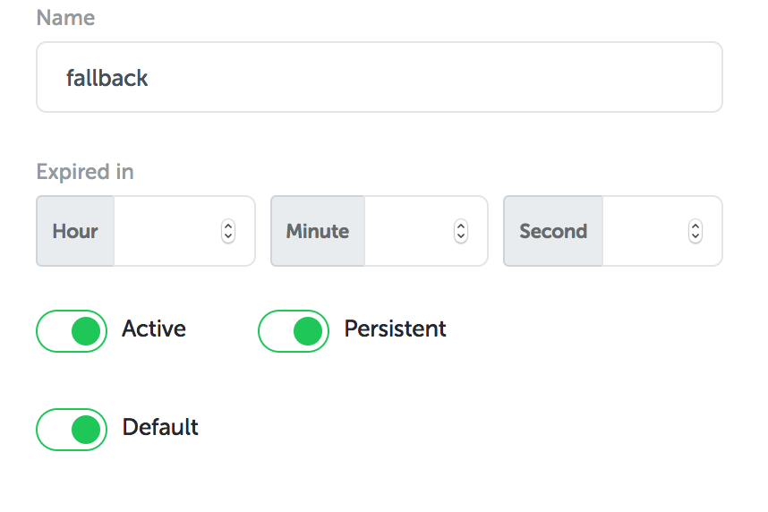

The bot emulator is now accessible from all bot screens, click on the button to chat with your bot - you can also test multiple deployments on this widget.

Methods have been moved to global, all methods are now available for every state and action.

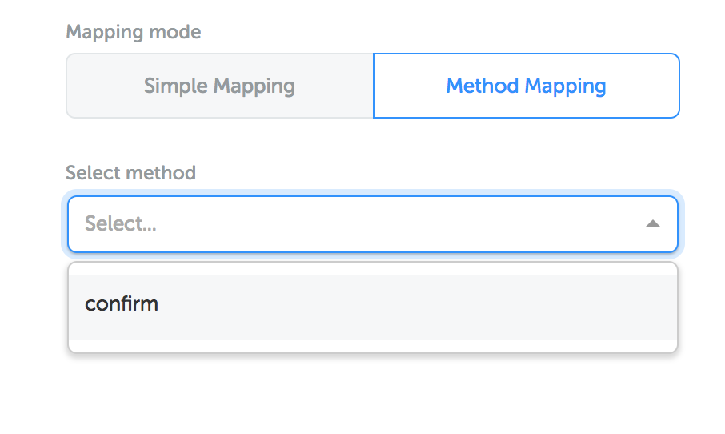

Version Changelog shows detailed information about each of your versions at a glance.

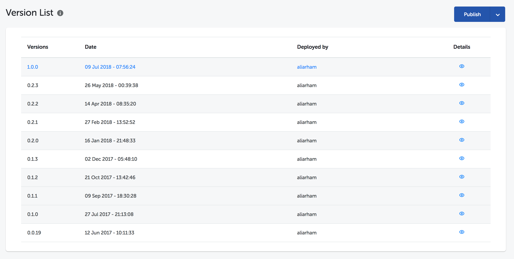

### NLU

Entities now have relations one another, this relationship can be given upon creation.

Ability to filter the prediction when doing a training data

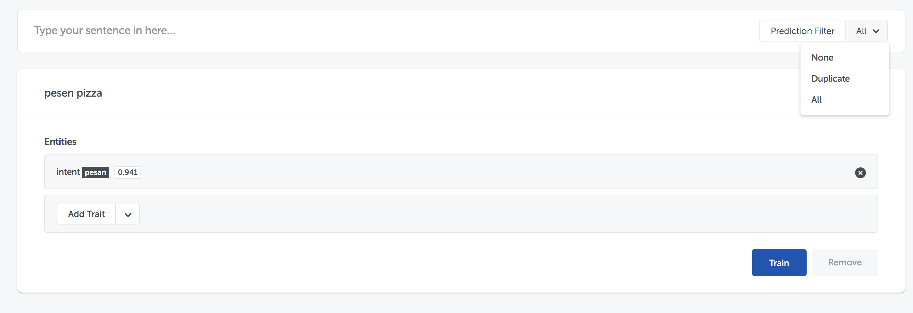
