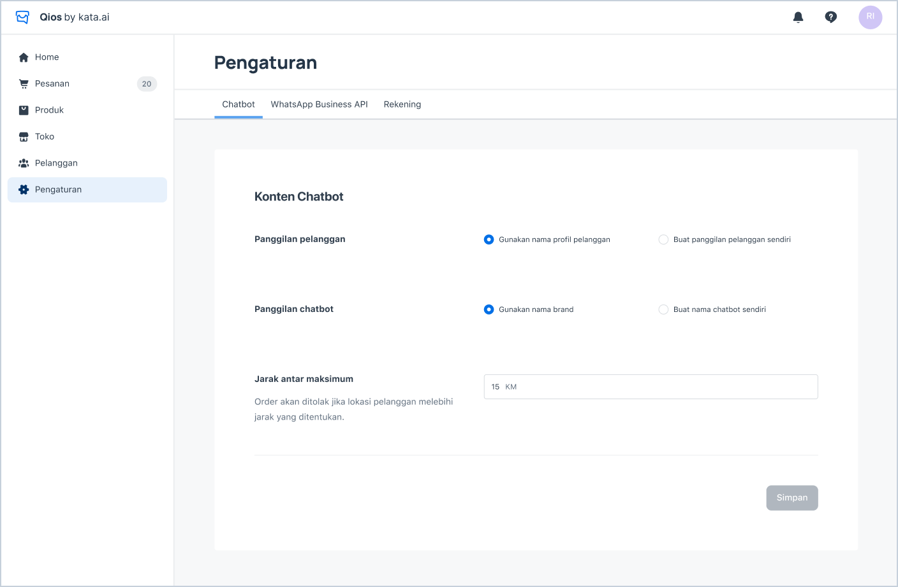
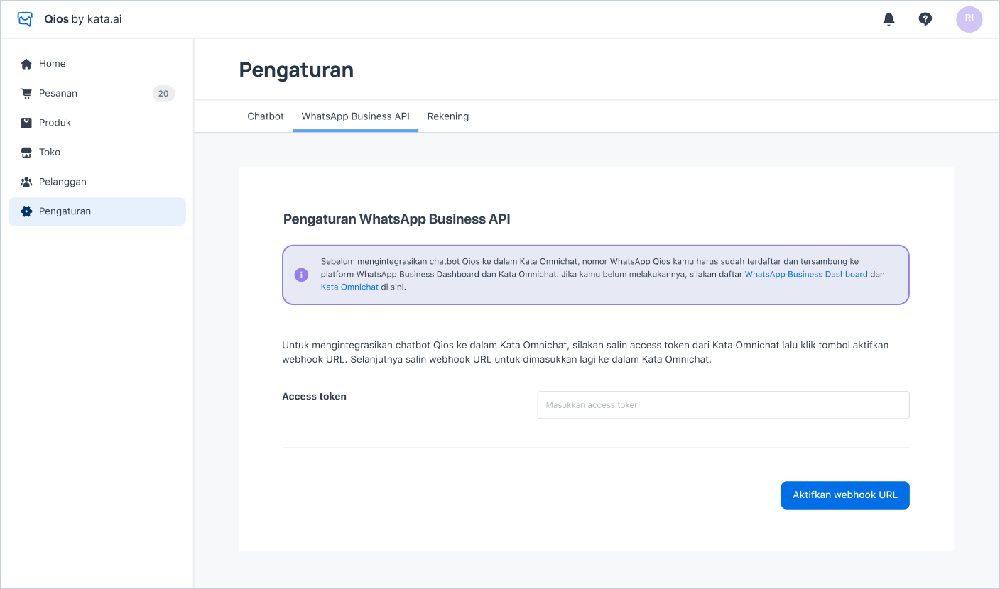
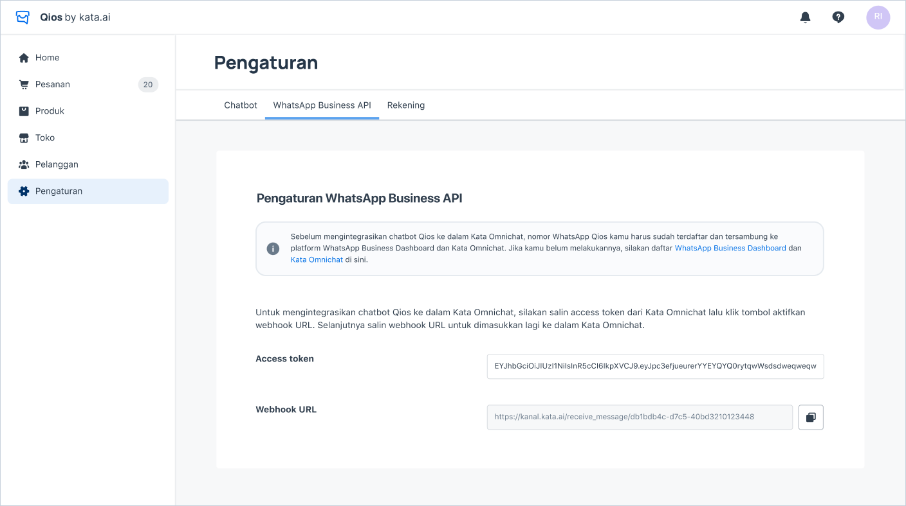

## Set Up Chatbot Preference

> Chatbot Preferences

1. Go to **Pengaturan > Chatbot**.
2. Choose the option for **“Panggilan pelanggan”** and **“Panggilan chatbot”**, whether you want to use default setting or you want to modify the customer’s name and chatbot’s name.
3. Fill in the maximum distance to accept the order (the maximum distance from system is up to 30 km)

## Activate WABA and Agent Bot through Kata Omnichat Account

<iframe width="600" height="300" src="https://www.youtube.com/embed/viq53pfMOFw?list=PLy86Ve1I7c3iZrOzmqE16D0ZVIjoDFRQw" title="YouTube video player" frameborder="0" allow="accelerometer; autoplay; clipboard-write; encrypted-media; gyroscope; picture-in-picture" allowfullscreen></iframe>

1. Before opening your store, you have to create a WABA inbox, then set up and activate the agent bot through Kata Omnichat. Learn more about [Kata Omnichat](/kata-omnichat/setup-agent-bot) and [creating the agent bot](/tutorial/create-simple-bot-handover-from-chatbot-to-agent).

2. Copy and paste the access token from agent bot in Kata Omnichat to Qios Dashboard in **Pengaturan > WhatsApp** Business API and click **_“Aktifkan webhook URL”_** button.

> Input Access Token to Connect Chatbot to Qios

3. Copy and paste the webhook URL that has been generated to Kata Omnichat in **Agent Bot configuration**.

> Webhook URL Generated from Access Token
