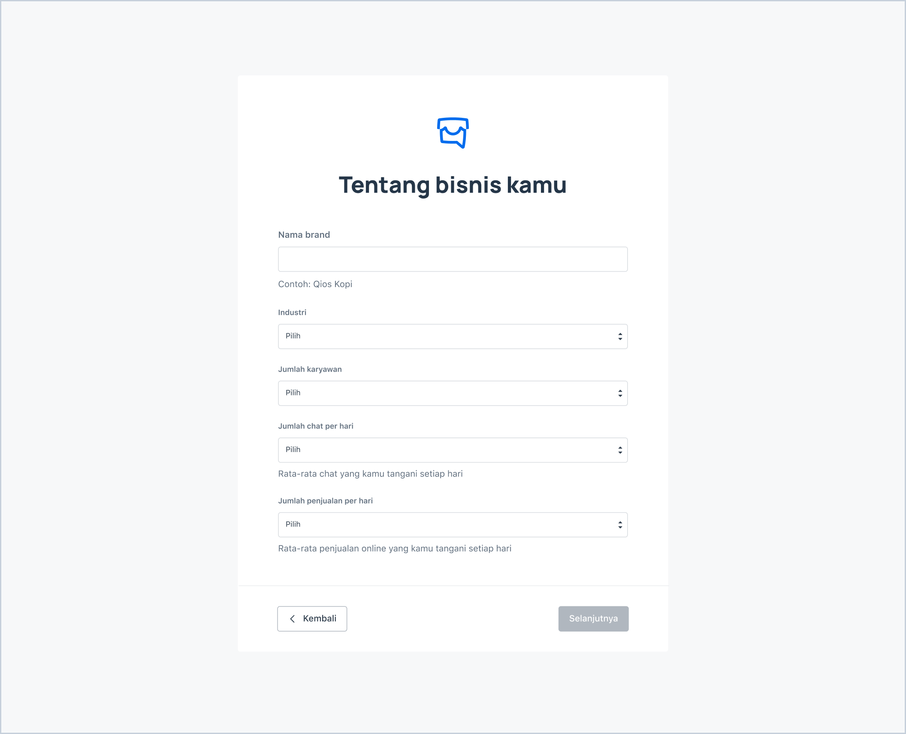
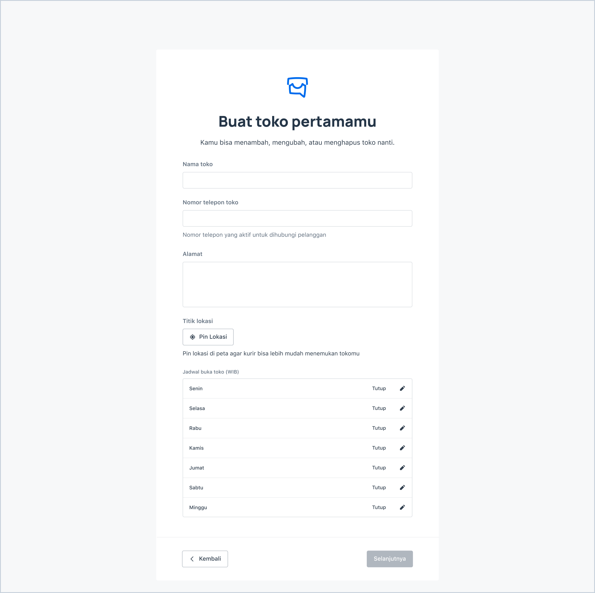
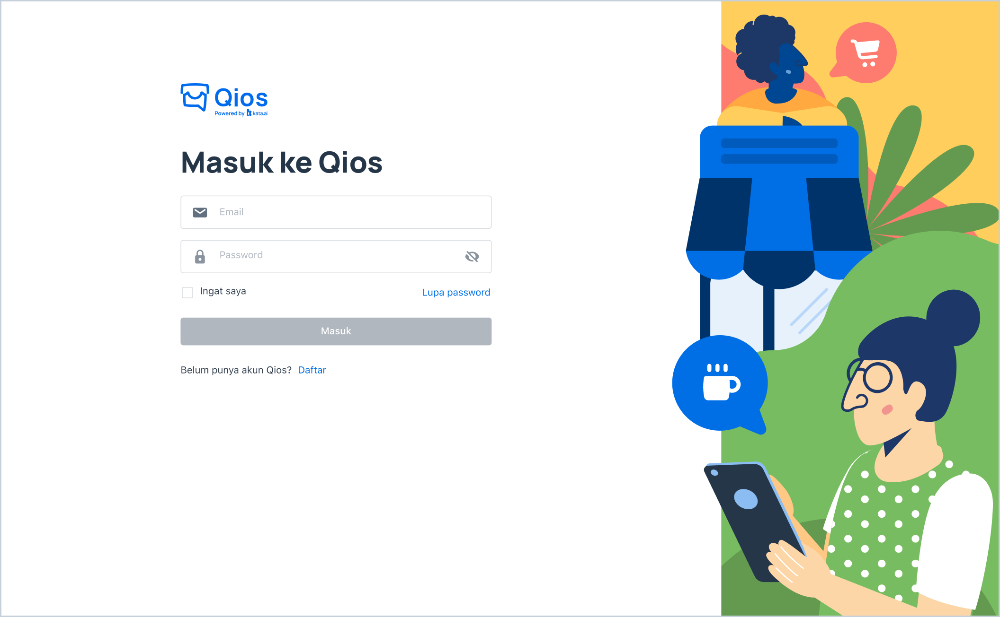

<iframe width="600" height="300" src="https://www.youtube.com/embed/eFWbrAObOXg?list=PLy86Ve1I7c3iZrOzmqE16D0ZVIjoDFRQw" title="YouTube video player" frameborder="0" allow="accelerometer; autoplay; clipboard-write; encrypted-media; gyroscope; picture-in-picture" allowfullscreen></iframe>

## Self-onboarding

> Qios Sign Up Page

1. Go to [https://dashboard.qios.co/](https://dashboard.qios.co/) and click **"Daftar"**. After that, fill in your **email** and **Password.**

2. After clicking the **Daftar** button, you will get an email to verify your account

3. After you verified your email, you will be redirected to the **Onboarding** page

4. In the **Onboarding** page, you have to fill in the **Personal Information**, **Business Information**, **Create Store** and do some set up for your chatbot

> Qios Self-Onboarding Step: Tentang Bisnis Kamu

> Qios Self-Onboarding Step: Buat Toko Pertamamu

5. After you fill all the forms, you will be redirected to **Qios Homepage**.

## Home

> Qios Home Page

1. As a first-time user, you can see that you need to add your product first, then set up the bot by connecting to WhatsApp through setting up the agent bot in Kata Omnichat

2. If you’ve already added your product and connect your bot to WhatsApp, then you will be ready to start selling your product

3. You can track the new order, the order that is ready to proceed and the finished order in this homepage. Also, you can see the product with low stock, best seller product and basic report

## Login

> Login to Qios

1. Go to [https://dashboard.qios.co/](https://dashboard.qios.co/)

2. Fill in **Email** and **Password**, then click **Masuk**
