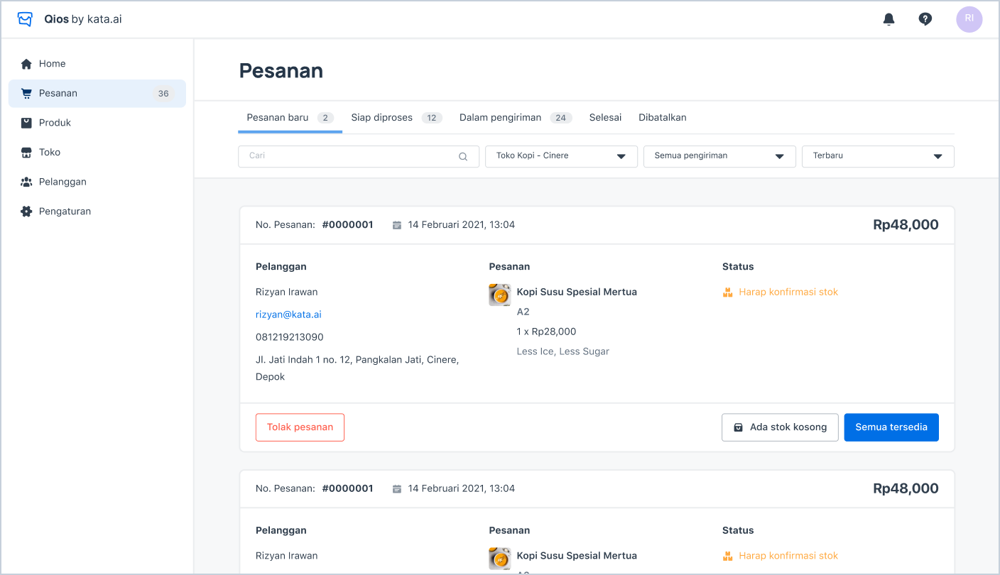
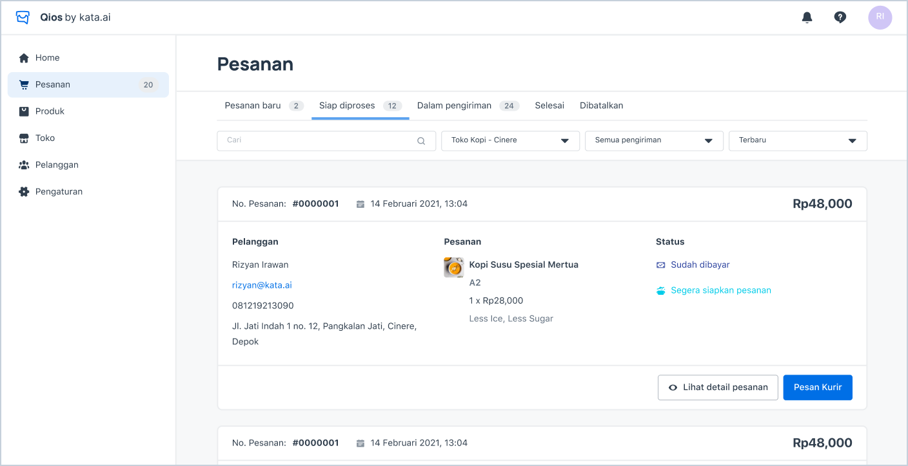
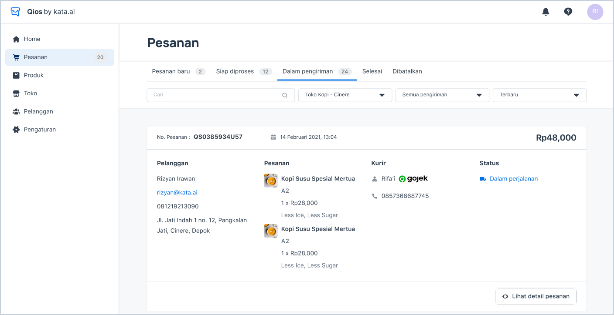

<iframe width="600" height="300" src="https://www.youtube.com/embed/rz8yh7mZVpg?list=PLy86Ve1I7c3iZrOzmqE16D0ZVIjoDFRQw" title="YouTube video player" frameborder="0" allow="accelerometer; autoplay; clipboard-write; encrypted-media; gyroscope; picture-in-picture" allowfullscreen></iframe>

## New Order

> Order Page

1. When new order coming, you can see the push notification and this notification will be stayed in notification bar in the right top of the page.
2. You have to manually confirm the order to avoid any mismatch stock between system and real stock.
3. To accept all the order in one orderID, you can click **“Semua tersedia”** button.
4. To accept some and reject the rest of them, you have to click **“Ada stok Kosong”** and switch off the toggle for the products that were out of stock.
5. To reject all the order in one orderID, you can click **“Tolak Pesanan”** button.
6. As admin, you can see the order in all stores by selecting the store in the dropdown menu. But, for store employee you can only see the order in the store that was 7. assigned to you.

## Ready to Proceed

1. After you confirmed the order, customer will either pay or cancel it.
2. If customer paid the order, then the order will be moved to **“Siap Diproses”** tab.

> Order Paid and Ready to Proceed

3. Your team can proceed the order and after it’s ready you can click **“Pesan Kurir”** button.
4. The system will automatically search for the courier.
5. After the order moved to **“Dalam pengiriman”** tab, the system will proceed it automatically based on when the courier’s action.

> Order Paid

6. The order will be automatically moved to “Selesai” tab if courier has been finished from their own system.
7. The order will be automatically moved to “Dibatalkan” tab if either you or your customer cancel it.
