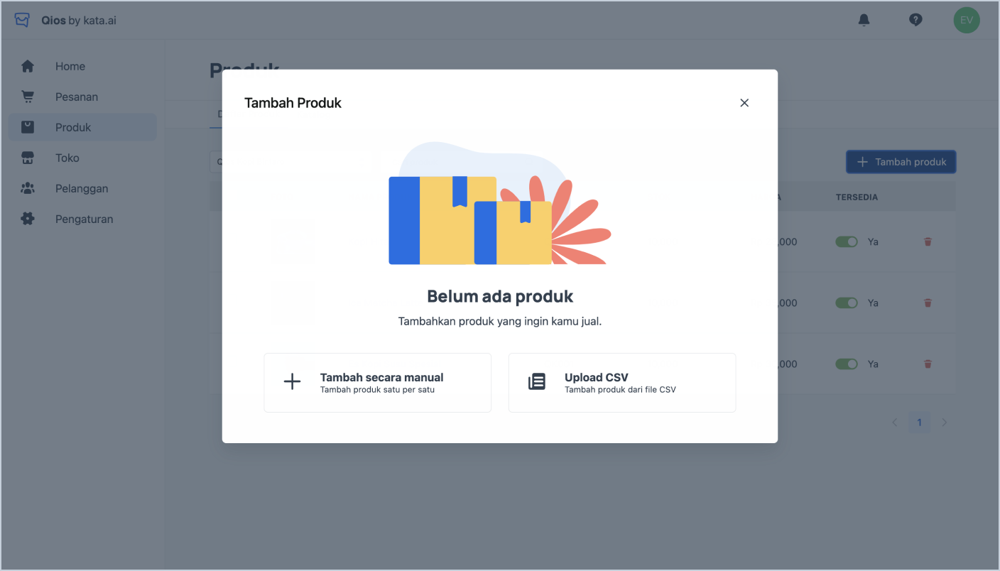

## Add Product

<iframe width="600" height="300" src="https://www.youtube.com/embed/B3JUihKdwX4?list=PLy86Ve1I7c3iZrOzmqE16D0ZVIjoDFRQw" title="YouTube video player" frameborder="0" allow="accelerometer; autoplay; clipboard-write; encrypted-media; gyroscope; picture-in-picture" allowfullscreen></iframe>

1. Click **“Produk”** and choose **“Tambah secara manual”** or **“Upload CSV”**.

> Add New Product

2. If you choose **“Tambah secara manual”**, you have to fill in the fields, then click **“Tambahkan produk”**

3. To bulky add product, you can choose **“Upload CSV”** and follow this template.

## Modify Product (Edit, Delete, Change Availability)

> Edit Product

1. To edit the product, you have to click the hyperlink in the name of each product
2. To delete the product, you have to click the **“Delete”** hyperlink
3. To change the availability of each product, you have to switch on/off the toggle

## Generate Catalogue for Chatbot

> Product Catalogue

1. Click the “**Katalog”** tab besides the **“Daftar produk”** tab to see all the products that you’ve uploaded. You can manage the appearance of the catalog view in customer facing (bot) through this feature
2. You can drag and move the thumbnail to rearrange the order and click **“Simpan”**
3. You can click **“Preview katalog”** to see how it will be displayed in customer facing
