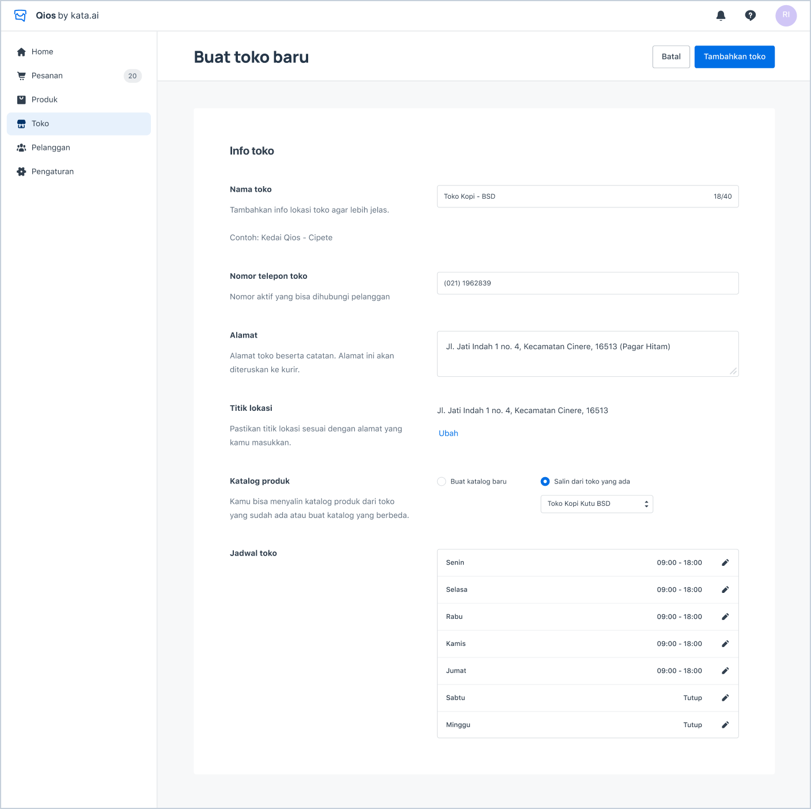

## Add a New Store

<iframe width="600" height="300" src="https://www.youtube.com/embed/dLcMLqLrp9U?list=PLy86Ve1I7c3iZrOzmqE16D0ZVIjoDFRQw" title="YouTube video player" frameborder="0" allow="accelerometer; autoplay; clipboard-write; encrypted-media; gyroscope; picture-in-picture" allowfullscreen></iframe>

1. You can add a store from the onboarding steps or from **“Toko”** menu.

> Add a New Store

2. If you add store from **“Toko”** menu, you have to click **“Tambah toko”** button first.

3. Fill in all the fields, then click **“Tambahkan toko”**.

## Modify Store

1. To edit the store, you have to click the hyperlink in the name of each store.
2. To delete the store, you have to click the **“Delete”** hyperlink.
3. To change the opening of each store, you have to switch on/off the toggle.
