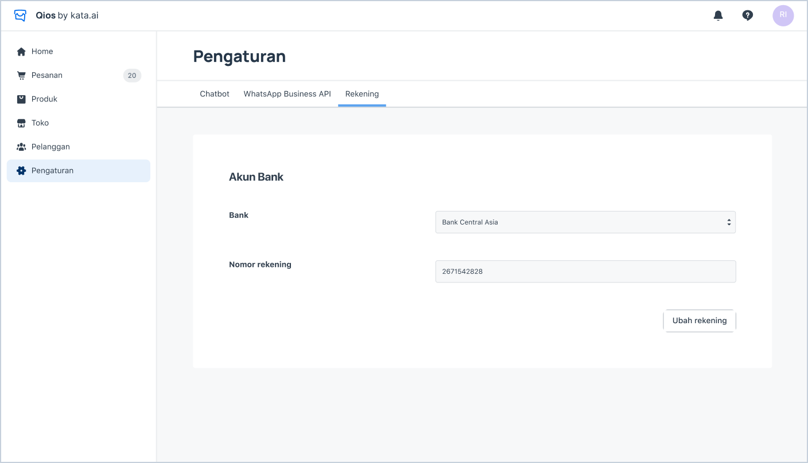

## Set Up Bank Account Information

> Set Up Bank Account

1. Go to **Pengaturan > Rekening**.
2. Fill in all the fields for you bank account information.
3. This information will be saved for manual disbursement that will be done by our finance team by weekly.
