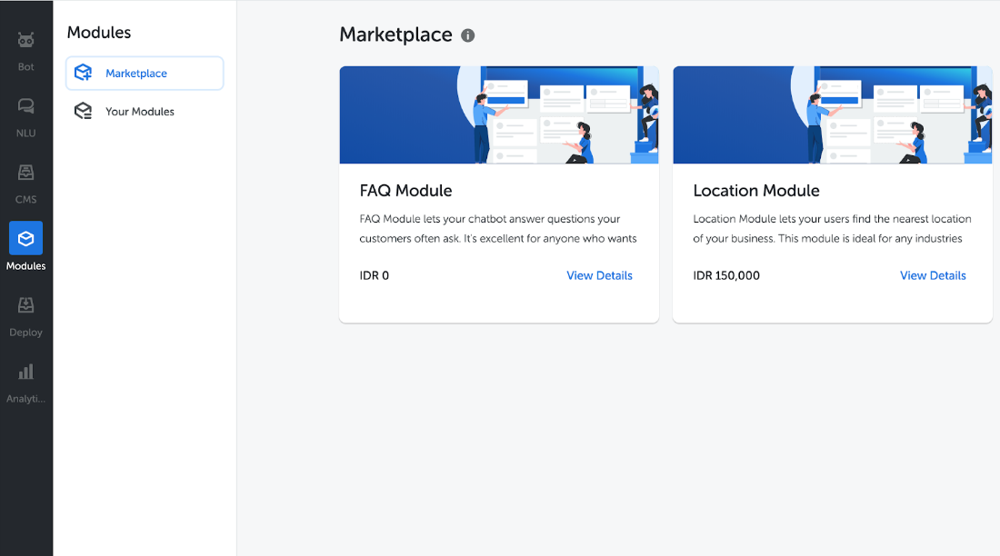

In this release, we're highlighting our newest feature and some recent updates to Kata Platform.

## Modules

Modules are prebuilt bot features, ready to be integrated into your project in just a few clicks. This way, you can create amazing conversational experiences even faster. In this beta-release, we're introducing modules for two of the most common chatbot features: FAQ and Location.

### FAQ Module

FAQ Module lets your chatbot answer questions your customers often ask. It's excellent for anyone who wants to reduce the workload of their customer service department. With this module, you can build the knowledge-base to handle the repetitive questions, so your live agents can focus on more complex problems.

### Location Module

Location Module lets your users find the nearest location of your business. This module is ideal for any industries offering face-to-face customer experiences, such as banking and retail. Your users can share their location, and you can point them to your nearest establishments along with the Google Maps directions.

All of our modules are already integrated with CMS Studio. It means anyone on your team can collaborate on managing the content without the need for programming or technical skills. Further details and documentation about Modules can be found [here](https://docs.kata.ai/modules/introduction/).

## Misc

- Fixed \n causing errors in Method.
- Emulator now lets you test each environment separately.
- Emulator now lets you test CMS content.
- Added emulator on client dashboard. Now your client can test changes they made directly on the dashboard.

As always, we're happy to chat with you to learn more about your use cases and feedback on Kata Platform. You can send us your thoughts via email to [support@kata.ai](mailto:support@kata.ai) or join our community on [Slack](http://bit.ly/TemanKata).
