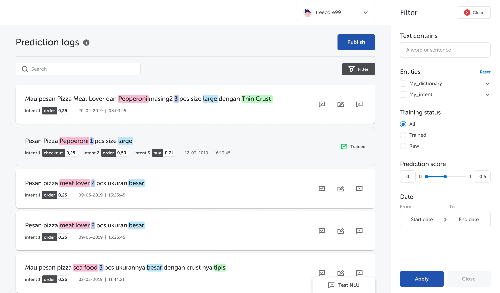

## What's New

Version 3.4.0 is all about Prediction Logs. Here’s what’s new:

* Prediction Logs data now shows predicted labels, prediction score, plus the date and time it was predicted.
* You can now search and filter your Prediction Logs data by entities, training status, prediction score, and date.
* We added a new **Ignore** feature, so you can train your NL model to, _well_, ignore sentences that don’t belong to any label. This allows your NL model to learn and improve its algorithm, ultimately improving the accuracy of your NL model.

## Bug Fixes

* Fixed FAQ table cannot show more than 10 labels
* Fixed error when adding/deleting questions in FAQ table
* Fixed bot revision history only show last 10 snapshots
* Fixed error when accessing NL Studio
