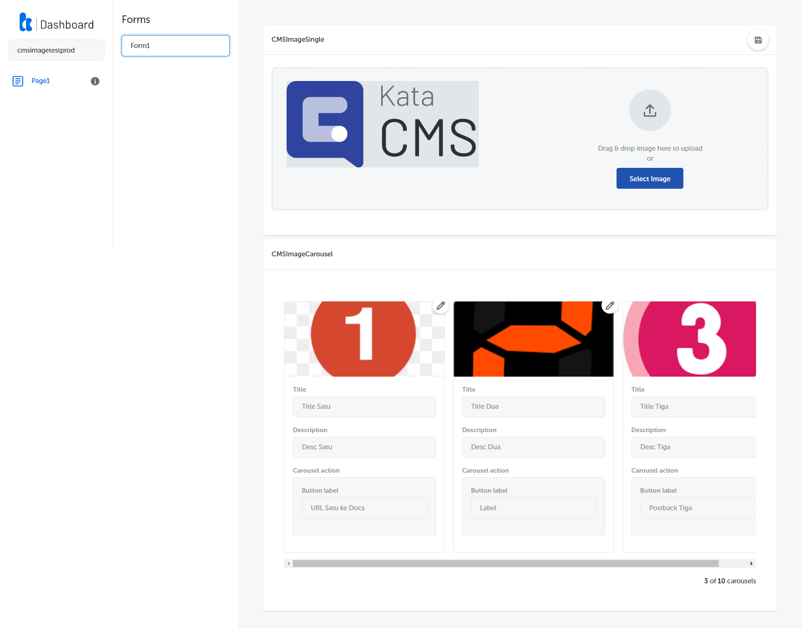
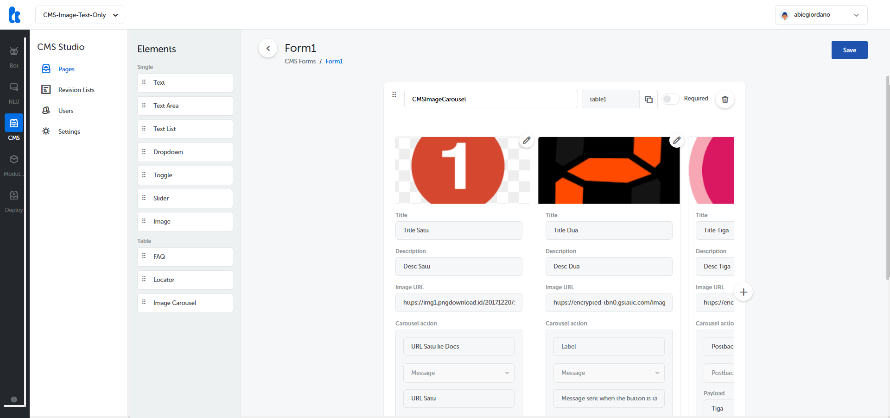

## What's New

Version 3.5.5 is dedicated for Kata CMS. Here’s what’s new:

- Added CMS Image Single and Table (Carousel) Elements in Kata CMS and Kata Dashboard.
- You can now use our CMS with new image management feature straight from Kata Dashboard.

- Update image directly using Single Image & Image Table (Carousel) Elements in Kata Dashboard.
- Edit the button label and URL on CMS Image Table (Carousel) in Kata Dashboard.
- Set the carousel action with three types of action: URL, Postback, and Message on Kata CMS.

