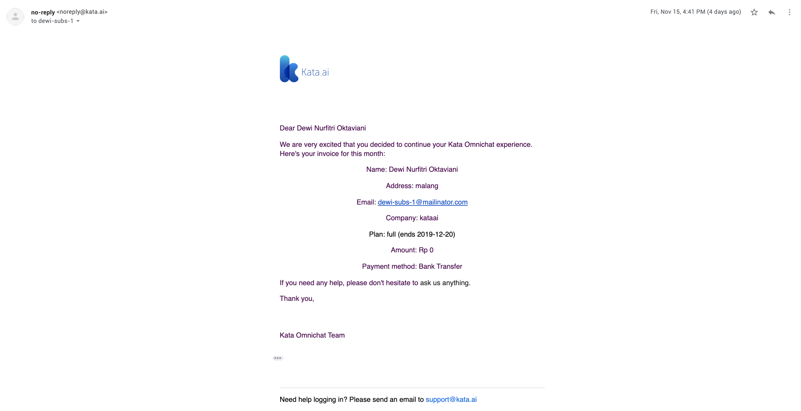

## What's New

Version 3.5.6 is about download feature on Prediction Logs, Platform Analytics and Kata Omnichat. Here’s what’s new:

### Kata Omnichat

Now Kata Omnichat is available as a module. We can create Qiscus Account and activate the module once we’ve already add Kata Omnichat Module to Project.

Automatically adding `handover` to Kata Flow

Managing agents in Dashboard if we’re an admin or supervisor

Showing list of messages in Inbox menu. Also, do chatting with customer.

Send subscription email to customer

### Download Prediction Log

We can download the prediction log as CSV or JSON, within the time range or all of them

### Analytics

Brings back Analytics menu in project with new user interface

Showing statistics in users and conversation under Analytics menu.

Analytics can show conversation log for each session

