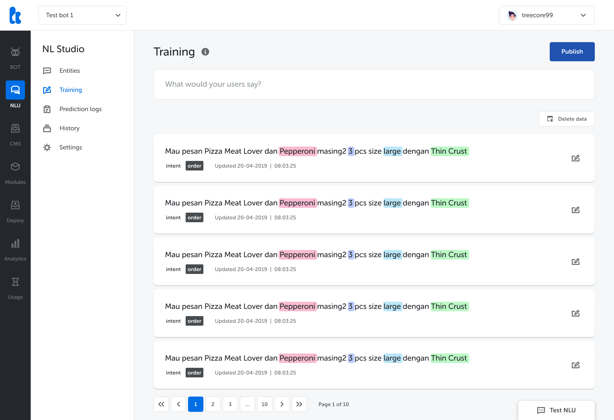
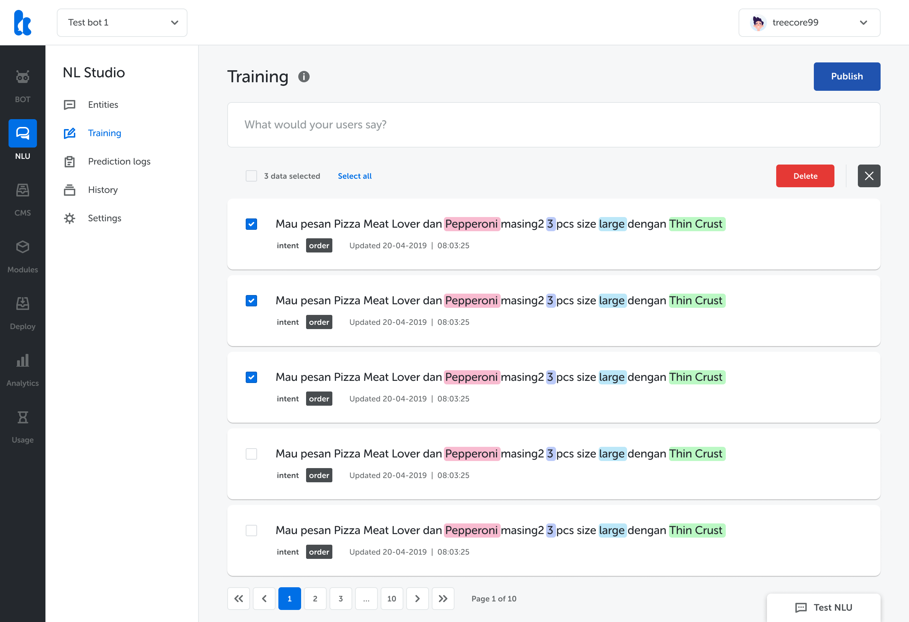

## What's New

You can now **delete trained data** on Kata NL. Some important notes:

- You can’t undo this action. Deleted data can’t be restored.
- Once you delete trained data, your model will be retrained. You won’t be able to add, edit, or delete other data during the process.
- The retraining duration depends on the quantity of data you deleted. Deleting more data will take a longer time.

