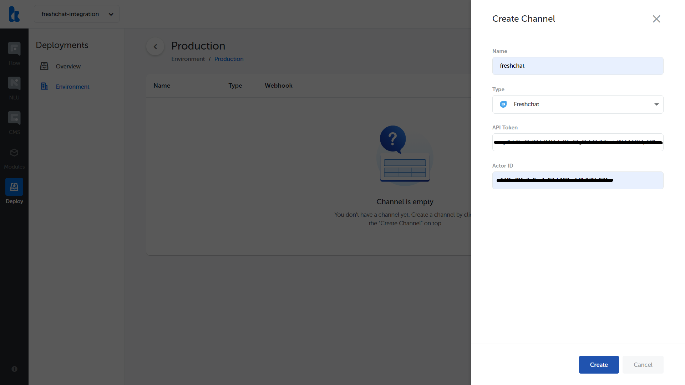

## What's New

Version 3.7.0 is all about adding new channel for you to talk to your customers. Introducing, _new channel_ for Kata Platform channel integration: Freshchat.

Freshchat provides live chat software that helps you to engage with your website visitors, provide assistance, and convert leads to happy customers. [Read more about the integration here](https://docs.kata.ai/channels/freshchat/).

