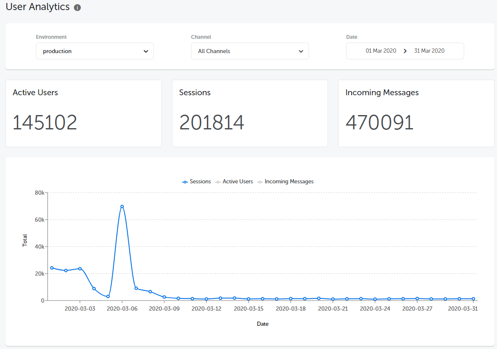
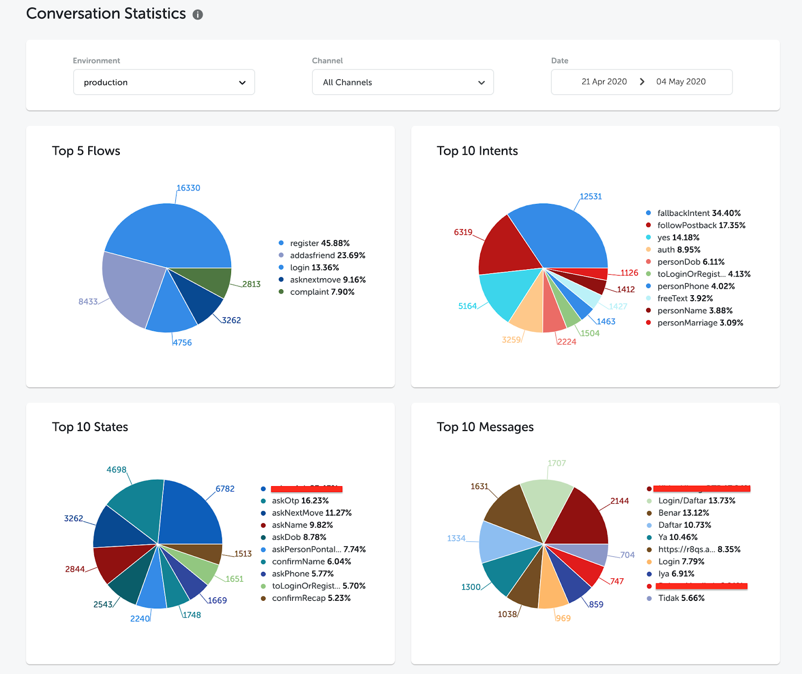
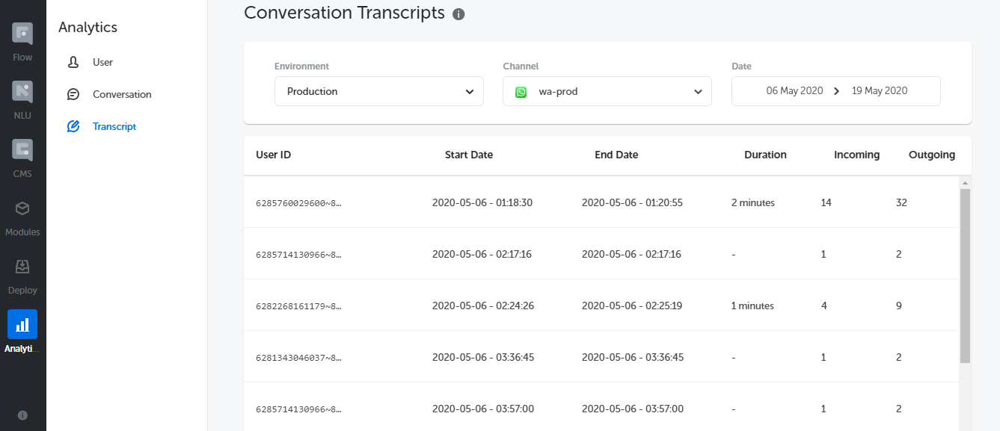
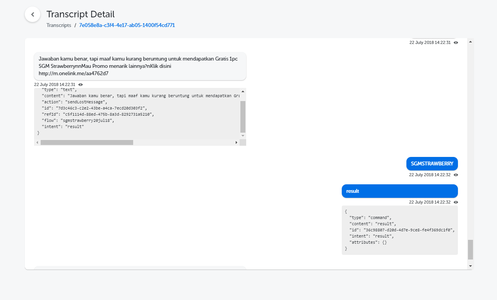

## What's New

Basic analytics, which was previously available on Kata Platform 2.5, is now making a comeback on Kata Platform 3.0.

You can now see the total active users, total sessions, and total incoming messages of your bot (also available in line graph). Find it on **Analytics > Users** menu.

Gain high-level insights of your conversations by seeing top flows, top intents, top states, and top messages of your bot. You’ll see those stats on **Analytics > Conversation** menu.

See the details of your conversations on **Analytics > Transcript** menu. Here, you’ll find the chat history between the user and your bot, from the duration of the conversation to the message details

