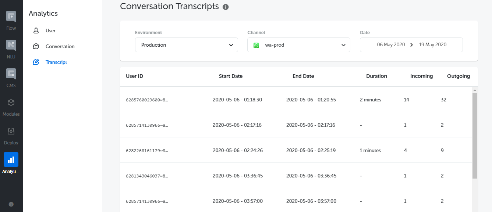

## Features

Added **Transcript List** which provides User ID, Start Date, End Date, Duration, Incoming, and Outgoing information.

By clicking one of the Transcript List row, project owner can see **Transcript Detail** which provide the chat history of user and bot. Also, there is **eye icon** on the bottom of each bubble which shows message detail.

Furthermore, project owner can **filter** the Transcript List by Environment, Channel, and Date. In the date picker, when project owner choose a date more than 2 months ago, there will be a **pop-up message** which inform them to contact us.

