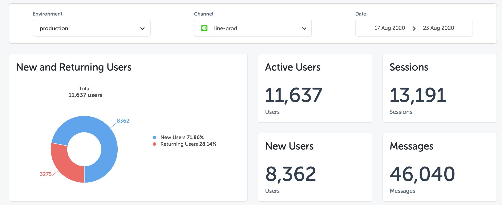
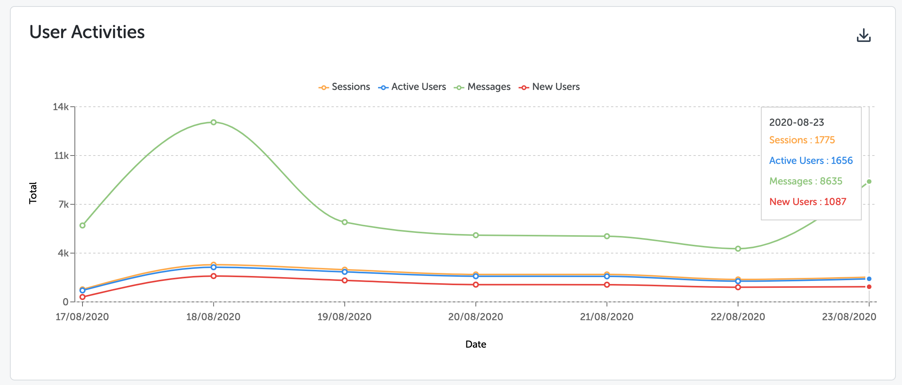
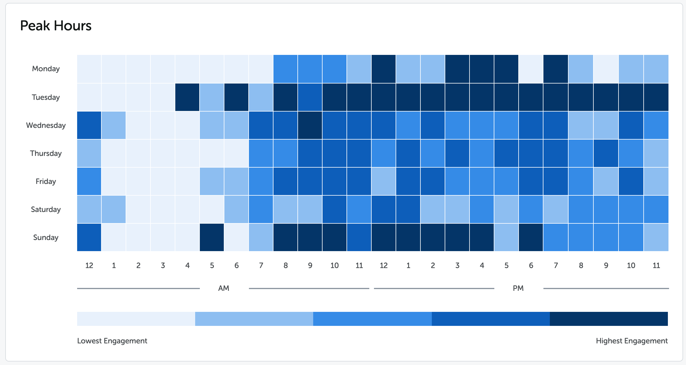
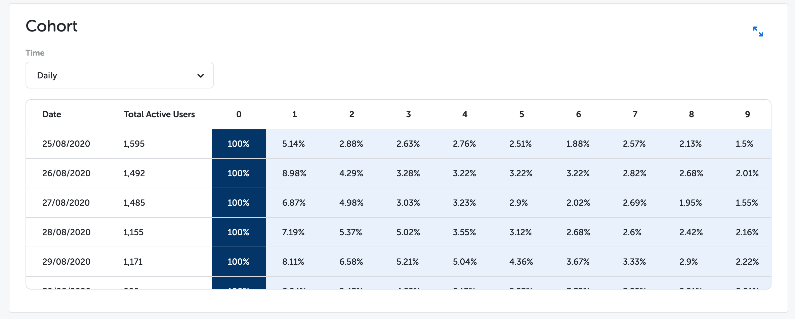
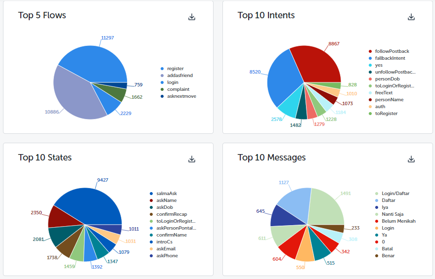
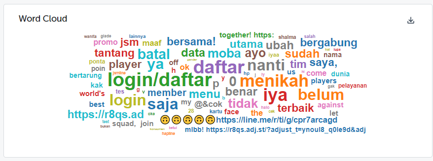
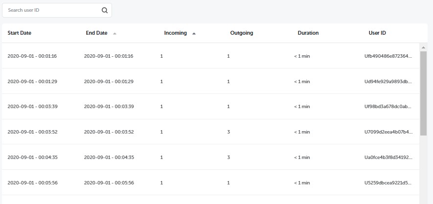

We are proud to announce a whole new experience with our analytics platform.

You can see more detailed user data, namely: New and Returning Users. Here you can see the number of new and returning user, also the total of both of them, based on filtering environment, channels, and dates. You also be able to see the total number of Active Users, Sessions, New Users, and Messages.

You can get daily user activity data based on the selected date range, showing in a line chart. Get daily data for sessions, messages, active users and the newest is the number of new users. The data is also available offline by downloading it first.

Get insights to blast messages in peak hours by looking at the total messages in the 7 days and 24 hours. You can do a hover in each block to see the number of incoming messages you get every hour on the selected date range.

Did you know that it's important to pay attention to how many users come back to chatting with the chatbot? Now we have a Cohort table to display this data. You can view user retention data from daily, weekly, and monthly.

In the Topics menu, you can see the most topic that users are looking for. You can see the Top Flows, Top Intents, Top States, and Top Messages. Now, we also be able to download those insights into csv files.

In addition, we also have a Word Cloud so we see the most common words used by user at a glance.

In the Transcript menu, we can see the conversation history between user and chat bot. Now, we can sort the start date, end date, incoming, outgoing, and duration into ascending and descending sequence. We also be able to search transcript by user ID.

